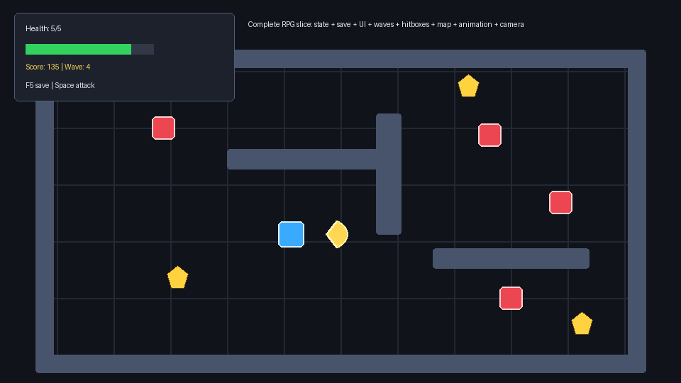

# Rust + Bevy Tutorial

A community-made Rust + Bevy tutorial site for learning Rust through a small playable Bevy RPG slice.

Public site:

- English: https://smturtle2.github.io/bevy-tutorial/en/
- Korean: https://smturtle2.github.io/bevy-tutorial/ko/

The tutorial targets:

- Rust edition: `2024`
- Bevy: `0.18.1`



## Run The Bevy Project

```sh
cargo run
```

## Run Chapter Examples

```sh
cargo run --example 01_empty_app
cargo run --example 02_spawn_sprite
cargo run --example 03_player_input
cargo run --example 04_velocity_body
cargo run --example 05_plugins_sets
cargo run --example 06_assets_camera_ui
cargo run --example 07_rpg_slice
cargo run --example 08_smooth_camera_follow
cargo run --example 09_enemy_waves
cargo run --example 10_attack_hitbox
cargo run --example 11_sprite_assets
cargo run --example 12_screen_space_ui
cargo run --example 13_animation_state
cargo run --example 14_handmade_map_geometry
cargo run --example 15_game_states
cargo run --example 16_save_load_progress
cargo run --example 17_complete_rpg_slice
cargo run --example 18_projectiles
cargo run --example 19_inventory
cargo run --example 20_dialogue
cargo run --example 21_audio_events
cargo run --example 22_scene_loading
```

## Run The Site Locally

```sh
npm install
npm run build
npm run preview
```

GitHub Pages is built from `dist/` by `.github/workflows/pages.yml`.

## License

This tutorial is licensed under the [MIT License](LICENSE). Code, documentation, and included tutorial assets are MIT-licensed unless a file explicitly states otherwise.
