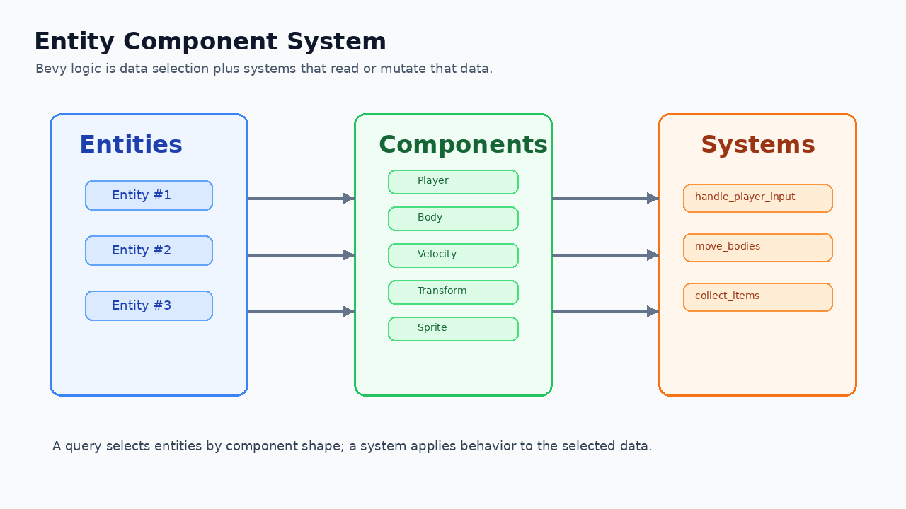

# 1. Rust For Bevy

<div align="center">

[Index](index.md) · [← Previous: Project setup](00-project-setup.md) · [Next: The Bevy app model →](02-bevy-app-model.md)

</div>

---

## Outcome

At the end of this chapter, you can read the Rust syntax that appears in the first Bevy examples: functions, bindings, mutability, structs, enums, `impl`, references, ownership, generics, `Option`, `Result`, modules, and system parameters.

The goal is practical: when you see a Bevy system signature, you should be able to say what data the system receives and what it is allowed to mutate.



## Run

```sh
cargo run --example 01_empty_app
```

Read `examples/01_empty_app.rs` with this chapter open:

```rust
use bevy::prelude::*;

fn main() {
    App::new()
        .insert_resource(ClearColor(Color::srgb(0.08, 0.09, 0.11)))
        .add_plugins(DefaultPlugins)
        .add_systems(Startup, setup_camera)
        .run();
}

fn setup_camera(mut commands: Commands) {
    commands.spawn(Camera2d);
}
```

This small file already contains most Rust shapes you will keep seeing.

## Names, Values, And Types

Rust creates local names with `let`:

```rust
let score = 0;
let speed: f32 = 280.0;
let direction = Vec2::ZERO;
```

The contract is:

```text
let name = value;        create a binding and infer the type
let name: Type = value;  create a binding with an explicit type
```

Bevy code often leaves local types inferred because the right side is clear:

```rust
let mut direction = Vec2::ZERO;
```

Function parameters are different. System parameters are written explicitly because they are the system's access contract:

```rust
fn move_player(
    time: Res<Time>,
    keyboard: Res<ButtonInput<KeyCode>>,
    mut players: Query<&mut Transform, With<Player>>,
) {
}
```

Read that signature as: this system reads time, reads keyboard input, and mutates `Transform` on entities that have `Player`.

## Mutability

Bindings are immutable by default:

```rust
let direction = Vec2::ZERO;
direction.x += 1.0; // compile error
```

Use `mut` when the binding itself must change:

```rust
let mut direction = Vec2::ZERO;
direction.x += 1.0;
```

`mut` can apply to different things:

```rust
let mut value = 10;      // the binding can be changed
let reference = &mut value; // exclusive mutable borrow of the value
```

This is also valid:

```rust
let a = 10;
let b = 20;
let mut r = &a;
r = &b;
```

Here `r` can point to a different integer, but `r` is still a shared reference: its type is `&i32`, not `i32`.

If you want a mutable integer copied from a read-only reference:

```rust
let a = 10;
let r = &a;
let mut copied: i32 = *r;
copied += 1;
```

`i32` is `Copy`, so `*r` copies the number out.

## Functions And Semicolons

Functions use `fn`:

```rust
fn add_score(current: u32, amount: u32) -> u32 {
    current + amount
}
```

Rules:

```text
current: u32    parameter name and type
-> u32          return type
no semicolon    final expression becomes the return value
```

A semicolon turns an expression into a statement:

```rust
fn add_score(current: u32, amount: u32) -> u32 {
    current + amount;
    // compile error: expected u32, found ()
}
```

`()` is the unit type. It means “no meaningful value.” Most Bevy systems return `()`:

```rust
fn setup_camera(mut commands: Commands) {
    commands.spawn(Camera2d);
}
```

## `::` And `.`

Rust uses `::` for names under a type or module:

```rust
App::new()
Vec2::ZERO
Vec3::new(0.0, 0.0, 1.0)
Transform::from_xyz(0.0, 0.0, 1.0)
```

Rust uses `.` for methods and fields on an existing value:

```rust
direction.normalize_or_zero()
transform.translation
velocity.0
```

Read chained Bevy setup the same way:

```rust
App::new()
    .add_plugins(DefaultPlugins)
    .add_systems(Update, move_player)
    .run();
```

`App::new()` creates a value. Each later line calls a method on that value.

## Structs

`struct` defines a new type. Bevy components and resources are usually structs.

A marker component has no fields:

```rust
#[derive(Component)]
struct Player;
```

An entity either has `Player` or it does not. The marker's presence is the data.

A tuple struct gives one value a domain name:

```rust
#[derive(Component)]
struct Velocity(Vec2);
```

Access uses numeric field syntax:

```rust
velocity.0 = Vec2::X * 260.0;
```

A named-field struct carries several facts:

```rust
#[derive(Component)]
struct Body {
    half_size: Vec2,
}
```

Use this rule:

```text
marker only                   -> unit struct
one domain value              -> tuple struct
several named facts           -> named-field struct
reusable spawn shape          -> bundle struct
```

## Tuples And Spawn Calls

Rust tuples group values:

```rust
let pair = (10, 20);
let x = pair.0;
```

Bevy uses tuples to spawn several components together:

```rust
commands.spawn((
    Player,
    Sprite::from_color(Color::srgb(0.25, 0.70, 1.0), Vec2::splat(80.0)),
    Transform::from_translation(Vec3::ZERO),
));
```

The outer `spawn(...)` is the function call. The inner `(...)` is the tuple of components.

## Derive And Traits

Traits are behavior contracts. Bevy uses derive macros to implement common traits for your types:

```rust
#[derive(Component)]
struct Player;

#[derive(Resource, Default)]
struct Score(u32);

#[derive(SystemSet, Debug, Clone, PartialEq, Eq, Hash)]
enum GameSet {
    Input,
    Movement,
}
```

`Component` means Bevy may attach the type to an entity. `Resource` means Bevy may store exactly one value of that type in the world. `Default` means Rust can create a standard initial value.

## `impl` And `Self`

An `impl` block adds functions or methods to a type:

```rust
impl BodyBundle {
    fn new(position: Vec3) -> Self {
        Self {
            body: Body,
            velocity: Velocity(Vec2::ZERO),
            transform: Transform::from_translation(position),
        }
    }
}
```

Rules:

```text
BodyBundle::new(...)  associated function called on the type
Self                  the type currently being implemented
Self { ... }          construct a value of that type
```

Bevy tutorials use `new` constructors for bundles because spawning should be boring:

```rust
commands.spawn(PlayerBundle::new(&asset_server));
```

The call site says what is being spawned, not every field needed to spawn it.

## Enums And `match`

Enums model a closed set of states:

```rust
#[derive(Component, Debug, Clone, Copy, PartialEq, Eq)]
enum PlayerAnimState {
    Idle,
    Run,
    Attack,
}
```

`match` handles every case:

```rust
match animation.state {
    PlayerAnimState::Idle => atlas.index = 0,
    PlayerAnimState::Run => atlas.index = animation.run_frame,
    PlayerAnimState::Attack => atlas.index = 3,
}
```

The compiler checks that all enum variants are handled. That is useful for animation, game states, menu states, and save/load decisions.

## Ownership, Borrowing, And Bevy Systems

Rust has one clear owner for most values. Passing an owned value can move it:

```rust
let name = String::from("player");
let other = name; // name moved into other
```

Small numeric and math values often implement `Copy`, so assignment copies them:

```rust
let a = Vec2::X;
let b = a; // Vec2 is copied
```

Borrowing gives temporary access:

```rust
fn length(v: &Vec2) -> f32 {
    v.length()
}

fn push_right(v: &mut Vec2) {
    v.x += 1.0;
}
```

Bevy system parameters are Rust borrowing made visible:

```text
Res<T>       shared access to a resource
ResMut<T>    mutable access to a resource
&T           shared component access
&mut T       mutable component access
```

If one system asks for `Query<&mut Transform, With<Player>>`, Bevy knows that system writes player transforms. That type information is how Bevy schedules systems safely.

## Generics And Query Syntax

Generics put a type inside another type:

```rust
Res<Time>
Res<ButtonInput<KeyCode>>
Query<&mut Transform, With<Player>>
Query<(&mut Transform, &Velocity), With<Body>>
```

Read inside out:

```text
ButtonInput<KeyCode>              keyboard key state
Res<ButtonInput<KeyCode>>         shared resource access to that state
With<Player>                      filter: entity must have Player
Query<&mut Transform, With<Player>> mutable Transform access for player entities
```

Tuple query data means “fetch these components from the same entity”:

```rust
for (mut transform, velocity) in &mut bodies {
    transform.translation += velocity.0.extend(0.0);
}
```

The loop variable is a tuple because the query asks for a tuple.

## `Option`, `Result`, And Early Exit

`Option<T>` means a value may be present:

```rust
let Some(atlas) = &mut sprite.texture_atlas else {
    return;
};
```

This says: if the sprite has no texture atlas, leave the system now.

`Result<T, E>` means an operation can succeed or fail:

```rust
fn save_progress_to_disk(progress: &Progress) -> Result<(), String> {
    let json = serde_json::to_string_pretty(progress).map_err(|error| error.to_string())?;
    fs::write(SAVE_PATH, json).map_err(|error| error.to_string())
}
```

`?` returns early on error. You will use this in the save/load chapter.

## Modules, `use`, And `pub`

`use` brings names into scope:

```rust
use bevy::prelude::*;
```

Modules split code:

```rust
mod body;
mod player;
```

Visibility is explicit:

```rust
pub struct BodyPlugin;
```

In this tutorial, start with one example file. Move code into modules only when a responsibility becomes stable: body movement, player behavior, assets, UI, or save/load.

## Read A System Signature

Use this checklist for every Bevy system:

```rust
fn player_input(
    keyboard: Res<ButtonInput<KeyCode>>,
    mut players: Query<(&mut Velocity, &mut Facing), With<Player>>,
) {
}
```

Ask:

```text
Which resources are read?        keyboard
Which resources are written?     none
Which components are read?       Facing is written, not read-only
Which components are written?    Velocity, Facing
Which entities match?            entities with Player, Velocity, Facing
Does it change world structure?  no Commands parameter, so no spawn/despawn
```

This one habit makes Bevy code much easier to reason about.

## Check

You are ready for chapter 2 when you can explain these expressions:

```text
App::new()
commands.spawn(Camera2d)
Transform::from_xyz(0.0, 0.0, 1.0)
velocity.0
Query<(&mut Transform, &Velocity), With<Body>>
```

## Change

Open `examples/03_player_input.rs` and change:

```rust
struct PlayerSpeed(f32);
```

to:

```rust
struct PlayerSpeed(pub f32);
```

The example still works because everything is in one file. Later, when types cross module boundaries, `pub` controls whether other modules can access fields directly.

---

<div align="center">

[← Previous: Project setup](00-project-setup.md) · [Index](index.md) · [Next: The Bevy app model →](02-bevy-app-model.md)

</div>
