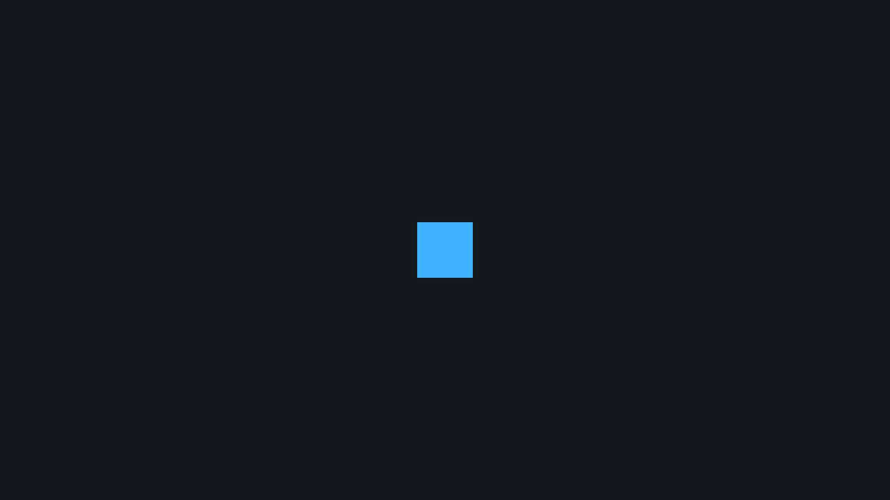

# 2. The Bevy App Model

<div align="center">

[Index](index.md) · [← Previous: Rust for Bevy](01-rust-for-bevy.md) · [Next: ECS fundamentals →](03-ecs-fundamentals.md)

</div>

---

## Outcome

At the end of this chapter, you can read a Bevy `App` setup from top to bottom. You will know where plugins, resources, startup systems, update systems, and commands fit.



## Run

```sh
cargo run --example 01_empty_app
cargo run --example 02_spawn_sprite
```

The first example opens a dark window. The second example adds a visible blue square.

## Build Step 1: Create The App

`examples/01_empty_app.rs` starts with this chain:

```rust
fn main() {
    App::new()
        .insert_resource(ClearColor(Color::srgb(0.08, 0.09, 0.11)))
        .add_plugins(DefaultPlugins)
        .add_systems(Startup, setup_camera)
        .run();
}
```

Read it as a registration list:

```text
App::new()                  create the app
insert_resource(...)        store one global value in the ECS world
add_plugins(DefaultPlugins) add windowing, rendering, input, assets, logging, and defaults
add_systems(Startup, ...)   register a system that runs once
run()                       enter Bevy's engine loop
```

`App` is the place where behavior is registered. The behavior itself lives in systems.

## Build Step 2: Add A Startup System

The startup system creates a camera:

```rust
fn setup_camera(mut commands: Commands) {
    commands.spawn(Camera2d);
}
```

`Startup` means the system runs once when the app starts:

```rust
.add_systems(Startup, setup_camera)
```

`Update` means a system runs every frame:

```rust
.add_systems(Update, move_player)
```

The function name does not decide timing. The schedule decides timing.

## Build Step 3: Use Commands For Structural Changes

`Commands` queues changes to the ECS world:

```rust
commands.spawn(Camera2d);
commands.spawn((Sprite::from_color(...), Transform::from_translation(...)));
```

Common command operations:

```text
spawn(...)                  create an entity
entity(id).despawn()        remove an entity
entity(id).insert(...)      add components
entity(id).remove::<T>()    remove one component type
```

Commands are deferred. A system records the requested structural change; Bevy applies queued commands at defined apply points. This is one reason systems can run safely in parallel.

Use this rule:

```text
Commands = change which entities/components exist
Query    = read or mutate component values that already exist
```

## Build Step 4: Spawn A Sprite Entity

`examples/02_spawn_sprite.rs` creates two entities:

```rust
fn setup(mut commands: Commands) {
    commands.spawn(Camera2d);

    commands.spawn((
        Sprite::from_color(Color::srgb(0.25, 0.70, 1.0), Vec2::splat(80.0)),
        Transform::from_translation(Vec3::ZERO),
    ));
}
```

The camera entity has:

```text
Camera2d
```

The square entity has:

```text
Sprite       what to draw
Transform    where to draw it
```

Rendering is ECS data. A visible 2D thing needs something renderable and a transform, and the world needs a camera that can see it.

## Rust Lens

The sprite spawn uses a tuple:

```rust
commands.spawn((
    Sprite::from_color(...),
    Transform::from_translation(...),
));
```

That tuple is a group of component values attached to one entity.

The color call uses associated functions:

```rust
Color::srgb(0.25, 0.70, 1.0)
Vec2::splat(80.0)
Vec3::ZERO
```

Each one creates a value before Bevy stores it as component data.

## Bevy Lens

`DefaultPlugins` installs the normal window, renderer, input, asset loader, logging setup, and other engine pieces.

`ClearColor` is a resource because there is one background clear color for the app:

```rust
.insert_resource(ClearColor(Color::srgb(0.08, 0.09, 0.11)))
```

Resources are global typed values. Components belong to entities.

## Check

Run the sprite example:

```sh
cargo run --example 02_spawn_sprite
```

You should see a blue square centered in a dark window.

Now make these changes one at a time:

- Remove `commands.spawn(Camera2d);`: the app runs, but the square is not visible.
- Change `Vec2::splat(80.0)` to `Vec2::splat(30.0)`: the square becomes smaller.
- Change `Vec3::ZERO` to `Vec3::new(200.0, 0.0, 0.0)`: the square moves right.

## Change

Add a second square:

```rust
commands.spawn((
    Sprite::from_color(Color::srgb(1.0, 0.82, 0.25), Vec2::splat(40.0)),
    Transform::from_xyz(120.0, 0.0, 1.0),
));
```

Expected result: a smaller yellow square appears to the right. Its `z` value is higher, so if it overlaps the blue square it is drawn on top.

---

<div align="center">

[← Previous: Rust for Bevy](01-rust-for-bevy.md) · [Index](index.md) · [Next: ECS fundamentals →](03-ecs-fundamentals.md)

</div>
