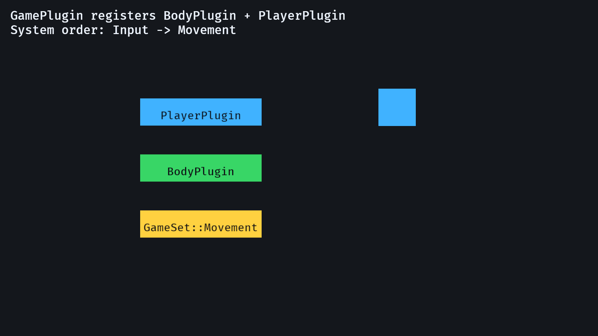

# 5. Bundles, Plugins, And Sets

<div align="center">

[Index](index.md) · [← Previous: Input and movement](04-input-and-movement.md) · [Next: Assets, camera, and UI →](06-assets-camera-ui.md)

</div>

---

## Outcome

At the end of this chapter, spawn data, feature registration, and frame order are no longer mixed together in `main`.



## Run

```sh
cargo run --example 05_plugins_sets
```

The visible behavior is still a movable player. The important change is the source-code structure.

## Build Step 1: Bundle Repeated Spawn Data

A bundle is a group of components used together:

```rust
#[derive(Bundle)]
struct BodyBundle {
    body: Body,
    velocity: Velocity,
    transform: Transform,
}
```

The constructor defines the spawn defaults:

```rust
impl BodyBundle {
    fn new(position: Vec3) -> Self {
        Self {
            body: Body,
            velocity: Velocity(Vec2::ZERO),
            transform: Transform::from_translation(position),
        }
    }
}
```

Now spawning a body does not require every call site to remember the same three components.

## Build Step 2: Compose Bundles

Bundles can contain other bundles:

```rust
#[derive(Bundle)]
struct PlayerBundle {
    player: Player,
    body: BodyBundle,
    sprite: Sprite,
}
```

The player constructor becomes:

```rust
impl PlayerBundle {
    fn new() -> Self {
        Self {
            player: Player,
            body: BodyBundle::new(Vec3::ZERO),
            sprite: Sprite::from_color(Color::srgb(0.25, 0.70, 1.0), Vec2::splat(80.0)),
        }
    }
}
```

Spawning is now explicit and short:

```rust
commands.spawn(PlayerBundle::new());
```

This is the clean Rust way to solve the “I have to declare the same spawn variables in two places” feeling. The component types stay separate, but the spawn recipe is centralized.

## Build Step 3: Use Plugins As Registration Units

A plugin owns registration for one feature area:

```rust
struct BodyPlugin;

impl Plugin for BodyPlugin {
    fn build(&self, app: &mut App) {
        app.insert_resource(BodySpeed(220.0))
            .add_systems(Update, move_bodies.in_set(GameSet::Movement));
    }
}
```

The player plugin owns player setup and input:

```rust
struct PlayerPlugin;

impl Plugin for PlayerPlugin {
    fn build(&self, app: &mut App) {
        app.add_systems(Startup, spawn_player)
            .add_systems(Update, handle_player_input.in_set(GameSet::Input));
    }
}
```

Plugins can add other plugins:

```rust
struct GamePlugin;

impl Plugin for GamePlugin {
    fn build(&self, app: &mut App) {
        app.add_plugins(BodyPlugin)
            .add_plugins(PlayerPlugin);
    }
}
```

That is normal Bevy structure. A top-level game plugin can assemble feature plugins.

## Build Step 4: Name Frame Phases With `SystemSet`

The example defines frame phases:

```rust
#[derive(SystemSet, Debug, Clone, PartialEq, Eq, Hash)]
enum GameSet {
    Input,
    Movement,
}
```

Then it orders those sets:

```rust
.configure_sets(Update, (GameSet::Input, GameSet::Movement).chain())
```

Individual systems join a set:

```rust
handle_player_input.in_set(GameSet::Input)
move_bodies.in_set(GameSet::Movement)
```

The result is readable frame order:

```text
Input -> Movement
```

## Rust Lens

`impl Plugin for BodyPlugin` means `BodyPlugin` implements Bevy's `Plugin` trait:

```rust
impl Plugin for BodyPlugin {
    fn build(&self, app: &mut App) {
    }
}
```

`&self` borrows the plugin value. `&mut App` gives the build method mutable access to the app registration object.

`Self` in bundle constructors means the type currently being implemented:

```rust
fn new() -> Self
```

For `impl PlayerBundle`, `Self` means `PlayerBundle`.

## Bevy Lens

Use these boundaries:

```text
Component   data type attached to entities
Bundle      reusable spawn recipe
System      behavior
Plugin      registration boundary
SystemSet   execution phase
```

This is the point where Bevy stops feeling like one long `App` chain. The chain still exists, but each plugin owns a focused part of it.

## Check

Run:

```sh
cargo run --example 05_plugins_sets
```

Expected result:

- The player moves.
- `GamePlugin` adds `BodyPlugin` and `PlayerPlugin`.
- `GameSet::Input` runs before `GameSet::Movement`.

## Change

Swap the set order:

```rust
.configure_sets(Update, (GameSet::Movement, GameSet::Input).chain())
```

Expected result: movement uses the previous frame's velocity, so controls can feel one frame late. Put the order back after observing it.

---

<div align="center">

[← Previous: Input and movement](04-input-and-movement.md) · [Index](index.md) · [Next: Assets, camera, and UI →](06-assets-camera-ui.md)

</div>
