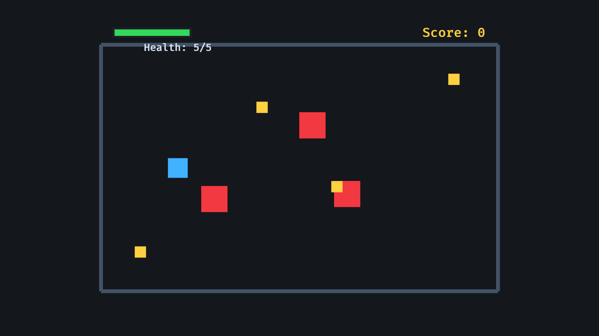

# 7. RPG Foundation Slice


<div align="center">

[Index](index.md) · [← Previous: Assets, camera, and UI](06-assets-camera-ui.md) · [Next: Smooth camera follow →](08-smooth-camera-follow.md)

</div>

---

Run:

```sh
cargo run --example 07_rpg_slice
```



This foundation example combines the earlier pieces into one compact game loop:

- player input
- simple enemy chasing
- reusable body movement
- arena clamping
- collectible pickup
- enemy damage with cooldown
- health and score display
- explicit system ordering

It is not the final tutorial result. It is the base slice that later chapters extend with camera smoothing, waves, hitboxes, screen-space UI, animation state, map geometry, game states, and save/load.

## Constants

The top of the example keeps tuning values together:

```rust
const PLAYER_SIZE: Vec2 = Vec2::splat(42.0);
const ENEMY_SIZE: Vec2 = Vec2::new(56.0, 56.0);
const COLLECTIBLE_SIZE: Vec2 = Vec2::splat(24.0);
const PLAYER_SPEED: f32 = 260.0;
const ENEMY_SPEED: f32 = 80.0;
const MAX_HEALTH: i32 = 5;
const ARENA_HALF_SIZE: Vec2 = Vec2::new(420.0, 260.0);
```

These are not resources because the example does not change them at runtime. If you wanted difficulty settings or live tuning, some of these could become resources later.

## System Sets

The foundation example uses a five-phase `Update` order:

```rust
#[derive(SystemSet, Debug, Clone, PartialEq, Eq, Hash)]
enum GameSet {
    Input,
    Ai,
    Movement,
    Collision,
    Display,
}
```

The plugin chains those sets:

```rust
.configure_sets(
    Update,
    (
        GameSet::Input,
        GameSet::Ai,
        GameSet::Movement,
        GameSet::Collision,
        GameSet::Display,
    )
        .chain(),
)
```

The resulting frame flow is:

```text
Input      player velocity from keyboard
Ai         enemy velocity toward player
Movement   apply velocity and clamp to arena
Collision  collect items and damage player
Display    update health bar and text HUD
```

That order is part of the design. Collision should happen after movement, and display should reflect the latest health and score.

## Components And Resource

The example uses marker components for identity:

```rust
struct Player;
struct Enemy;
struct Collectible;
struct HealthBarFill;
struct HealthText;
struct ScoreText;
```

It uses data components for per-entity state:

```rust
struct Body {
    half_size: Vec2,
}

struct Velocity(Vec2);

struct Health {
    current: i32,
    max: i32,
}
```

`Health` is a component because health belongs to the player entity. `Score` is a resource because the example has one global score:

```rust
#[derive(Resource)]
struct Score(u32);
```

The plugin inserts it:

```rust
.insert_resource(Score(0))
```

This is a deliberate split:

```text
Health = per-player component
Score  = one game-wide resource
```

## Explicit Bundles

The foundation example uses explicit bundles instead of tuple spawning for domain entities:

```rust
#[derive(Bundle)]
struct PlayerBundle {
    player: Player,
    body: BodyBundle,
    sprite: Sprite,
    health: Health,
}
```

`BodyBundle` holds the shared physical components:

```rust
#[derive(Bundle)]
struct BodyBundle {
    body: Body,
    velocity: Velocity,
    transform: Transform,
}
```

Then `PlayerBundle`, `EnemyBundle`, and `CollectibleBundle` each define their own spawn shape:

```rust
commands.spawn(PlayerBundle::new(Vec3::new(-260.0, 0.0, 1.0)));
commands.spawn(EnemyBundle::new(position));
commands.spawn(CollectibleBundle::new(position));
```

Nested bundles flatten when spawned. A player entity receives:

```text
Player
Body
Velocity
Transform
Sprite
Health
```

An enemy receives:

```text
Enemy
Body
Velocity
Transform
Sprite
```

A collectible also has `Velocity` because it uses `BodyBundle`, but no system gives collectibles nonzero velocity. This keeps the bundle simple at the cost of one unused component on collectibles.

## Setup

`setup` creates the initial world:

```text
Camera2d
arena frame sprites
one player
three enemies
four collectibles
health bar background
health bar fill
health text
score text
```

The arena border is created by a helper function:

```rust
fn spawn_arena_frame(commands: &mut Commands) {
    // spawns four rectangle sprites
}
```

This helper is not a system because it is called by `setup`. It receives `&mut Commands` and queues more spawns.

## Player Input

`player_input` is the same input idea from earlier chapters, but it writes actual velocity in units per second:

```rust
fn player_input(
    keyboard: Res<ButtonInput<KeyCode>>,
    mut players: Query<&mut Velocity, With<Player>>,
) {
    // ...
    for mut velocity in &mut players {
        velocity.0 = direction.normalize_or_zero() * PLAYER_SPEED;
    }
}
```

The system does not touch `Transform`. It only says what direction the player wants to move.

## Enemy AI

Enemies chase the player:

```rust
fn enemy_ai(
    player: Single<&Transform, With<Player>>,
    mut enemies: Query<(&Transform, &mut Velocity), With<Enemy>>,
) {
    let player_position = player.translation.truncate();

    for (transform, mut velocity) in &mut enemies {
        let to_player = player_position - transform.translation.truncate();
        velocity.0 = to_player.normalize_or_zero() * ENEMY_SPEED;
    }
}
```

`Single<&Transform, With<Player>>` says there must be exactly one player transform. Each enemy reads its own transform and writes its own velocity.

This simple AI has no pathfinding. It just moves straight toward the player.

## Movement And Arena Clamp

The plugin registers movement and clamping as a chained pair inside `GameSet::Movement`:

```rust
.add_systems(
    Update,
    (move_bodies, clamp_to_arena)
        .chain()
        .in_set(GameSet::Movement),
)
```

The order matters: first apply velocity, then clamp the resulting position to the arena.

Movement applies velocity:

```rust
fn move_bodies(time: Res<Time>, mut bodies: Query<(&mut Transform, &Velocity), With<Body>>) {
    for (mut transform, velocity) in &mut bodies {
        transform.translation += (velocity.0 * time.delta_secs()).extend(0.0);
    }
}
```

Then `clamp_to_arena` keeps bodies inside the arena:

```rust
fn clamp_to_arena(mut bodies: Query<(&mut Transform, &Body), With<Body>>) {
    for (mut transform, body) in &mut bodies {
        let min = -ARENA_HALF_SIZE + body.half_size;
        let max = ARENA_HALF_SIZE - body.half_size;
        transform.translation.x = transform.translation.x.clamp(min.x, max.x);
        transform.translation.y = transform.translation.y.clamp(min.y, max.y);
    }
}
```

`Body.half_size` is what keeps large sprites from crossing the border visually. The center of a body is clamped to the arena minus its extents.

## AABB Collision

The collision helper uses axis-aligned bounding boxes:

```rust
fn overlaps(
    a_transform: &Transform,
    a_body: &Body,
    b_transform: &Transform,
    b_body: &Body,
) -> bool {
    let a = a_transform.translation.truncate();
    let b = b_transform.translation.truncate();
    let distance = (a - b).abs();
    let allowed = a_body.half_size + b_body.half_size;

    distance.x < allowed.x && distance.y < allowed.y
}
```

This checks overlap separately on x and y:

```text
horizontal distance < combined half widths
vertical distance   < combined half heights
```

It works because the example uses unrotated rectangles. It is not a general physics engine.

## Collectibles: `Commands` And `ResMut`

`collect_items` detects overlaps between the player and collectibles:

```rust
fn collect_items(
    mut commands: Commands,
    mut score: ResMut<Score>,
    player: Single<(&Transform, &Body), With<Player>>,
    collectibles: Query<(Entity, &Transform, &Body), With<Collectible>>,
) {
    let (player_transform, player_body) = *player;

    for (entity, transform, body) in &collectibles {
        if overlaps(player_transform, player_body, transform, body) {
            commands.entity(entity).despawn();
            score.0 += 1;
            info!("score: {}", score.0);
        }
    }
}
```

The query includes `Entity` because despawning needs the entity ID. `Commands` queues the despawn. `ResMut<Score>` gives mutable access to the global score resource.

## Enemy Hits: `Local` Cooldown And `Health`

`enemy_hits_player` damages the player when an enemy overlaps:

```rust
fn enemy_hits_player(
    time: Res<Time>,
    player: Single<(&Transform, &Body, &mut Health), With<Player>>,
    enemies: Query<(&Transform, &Body), With<Enemy>>,
    mut hit_cooldown: Local<f32>,
) {
    *hit_cooldown -= time.delta_secs();

    if *hit_cooldown > 0.0 {
        return;
    }

    let (player_transform, player_body, mut health) = player.into_inner();

    for (enemy_transform, enemy_body) in &enemies {
        if overlaps(player_transform, player_body, enemy_transform, enemy_body) {
            health.current = (health.current - 1).max(0);
            *hit_cooldown = 1.0;
            info!("health: {}", health.current);
            break;
        }
    }
}
```

`Local<f32>` stores cooldown state for this system only. The system subtracts delta time every frame. When a hit occurs, it resets the cooldown to one second.

`Health` is mutated directly on the player component. `(health.current - 1).max(0)` prevents health from going below zero.

## Display: Health Bar And Text HUD

The health bar fill is a sprite tagged with `HealthBarFill`. The display system resizes and repositions it:

```rust
fn update_health_bar(
    player: Single<&Health, With<Player>>,
    mut bars: Query<(&mut Sprite, &mut Transform), With<HealthBarFill>>,
) {
    let health = *player;
    let health_fraction = health.current as f32 / health.max as f32;

    for (mut sprite, mut transform) in &mut bars {
        sprite.custom_size = Some(Vec2::new(160.0 * health_fraction, 14.0));
        transform.translation.x = -315.0 - (160.0 * (1.0 - health_fraction) / 2.0);
    }
}
```

The text HUD updates two `Text2d` entities:

```rust
fn update_hud_text(
    score: Res<Score>,
    player: Single<&Health, With<Player>>,
    mut health_text: Single<&mut Text2d, (With<HealthText>, Without<ScoreText>)>,
    mut score_text: Single<&mut Text2d, (With<ScoreText>, Without<HealthText>)>,
) {
    let health = *player;
    health_text.0 = format!("Health: {}/{}", health.current, health.max);
    score_text.0 = format!("Score: {}", score.0);
}
```

The `Without` filters prove that the two mutable `Text2d` accesses are for different entities.

## Why This Architecture Scales

Each feature has a clear data path:

```text
Keyboard input -> Velocity on Player
Enemy AI       -> Velocity on Enemy
Velocity       -> Transform on Body
Transform/Body -> collision decisions
Collision      -> Score resource, Health component, despawn commands
Health/Score   -> sprites and Text2d display
```

When you add a feature, place it in the same vocabulary:

```text
New per-entity data?  Component
One global value?     Resource
Spawn recipe?         Bundle
Behavior?             System
Feature registration? Plugin
Order dependency?     SystemSet
```

## Exercises

Try one change at a time:

1. Add a fourth enemy spawn position.
2. Change `ENEMY_SPEED` and observe how collision pressure changes.
3. Add another collectible position and confirm the score text updates.
4. Change `MAX_HEALTH` and make sure the starting text and health bar still make sense.
5. Add a new `GameSet` between `Collision` and `Display` for future effects, then place no systems in it.

## Common Mistakes

- Documenting score as a component here. In this example, `Score` is a resource.
- Documenting health as a resource here. In this example, `Health` is on the player entity.
- Forgetting to include `Entity` in a query when you need to despawn matched entities.
- Replacing AABB overlap with a center-point check and then wondering why rectangle sizes no longer matter.
- Removing the `Without` filters from the HUD text query and creating a mutable query conflict.
- Treating this as a physics engine. It is hand-written collision for unrotated rectangles.

---

<div align="center">

[← Previous: Assets, camera, and UI](06-assets-camera-ui.md) · [Index](index.md) · [Next: Smooth camera follow →](08-smooth-camera-follow.md)

</div>
