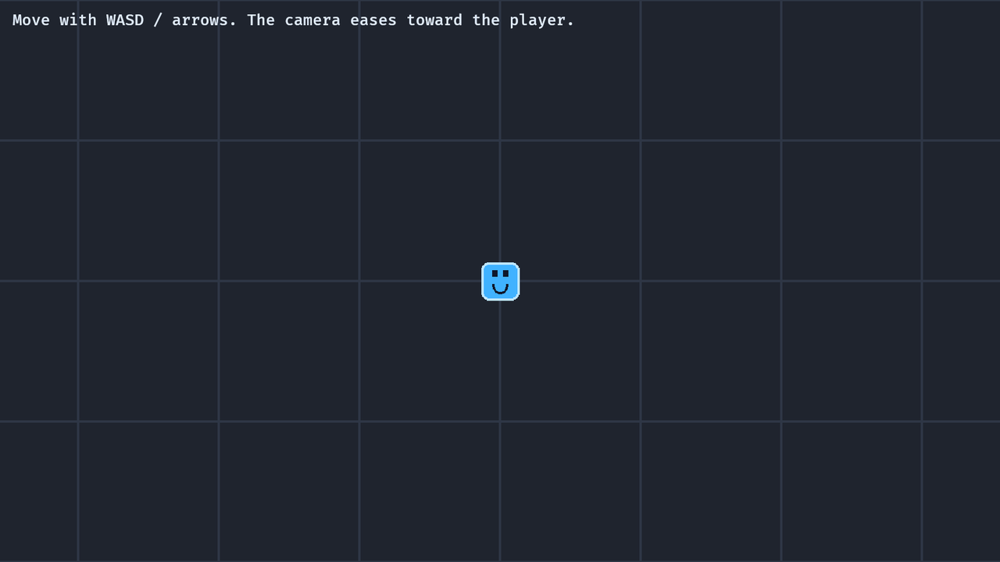

# 8. Smooth Camera Follow

<div align="center">

[Index](index.md) · [← Previous: RPG foundation slice](07-rpg-slice.md) · [Next: Enemy waves →](09-enemy-waves.md)

</div>

---

## Outcome

At the end of this chapter, the camera follows the player with easing instead of snapping directly to the player's position.



## Run

```sh
cargo run --example 08_smooth_camera_follow
```

Move with WASD or arrow keys. The camera starts away from the player and glides toward the target.

## Build Step 1: Store The Follow Target

The camera needs to remember which entity it follows:

```rust
#[derive(Component)]
struct CameraFollow {
    target: Entity,
    offset: Vec3,
    smoothness: f32,
}
```

This component belongs on the camera, not the player. The camera owns the behavior of following.

## Build Step 2: Capture The Player Entity ID

`commands.spawn(...).id()` returns the created entity ID:

```rust
let player = commands.spawn(PlayerBundle::new(&asset_server)).id();
```

The camera stores that ID:

```rust
commands.spawn((
    Camera2d,
    Transform::from_xyz(-420.0, 260.0, 0.0),
    CameraFollow {
        target: player,
        offset: Vec3::new(0.0, 0.0, 0.0),
        smoothness: CAMERA_SMOOTHNESS,
    },
));
```

This avoids a global “player position” resource. The relationship is direct: this camera follows that entity.

## Build Step 3: Move The Player Inside A Larger Map

The player still moves through `Transform`, but the example clamps movement to a larger map:

```rust
player.translation.x = player
    .translation
    .x
    .clamp(-MAP_HALF_SIZE.x, MAP_HALF_SIZE.x);
```

The map grid exists so camera motion is visible. Without background reference lines, camera movement is hard to see.

## Build Step 4: Ease Toward The Target

The follow system reads target transforms and mutates camera transforms:

```rust
fn smooth_follow_camera(
    time: Res<Time>,
    targets: Query<&Transform, Without<Camera2d>>,
    mut cameras: Query<(&CameraFollow, &mut Transform), With<Camera2d>>,
) {
    for (follow, mut camera_transform) in &mut cameras {
        let Ok(target_transform) = targets.get(follow.target) else {
            continue;
        };

        let target = Vec3::new(
            target_transform.translation.x,
            target_transform.translation.y,
            camera_transform.translation.z,
        ) + follow.offset;
        let blend = 1.0 - (-follow.smoothness * time.delta_secs()).exp();

        camera_transform.translation = camera_transform.translation.lerp(target, blend);
    }
}
```

`targets.get(follow.target)` fetches the transform for one specific entity. If that entity no longer exists, the system skips this camera.

## Build Step 5: Use Exponential Blending

The blend value is:

```rust
let blend = 1.0 - (-follow.smoothness * time.delta_secs()).exp();
```

This makes follow speed stable across frame rates. Higher `smoothness` reaches the target faster. Lower `smoothness` feels heavier.

`lerp` interpolates from current camera position to target:

```rust
camera_transform.translation = camera_transform.translation.lerp(target, blend);
```

## Rust Lens

This line introduces `let else`:

```rust
let Ok(target_transform) = targets.get(follow.target) else {
    continue;
};
```

`targets.get(...)` returns a `Result`. If it is `Ok`, Rust binds the transform. If it is `Err`, the loop continues to the next camera.

This is clearer than unwrapping because camera follow is allowed to survive a missing target.

## Bevy Lens

The camera is just another entity. It has:

```text
Camera2d
Transform
CameraFollow
```

Multiple cameras can exist. A camera's render order and target decide how it contributes to the final image. This chapter only uses one main world camera, but the component design does not require the player to know about cameras.

## Check

Run:

```sh
cargo run --example 08_smooth_camera_follow
```

Expected result:

- The player moves immediately.
- The camera glides toward the player instead of snapping.
- Grid lines make the camera motion visible.

## Change

Change:

```rust
const CAMERA_SMOOTHNESS: f32 = 9.0;
```

to:

```rust
const CAMERA_SMOOTHNESS: f32 = 2.0;
```

Expected result: the camera lags farther behind the player.

---

<div align="center">

[← Previous: RPG foundation slice](07-rpg-slice.md) · [Index](index.md) · [Next: Enemy waves →](09-enemy-waves.md)

</div>
