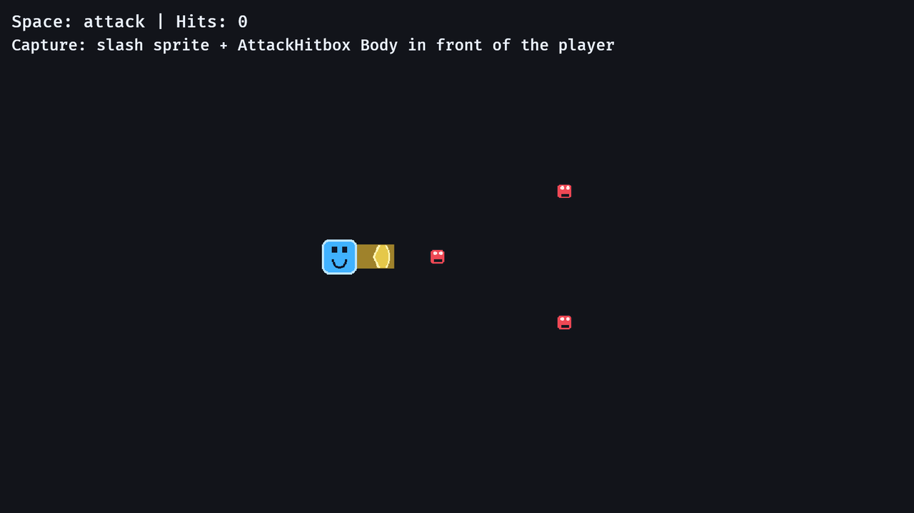

# 10. Attack Hitboxes

<div align="center">

[Index](index.md) · [← Previous: Enemy waves](09-enemy-waves.md) · [Next: Sprite assets →](11-sprite-assets.md)

</div>

---

## Outcome

At the end of this chapter, pressing Space creates a short-lived attack hitbox in front of the player. The hitbox is an entity with collision data, a slash sprite, damage, and a timer.



## Run

```sh
cargo run --example 10_attack_hitbox
```

Move with WASD/arrows. Press Space to attack.

## Build Step 1: Track Facing Direction

The player needs to remember the last movement direction:

```rust
#[derive(Component)]
struct Facing(Vec2);
```

Input updates `Facing` only when the player is moving:

```rust
let normalized = direction.normalize_or_zero();
velocity.0 = normalized * PLAYER_SPEED;

if normalized != Vec2::ZERO {
    facing.0 = normalized;
}
```

This lets the player stop moving and still attack in the last direction.

## Build Step 2: Define The Hitbox Component

An attack is gameplay data:

```rust
#[derive(Component)]
struct AttackHitbox {
    lifetime: Timer,
    damage: i32,
}
```

The hitbox also receives a `Body`, `Sprite`, and `Transform`. It is a normal entity, not a special collision mode.

## Build Step 3: Spawn On `just_pressed`

The attack system runs every frame but only acts on the press frame:

```rust
if !keyboard.just_pressed(KeyCode::Space) {
    return;
}
```

Then it places the hitbox in front of the player:

```rust
let (player_transform, facing) = *player;
let position = player_transform.translation + (facing.0 * HITBOX_DISTANCE).extend(1.0);
let angle = facing.0.y.atan2(facing.0.x);
```

`atan2` converts the facing vector into a rotation angle for the slash sprite.

## Build Step 4: Spawn The Hitbox Entity

The actual spawn is:

```rust
commands.spawn((
    AttackHitbox {
        lifetime: Timer::from_seconds(0.14, TimerMode::Once),
        damage: 1,
    },
    Body {
        half_size: HITBOX_SIZE / 2.0,
    },
    Sprite::from_image(asset_server.load("slash.png")),
    Transform {
        translation: position,
        rotation: Quat::from_rotation_z(angle),
        ..default()
    },
));
```

The short lifetime is important. A hitbox is not a permanent weapon object; it is the active damage window of one attack.

## Build Step 5: Apply Damage

The damage system checks every hitbox against every enemy:

```rust
for (hitbox_entity, hitbox_transform, hitbox_body, hitbox) in &hitboxes {
    let mut hit_anything = false;

    for (enemy_entity, enemy_transform, enemy_body, mut health) in &mut enemies {
        if overlaps(hitbox_transform, hitbox_body, enemy_transform, enemy_body) {
            health.current -= hitbox.damage;
            hit_count.0 += 1;
            hit_anything = true;

            if health.current <= 0 {
                commands.entity(enemy_entity).despawn();
            }
        }
    }

    if hit_anything {
        commands.entity(hitbox_entity).despawn();
    }
}
```

The hitbox despawns after it hits something. Defeated enemies despawn too.

## Build Step 6: Expire Missed Attacks

If the hitbox hits nothing, the timer removes it:

```rust
fn expire_attack_hitboxes(
    mut commands: Commands,
    time: Res<Time>,
    mut hitboxes: Query<(Entity, &mut AttackHitbox)>,
) {
    for (entity, mut hitbox) in &mut hitboxes {
        hitbox.lifetime.tick(time.delta());

        if hitbox.lifetime.is_finished() {
            commands.entity(entity).despawn();
        }
    }
}
```

This keeps the world clean.

## Rust Lens

`Vec::new()` appears in the damage system:

```rust
let mut defeated_enemies = Vec::new();
```

It stores enemies that were already defeated during this system run, so the same enemy is not processed again by another hitbox in the same frame.

The `..default()` syntax fills the remaining fields:

```rust
Transform {
    translation: position,
    rotation: Quat::from_rotation_z(angle),
    ..default()
}
```

That creates a full `Transform` while overriding only the fields we care about.

## Bevy Lens

Represent attacks as entities when they need position, lifetime, rendering, and collision. This keeps combat in the same ECS model as everything else:

```text
Player input     -> creates AttackHitbox entity
Combat collision -> reads AttackHitbox + Enemy bodies
Timer cleanup    -> despawns expired AttackHitbox entities
```

## Check

Run:

```sh
cargo run --example 10_attack_hitbox
```

Expected result:

- Space creates a slash in the facing direction.
- A slash that overlaps an enemy increments the hit counter.
- Enemies disappear after enough hits.
- Missed slashes disappear quickly.

## Change

Change:

```rust
const HITBOX_DISTANCE: f32 = 48.0;
```

to:

```rust
const HITBOX_DISTANCE: f32 = 90.0;
```

Expected result: attacks spawn farther from the player, making close enemies easier to miss.

---

<div align="center">

[← Previous: Enemy waves](09-enemy-waves.md) · [Index](index.md) · [Next: Sprite assets →](11-sprite-assets.md)

</div>
