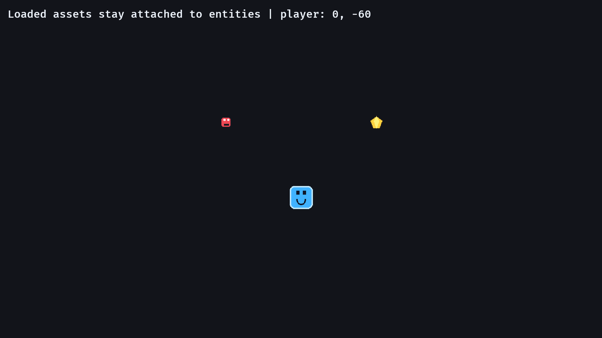

# 11. Sprite Assets

<div align="center">

[Index](index.md) · [← Previous: Attack hitboxes](10-attack-hitbox.md) · [Next: Screen-space UI →](12-screen-space-ui.md)

</div>

---

## Outcome

At the end of this chapter, colored placeholder rectangles are replaced with image assets from the `assets/` directory.



## Run

```sh
cargo run --example 11_sprite_assets
```

Move the player with WASD/arrows. The status text updates while image-backed sprites stay attached to their entities.

## Build Step 1: Use Pixel-Friendly Image Settings

The app uses nearest-neighbor image sampling:

```rust
.add_plugins(DefaultPlugins.set(ImagePlugin::default_nearest()))
```

For pixel art, this prevents sprites from becoming blurry when scaled.

## Build Step 2: Load The Player Image

The player bundle stores a sprite created from an image handle:

```rust
impl PlayerBundle {
    fn new(asset_server: &AssetServer) -> Self {
        Self {
            player: Player,
            sprite: Sprite::from_image(asset_server.load("player.png")),
            transform: Transform::from_xyz(0.0, -60.0, 2.0),
        }
    }
}
```

`asset_server.load("player.png")` maps to:

```text
assets/player.png
```

The entity owns the `Sprite` component. The asset server owns loading and caching.

## Build Step 3: Reuse Display Sprite Construction

The example adds a small bundle for static display sprites:

```rust
#[derive(Bundle)]
struct DisplaySpriteBundle {
    sprite: Sprite,
    transform: Transform,
}

impl DisplaySpriteBundle {
    fn new(path: &'static str, position: Vec3, asset_server: &AssetServer) -> Self {
        Self {
            sprite: Sprite::from_image(asset_server.load(path)),
            transform: Transform::from_translation(position),
        }
    }
}
```

Then setup can spawn multiple assets with a simple loop:

```rust
for (path, x) in [("enemy.png", -160.0), ("gem.png", 160.0)] {
    commands.spawn(DisplaySpriteBundle::new(
        path,
        Vec3::new(x, 100.0, 2.0),
        &asset_server,
    ));
}
```

The path is data. The spawn shape is the same.

## Build Step 4: Keep Gameplay Data Separate From Art

The player still moves by mutating `Transform`:

```rust
player.translation +=
    (direction.normalize_or_zero() * PLAYER_SPEED * time.delta_secs()).extend(0.0);
```

The movement system depends on `Transform` and movement data, while drawing depends on the sprite components.

## Rust Lens

This signature uses a string slice with a static lifetime:

```rust
fn new(path: &'static str, position: Vec3, asset_server: &AssetServer) -> Self
```

`"enemy.png"` and `"gem.png"` are string literals, so they live for the whole program and fit `&'static str`.

The bundle borrows `AssetServer` and stores only the returned handle in the `Sprite`.

## Bevy Lens

A sprite asset is still component data:

```text
Sprite { image: Handle<Image>, ... }
Transform
```

Changing art should not force movement, collision, AI, or saving code to change. Keep gameplay components and rendering components next to each other on the entity, but keep their systems focused.

## Check

Run:

```sh
cargo run --example 11_sprite_assets
```

Expected result:

- `player.png`, `enemy.png`, and `gem.png` are visible.
- The player moves.
- The status text reports the player's position.

## Change

Swap the display assets:

```rust
for (path, x) in [("gem.png", -160.0), ("enemy.png", 160.0)] {
```

Expected result: the left and right display sprites swap without any gameplay code changing.

---

<div align="center">

[← Previous: Attack hitboxes](10-attack-hitbox.md) · [Index](index.md) · [Next: Screen-space UI →](12-screen-space-ui.md)

</div>
