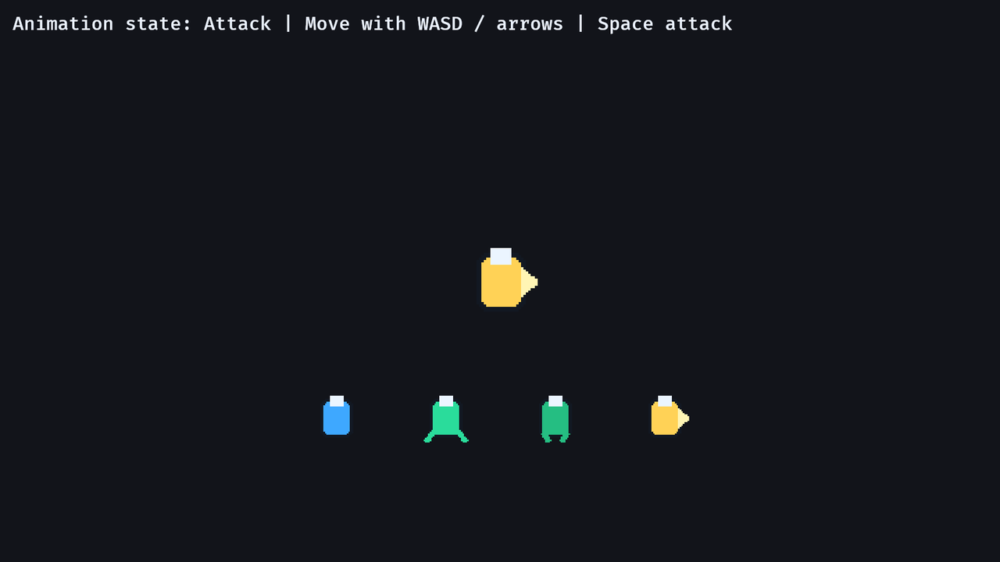

# 13. Animation State

<div align="center">

[Index](index.md) · [← Previous: Screen-space UI](12-screen-space-ui.md) · [Next: Handmade map geometry →](14-handmade-map-geometry.md)

</div>

---

## Outcome

At the end of this chapter, the player sprite changes frames from a sprite sheet based on animation state: idle, run, and attack.



## Run

```sh
cargo run --example 13_animation_state
```

Move with WASD/arrows. Press Space to attack.

## Build Step 1: Define Animation States

The player animation state is an enum:

```rust
#[derive(Component, Debug, Clone, Copy, PartialEq, Eq)]
enum PlayerAnimState {
    Idle,
    Run,
    Attack,
}
```

There are exactly three states. `match` will later handle all three.

## Build Step 2: Store Animation Timers

The animation component stores current state and frame timing:

```rust
#[derive(Component)]
struct PlayerAnimation {
    state: PlayerAnimState,
    frame_timer: Timer,
    attack_timer: Timer,
    run_frame: usize,
}
```

`Default` creates the normal initial animation:

```rust
impl Default for PlayerAnimation {
    fn default() -> Self {
        Self {
            state: PlayerAnimState::Idle,
            frame_timer: Timer::from_seconds(0.14, TimerMode::Repeating),
            attack_timer: Timer::from_seconds(0.20, TimerMode::Once),
            run_frame: 1,
        }
    }
}
```

The run animation alternates between frame `1` and frame `2`. Attack uses frame `3`.

## Build Step 3: Create A Texture Atlas Layout

Setup loads the sprite sheet:

```rust
let texture = asset_server.load("player_sheet.png");
let layout = TextureAtlasLayout::from_grid(UVec2::splat(32), 4, 1, None, None);
let texture_atlas_layout = texture_atlas_layouts.add(layout);
```

The sheet is four frames wide, one row high, and each frame is `32x32`.

The sprite stores both the image and the atlas layout:

```rust
Sprite {
    image: texture.clone(),
    texture_atlas: Some(TextureAtlas {
        layout: texture_atlas_layout.clone(),
        index: 0,
    }),
    ..default()
}
```

Changing `index` changes which frame is rendered.

## Build Step 4: Choose State From Input

Input updates velocity and animation state:

```rust
if keyboard.just_pressed(KeyCode::Space) {
    animation.state = PlayerAnimState::Attack;
    animation.attack_timer.reset();
} else if animation.state != PlayerAnimState::Attack {
    animation.state = if normalized == Vec2::ZERO {
        PlayerAnimState::Idle
    } else {
        PlayerAnimState::Run
    };
}
```

Attack has priority. Movement cannot interrupt it until the attack timer finishes.

## Build Step 5: Drive Atlas Index With `match`

The animation system reads the current state:

```rust
match animation.state {
    PlayerAnimState::Idle => {
        atlas.index = 0;
    }
    PlayerAnimState::Run => {
        animation.frame_timer.tick(time.delta());

        if animation.frame_timer.just_finished() {
            animation.run_frame = if animation.run_frame == 1 { 2 } else { 1 };
        }

        atlas.index = animation.run_frame;
    }
    PlayerAnimState::Attack => {
        atlas.index = 3;
        animation.attack_timer.tick(time.delta());

        if animation.attack_timer.is_finished() {
            animation.state = if velocity.0 == Vec2::ZERO {
                PlayerAnimState::Idle
            } else {
                PlayerAnimState::Run
            };
        }
    }
}
```

This is the core animation loop: state chooses frame behavior, timers decide when state or frame changes.

## Rust Lens

The atlas access uses `Option`:

```rust
let Some(atlas) = &mut sprite.texture_atlas else {
    return;
};
```

Some sprites may not have a texture atlas. This system only animates sprites that do. The early return keeps the code explicit.

The enum derives `Copy`, so assigning animation states is cheap:

```rust
animation.state = PlayerAnimState::Attack;
```

## Bevy Lens

Animation is component data plus one system:

```text
Sprite.texture_atlas.index       what frame is visible
PlayerAnimation.state            what behavior is active
PlayerAnimation timers           when to advance
animate_player system            state -> atlas index
```

Do not put animation decisions inside rendering code. Rendering reads the sprite. Your gameplay systems decide state.

## Check

Run:

```sh
cargo run --example 13_animation_state
```

Expected result:

- Idle uses frame 0.
- Moving alternates run frames.
- Space switches to the attack frame briefly.
- The label shows the current animation state.

## Change

Change the run timer:

```rust
Timer::from_seconds(0.14, TimerMode::Repeating)
```

to:

```rust
Timer::from_seconds(0.06, TimerMode::Repeating)
```

Expected result: the run animation cycles faster while movement speed stays the same.

---

<div align="center">

[← Previous: Screen-space UI](12-screen-space-ui.md) · [Index](index.md) · [Next: Handmade map geometry →](14-handmade-map-geometry.md)

</div>
