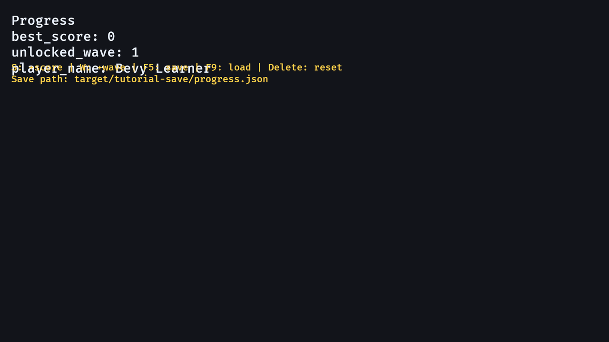

# 16. Save And Load Progress

<div align="center">

[Index](index.md) · [← Previous: Game states](15-game-states.md) · [Next: Integrated RPG slice →](17-complete-rpg-slice.md)

</div>

---

## Outcome

At the end of this chapter, the app stores explicit progress data as JSON and can save, load, and reset it from keyboard input.



## Run

```sh
cargo run --example 16_save_load_progress
```

Controls:

```text
S       add score in memory
W       unlock another wave in memory
F5      save progress to disk
F9      load progress from disk
Delete  reset progress and remove the save file
```

The save path is:

```text
target/tutorial-save/progress.json
```

## Build Step 1: Save Explicit Progress, Not The World

The progress resource is plain serializable data:

```rust
#[derive(Resource, Debug, Clone, Serialize, Deserialize)]
struct Progress {
    best_score: u32,
    unlocked_wave: u32,
    player_name: String,
}
```

It has a default starting value:

```rust
impl Default for Progress {
    fn default() -> Self {
        Self {
            best_score: 0,
            unlocked_wave: 1,
            player_name: "Bevy Learner".to_string(),
        }
    }
}
```

The saved data is deliberately small. It does not include camera transforms, UI entities, loaded handles, or temporary enemies.

## Build Step 2: Load On App Startup

Startup registration inserts loaded progress:

```rust
.insert_resource(load_progress_from_disk())
```

The loader tries file read, JSON parse, then default:

```rust
fn load_progress_from_disk() -> Progress {
    fs::read_to_string(SAVE_PATH)
        .ok()
        .and_then(|text| serde_json::from_str(&text).ok())
        .unwrap_or_default()
}
```

The chain means:

```text
file exists and can be read -> parse JSON
parse succeeds              -> use parsed progress
anything fails              -> use Progress::default()
```

## Build Step 3: Edit Progress In Memory

The edit system mutates the resource:

```rust
fn edit_progress(
    keyboard: Res<ButtonInput<KeyCode>>,
    mut progress: ResMut<Progress>,
    mut status: ResMut<SaveStatus>,
) {
    if keyboard.just_pressed(KeyCode::KeyS) {
        progress.best_score += 100;
        status.message = "Changed best_score in memory".to_string();
    }
}
```

Changing the resource does not automatically write a file. Disk IO happens only when the save key is pressed.

## Build Step 4: Save With `Result`

The save function returns `Result<(), String>`:

```rust
fn save_progress_to_disk(progress: &Progress) -> Result<(), String> {
    let Some(parent) = Path::new(SAVE_PATH).parent() else {
        return Err("save path has no parent directory".to_string());
    };

    fs::create_dir_all(parent).map_err(|error| error.to_string())?;

    let json = serde_json::to_string_pretty(progress).map_err(|error| error.to_string())?;
    fs::write(SAVE_PATH, json).map_err(|error| error.to_string())
}
```

The function creates the directory, serializes JSON, writes the file, and reports errors as text.

## Build Step 5: Report Save Status In UI

The input system maps the save result into a status message:

```rust
if keyboard.just_pressed(KeyCode::F5) {
    match save_progress_to_disk(&progress) {
        Ok(()) => status.message = format!("Saved to {SAVE_PATH}"),
        Err(error) => status.message = format!("Save failed: {error}"),
    }
}
```

The display system writes both progress and status text:

```rust
progress_text.0 = format!(
    "Progress\nbest_score: {}\nunlocked_wave: {}\nplayer_name: {}",
    progress.best_score, progress.unlocked_wave, progress.player_name
);
```

## Rust Lens

`Serialize` and `Deserialize` come from `serde`:

```rust
use serde::{Deserialize, Serialize};
```

They allow `serde_json` to convert between Rust structs and JSON text.

`?` is error propagation:

```rust
fs::create_dir_all(parent).map_err(|error| error.to_string())?;
```

If directory creation fails, the function returns early with `Err(...)`.

## Bevy Lens

Progress is a resource because it is one global save profile for the app:

```text
Progress resource     long-lived player progress
SaveStatus resource   UI feedback about IO
ProgressText entity   renders progress
SaveStatusText entity renders save feedback
```

Saving should use explicit data structures. A full ECS world contains temporary and engine-owned data that usually does not belong in a player save.

## Check

Run:

```sh
cargo run --example 16_save_load_progress
```

Expected result:

- Press `S` and `W` to change values.
- Press `F5`; a JSON file appears under `target/tutorial-save/`.
- Restart the example; saved values load.
- Press Delete; values reset and the file is removed.

## Change

Add a new field:

```rust
gold: u32,
```

Then update `Default`, `update_text`, and any save display you want. Expected result: the JSON file includes the new field after saving.

---

<div align="center">

[← Previous: Game states](15-game-states.md) · [Index](index.md) · [Next: Integrated RPG slice →](17-complete-rpg-slice.md)

</div>
