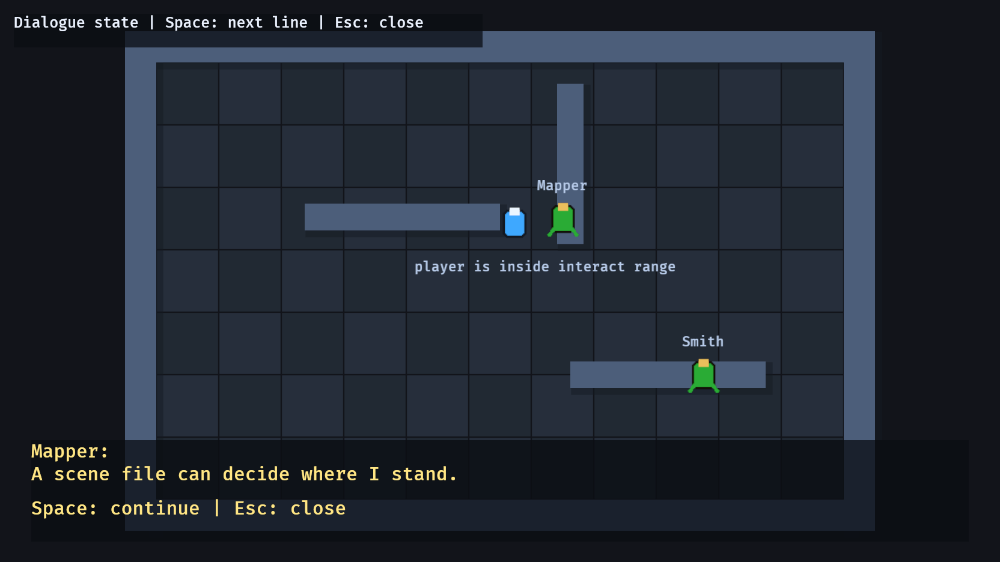

# 19. Dialogue

<div align="center">

[Index](index.md) · [← Previous: Inventory](18-inventory.md) · [Next: Audio events →](20-audio-events.md)

</div>

---

## Outcome

This chapter adds a dialogue mode to the RPG loop. NPCs own their static lines. `DialogueState` records the current conversation. `GameState::Dialogue` pauses normal movement while dialogue input advances or closes the conversation.



## Run

```sh
cargo run --example 19_dialogue
```

Controls:

```text
WASD / Arrow keys   move
E                   talk near an NPC
Space               advance dialogue
Esc                 close dialogue
```

## Continuity Contract

Dialogue uses the state system already introduced earlier:

```text
GameState::Playing    movement and exploration
GameState::Dialogue   dialogue input and text presentation
DialogueState         which NPC is active and which line is visible
Npc component         speaker name and line data
```

The mode owner is `GameState`. The content owner is `Npc`. The current conversation owner is `DialogueState`.

## Build Step 1: Add A Dialogue State

The state enum now has two modes:

```rust
#[derive(States, Debug, Clone, Copy, PartialEq, Eq, Hash, Default)]
enum GameState {
    #[default]
    Playing,
    Dialogue,
}
```

The derives satisfy Bevy's state contract. `Default` chooses `Playing` as the starting mode.

## Build Step 2: Put Lines On NPCs

An NPC owns speaker data:

```rust
#[derive(Component)]
struct Npc {
    name: &'static str,
    lines: &'static [&'static str],
}
```

This example writes lines directly in Rust source, so it can borrow string literals. A string literal has type `&'static str`: a borrowed string slice that lives for the whole program.

Use this rule for string ownership:

```text
hard-coded text in source code      &'static str
borrowed text from somewhere else   &str with that borrow's lifetime
text loaded from files or network   String
arrays of hard-coded lines          &'static [&'static str]
scene-loaded dialogue lines         Vec<String>
```

Chapter 21 uses `Vec<String>` because JSON parsing creates owned strings at runtime.

## Build Step 3: Store The Current Conversation

The active conversation is a resource:

```rust
#[derive(Resource, Default)]
struct DialogueState {
    active_npc: Option<Entity>,
    line_index: usize,
}
```

The NPC owns lines. The resource owns the currently open conversation.

## Build Step 4: Gate Movement By State

Movement reads the current state:

```rust
if *state.get() != GameState::Playing {
    return;
}
```

This is stronger than a random boolean because every system can use the same app mode contract.

## Build Step 5: Start, Advance, And End Dialogue

The input system owns the transition rules:

```text
E near NPC while Playing       active_npc = Some(entity), state = Dialogue
Space while Dialogue           line_index += 1
past last line                 active_npc = None, state = Playing
Esc                            active_npc = None, state = Playing
```

The selected NPC is stored as an `Entity`:

```rust
dialogue.active_npc = Some(entity);
dialogue.line_index = 0;
next_state.set(GameState::Dialogue);
```

## Build Step 6: Render Dialogue UI

The UI system reads `DialogueState` and the active `Npc`:

```rust
let Some(entity) = dialogue.active_npc else {
    text.0.clear();
    return;
};

let Ok(npc) = npcs.get(entity) else {
    text.0.clear();
    return;
};
```

`let else` keeps the active conversation case flat. If no dialogue is active, the text is cleared and the system exits.

## Integration Points

Dialogue plugs into the RPG loop through state, not through movement code:

```text
Input      E/Space/Esc decides dialogue transitions
Movement   runs only while GameState::Playing
Ui         prompt and dialogue panel reflect current state
Scenes     loaded NPCs can use the same name + lines data shape
```

If combat should stop during dialogue, gate combat systems with `in_state(GameState::Playing)`. If the pause menu should close dialogue first, make that rule in the input state transition system.

## Rust Lens

`Option<Entity>` models “no active dialogue” versus “talking to this NPC”:

```rust
active_npc: Option<Entity>
```

`Entity` is an ID, not a reference. Storing it avoids long-lived Rust borrows across frames. Each frame, the UI system uses the ID to query the current NPC data.

`&'static str` is a borrowed string slice with a lifetime:

```rust
name: &'static str
```

The apostrophe syntax names how long a borrow is valid. `'static` means the data lives for the whole program. You see it here because hard-coded string literals are embedded in the program binary.

## Check

Run:

```sh
cargo run --example 19_dialogue
```

Expected result:

- A prompt appears near an NPC.
- `E` opens the dialogue panel and enters `GameState::Dialogue`.
- `Space` advances through the NPC's lines.
- `Esc` closes dialogue and returns to `GameState::Playing`.
- Movement pauses while dialogue is active.

## Change

Add a new line to the Mapper NPC:

```rust
"Dialogue data can grow without changing the UI system.",
```

Expected result: `Space` now advances through one more line for that NPC.

---

<div align="center">

[← Previous: Inventory](18-inventory.md) · [Index](index.md) · [Next: Audio events →](20-audio-events.md)

</div>
