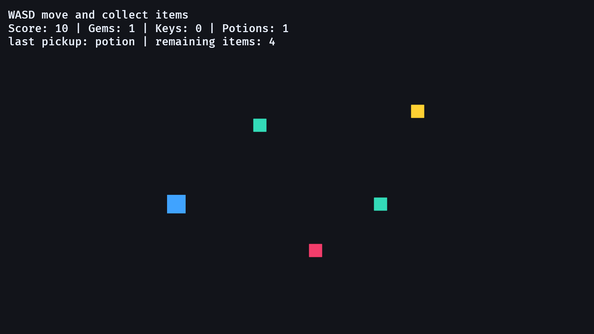

# 19. Inventory

<div align="center">

[Index](index.md) · [← Previous: Projectiles](18-projectiles.md) · [Next: Dialogue →](20-dialogue.md)

</div>

---

## Outcome

This chapter extends the RPG data model with inventory. Pickups remain world entities with position and collision, but collection now updates two owners: `Inventory` stores what the player owns, and `RunStats` stores score earned during the run.



## Run

```sh
cargo run --example 19_inventory
```

Move with WASD or arrow keys and touch the items.

## Continuity Contract

The chapter keeps the same expansion-checkpoint shape:

```text
GameState::Playing      gameplay systems are gated by state
GameSet                 Input -> Collision -> Ui for this feature
GameplayEntity          spawned gameplay objects are marked consistently
Body                    pickup collision uses the same body contract
RunStats                run-scoped score remains separate from inventory ownership
```

The new data owners are:

```text
InventoryItem component    what this world pickup is
ItemKind enum              closed set of item types
Inventory resource         player-owned item counts
```

## Build Step 1: Separate Item Kind From Inventory Counts

`ItemKind` describes the item type:

```rust
#[derive(Component, Debug, Clone, Copy, PartialEq, Eq, Hash)]
enum ItemKind {
    Gem,
    Key,
    Potion,
}
```

Those derives have concrete jobs:

```text
Component    allowed here because this enum can be attached directly if needed
Debug        printable while debugging inventory rules
Clone/Copy   small enum values can be copied out of item components
PartialEq/Eq comparison works without custom code
Hash         the enum is ready for hash maps or set-style inventory rules
```

The resource stores the player's current counts:

```rust
#[derive(Resource, Default)]
struct Inventory {
    gems: u32,
    keys: u32,
    potions: u32,
    last_pickup: Option<ItemKind>,
}
```

This split matters. `ItemKind::Gem` is item identity. `inventory.gems` is current player state.

## Build Step 2: Put Pickups In The World

An item on the ground has collision and presentation:

```rust
#[derive(Component)]
struct InventoryItem {
    kind: ItemKind,
}
```

The bundle turns level placement into one spawn call:

```rust
commands.spawn(ItemBundle::new(ItemKind::Key, Vec3::new(260.0, 120.0, 2.0)));
```

The item entity is still a world object. It can be moved, despawned, loaded from a scene, or checked by collision systems.

## Build Step 3: Keep Inventory Mutation In One Method

The inventory update rule belongs to `Inventory::add`:

```rust
impl Inventory {
    fn add(&mut self, kind: ItemKind) {
        match kind {
            ItemKind::Gem => self.gems += 1,
            ItemKind::Key => self.keys += 1,
            ItemKind::Potion => self.potions += 1,
        }

        self.last_pickup = Some(kind);
    }
}
```

The `match` is exhaustive. If you add `ItemKind::Coin`, Rust requires you to decide how the inventory stores it.

## Build Step 4: Define The Pickup Rule

Collection updates both item ownership and run score:

```rust
if overlaps(player_transform, player_body, item_transform, item_body) {
    inventory.add(item.kind);
    stats.score += item.kind.score_value();
    commands.entity(entity).despawn();
}
```

That is the chapter's gameplay contract:

```text
player overlaps pickup
-> Inventory changes
-> RunStats.score changes according to ItemKind
-> pickup entity despawns
```

Gems are now both inventory items and score pickups. The adapter is `ItemKind::score_value`.

## Build Step 5: Show Inventory In Screen-Space UI

The UI system reads the resource and writes text:

```rust
text.0 = format!(
    "Score: {} | Gems: {} | Keys: {} | Potions: {}",
    stats.score,
    inventory.gems,
    inventory.keys,
    inventory.potions,
);
```

The HUD reads `Inventory` and `RunStats` and presents their current values.

## Integration Points

Inventory connects to earlier and later chapters like this:

```text
chapter 17 score       RunStats.score still records run value
chapter 19 inventory   Inventory records owned items
chapter 22 scenes      scene files can spawn InventoryItem entities
save/load              long-lived inventory fields can be added to Progress
```

The rule for save data is ownership-based: save long-lived player progress, not temporary world entities that will be rebuilt from a scene.

## Rust Lens

`Option<ItemKind>` means there may or may not be a last pickup:

```rust
last_pickup: Option<ItemKind>
```

The UI converts that optional value into text:

```rust
let last = inventory
    .last_pickup
    .map(|kind| format!("last pickup: {}", kind.label()))
    .unwrap_or_else(|| "last pickup: none".to_string());
```

`map` handles `Some(kind)`. `unwrap_or_else` handles `None`.

`ItemKind` is `Copy`, so `inventory.add(item.kind)` copies the enum value out of the component. That is appropriate for a tiny enum. For large item records loaded from files, use an ID or clone owned data intentionally.

## Bevy Lens

Inventory is a resource here because there is one player:

```text
world pickup item      Component
player-owned counts    Resource
run score              Resource
HUD display            UI entity
```

In a multiplayer game, `Inventory` would usually become a component on each player entity. The owner follows the game rule.

## Check

Run:

```sh
cargo run --example 19_inventory
```

Expected result:

- The player can move into items.
- Collected items disappear.
- The matching inventory count increases.
- Score increases according to `ItemKind::score_value`.
- The last pickup label changes.
- The remaining item count decreases.

## Change

Add another pickup in `setup`:

```rust
(ItemKind::Potion, Vec3::new(-180.0, 170.0, 2.0)),
```

Expected result: the new potion appears, can be collected, and increases the potion count through the same system.

---

<div align="center">

[← Previous: Projectiles](18-projectiles.md) · [Index](index.md) · [Next: Dialogue →](20-dialogue.md)

</div>
