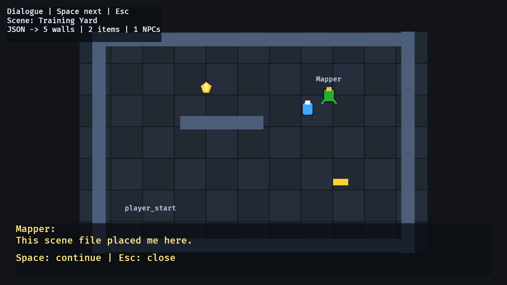

# 22. Scene Loading

<div align="center">

[Index](index.md) · [← Previous: Audio events](21-audio-events.md) · [Contribute →](https://github.com/smturtle2/bevy-tutorial)

</div>

---

## Outcome

This chapter moves level layout out of Rust source and into JSON scene files. The loaded scene still spawns the same gameplay components used earlier: `Player`, `Wall`, `InventoryItem`, `Npc`, `Body`, `Transform`, and sprites.



## Run

```sh
cargo run --example 22_scene_loading
```

Controls:

```text
1                   load Training Yard
2                   load Library Hall
WASD / Arrow keys   move and collect loaded items
E                   talk to a loaded NPC
Space               advance dialogue
Esc                 close dialogue
```

## Continuity Contract

Scene loading is data-driven spawning:

```text
scene file          describes where gameplay objects start
serde structs       define the accepted file shape
spawn_scene         converts scene data into Bevy entities
SceneEntity         marks loaded entities for cleanup before a scene switch
GameplayEntity      keeps the same broad gameplay marker used by expansion examples
InventoryItem       loaded pickups use the inventory chapter's component
Npc                 loaded NPCs use the dialogue chapter's name + lines shape
DialogueState       tracks the current loaded NPC conversation
```

The scene file owns placement data. Rust systems still own movement, collision, pickup, dialogue, UI, and cleanup rules.

## Build Step 1: Define The Scene File Contract

The JSON file contains layout data:

```json
{
  "name": "Training Yard",
  "player_start": [-260.0, -120.0],
  "walls": [
    { "x": 0.0, "y": 260.0, "w": 760.0, "h": 34.0 }
  ],
  "items": [
    { "kind": "Gem", "x": -120.0, "y": 140.0 }
  ],
  "npcs": [
    {
      "name": "Mapper",
      "x": 190.0,
      "y": 120.0,
      "lines": ["This scene file placed me here."]
    }
  ]
}
```

The Rust side mirrors that shape:

```rust
#[derive(Deserialize)]
struct SceneData {
    name: String,
    player_start: [f32; 2],
    walls: Vec<RectData>,
    items: Vec<ItemData>,
    npcs: Vec<NpcData>,
}
```

`Deserialize` lets serde build `SceneData` from JSON text.

## Build Step 2: Deserialize Typed Item Kinds

The item kind has a Rust enum contract:

```rust
#[derive(Component, Deserialize, Debug, Clone, Copy, PartialEq, Eq, Hash)]
enum ItemKind {
    Gem,
    Key,
    Potion,
}
```

The JSON value `"Gem"` becomes `ItemKind::Gem`. If the file says `"Coin"` before Rust defines a `Coin` variant, parsing fails instead of silently creating invalid gameplay data.

## Build Step 3: Mark Loaded Entities

Every entity created from the scene receives `SceneEntity`:

```rust
#[derive(Component)]
struct SceneEntity;
```

Scene switching uses that marker:

```rust
for entity in &entities {
    commands.entity(entity).despawn();
}
```

This removes the previous scene's player, walls, items, and NPCs before the next scene is spawned.

## Build Step 4: Read And Parse The File

Loading has three steps:

```rust
let text = fs::read_to_string(&fs_path)?;
let scene = serde_json::from_str::<SceneData>(&text)?;
spawn_scene(commands, &scene);
```

The example writes those steps with `match` so the UI can show readable error messages:

```rust
let scene = match serde_json::from_str::<SceneData>(&text) {
    Ok(scene) => scene,
    Err(error) => return format!("Failed to parse {asset_path}: {error}"),
};
```

## Build Step 5: Spawn Existing Gameplay Components

The scene loader reuses the concepts from earlier chapters. Items become `InventoryItem` entities:

```rust
commands.spawn((
    GameplayEntity,
    SceneEntity,
    InventoryItem { kind: item.kind },
    Body { half_size: ITEM_SIZE / 2.0 },
    Sprite::from_color(item.kind.color(), ITEM_SIZE),
    Transform::from_xyz(item.x, item.y, 3.0),
));
```

NPCs become `Npc` entities with owned strings:

```rust
Npc {
    name: npc.name.clone(),
    lines: npc.lines.clone(),
}
```

The loaded scene now works with the same pickup and dialogue data shapes taught earlier.

## Build Step 6: Let Existing Systems Use Loaded Data

The pickup system depends on components, so hard-coded items and JSON-loaded items use the same rule:

```rust
if overlaps(player_transform, player_body, item_transform, item_body) {
    inventory.add(item.kind);
    stats.score += item.kind.score_value();
    commands.entity(entity).despawn();
}
```

That is the payoff of using the same component contracts across chapters.

## Integration Points

Scene loading closes the expansion track by connecting data files to gameplay systems:

```text
inventory   loaded items are InventoryItem entities
dialogue    loaded NPCs can be opened with E, advanced with Space, and closed with Esc
movement    loaded walls use Body collision
state/reset scene switches clean up SceneEntity entities
UI          status text and dialogue panel read loaded scene data
```

In a full game, save files and scene files serve different owners. Scene files describe the level. Save files describe persistent player progress.

## Rust Lens

`Vec<T>` means the scene can contain any number of values of type `T`:

```rust
walls: Vec<RectData>,
items: Vec<ItemData>,
npcs: Vec<NpcData>,
```

`serde_json::from_str::<SceneData>(&text)` uses explicit generic syntax. It asks serde to parse the JSON string into exactly `SceneData`.

`String` appears in loaded NPCs because file data is owned at runtime:

```rust
struct Npc {
    name: String,
    lines: Vec<String>,
}
```

That is the owned version of chapter 20's hard-coded `&'static str` dialogue.

## Check

Run:

```sh
cargo run --example 22_scene_loading
```

Expected result:

- Scene 1 loads on startup.
- Pressing `2` removes scene 1 entities and loads scene 2 entities.
- Walls block movement.
- Loaded items can be collected and update inventory/score.
- Pressing `E` near a loaded NPC opens the dialogue panel.
- `Space` advances loaded NPC lines and `Esc` closes the dialogue.
- Pressing `1` switches back to the first scene.

## Change

Add another item to `assets/scenes/arena_a.json`:

```json
{ "kind": "Potion", "x": 80.0, "y": -170.0 }
```

Expected result: running the example again shows the extra potion without changing Rust code.

---

<div align="center">

[← Previous: Audio events](21-audio-events.md) · [Index](index.md) · [Contribute →](https://github.com/smturtle2/bevy-tutorial)

</div>
