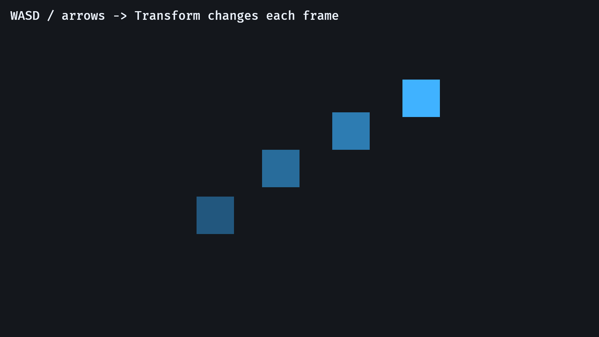
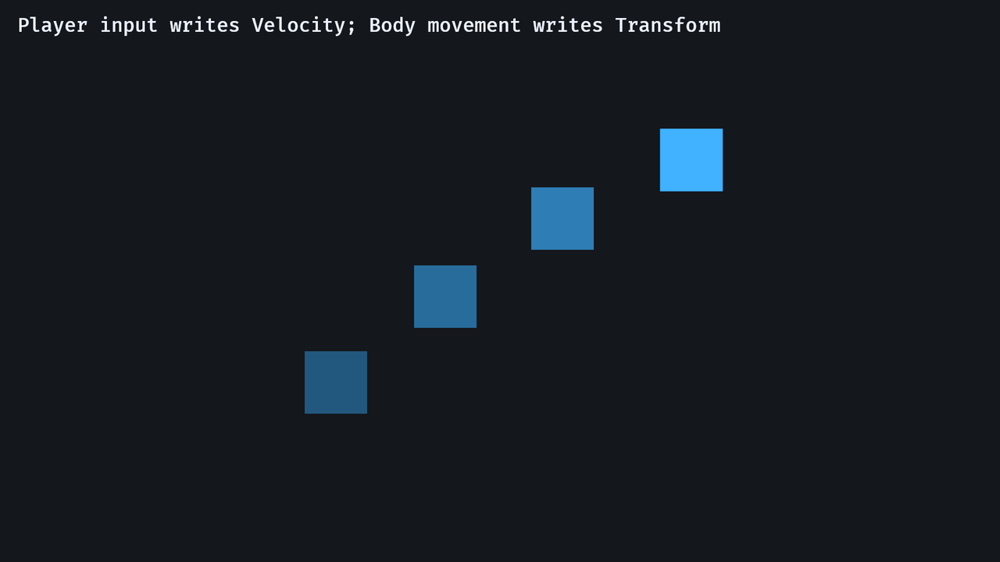

# 4. 입력과 이동


<div align="center">

[목차](index.md) · [← 이전: ECS 기본](03-ecs-fundamentals.md) · [다음: 번들, 플러그인, 세트 →](05-bundles-plugins-sets.md)

</div>

---

이 장은 정적인 sprite를 조작 가능한 엔티티로 바꾼 뒤, 이동을 더 재사용하기 좋은 ECS 형태로 리팩터링합니다.

## 둘러보기: `03_player_input`

실행합니다.

```sh
cargo run --example 03_player_input
```



WASD나 방향키를 사용하세요. 파란 사각형이 움직여야 합니다.

이 예제는 marker component와 resource를 도입합니다.

```rust
#[derive(Component)]
struct Player;

#[derive(Resource)]
struct PlayerSpeed(f32);
```

`Player`는 어떤 엔티티가 입력을 받을지 표시합니다. `PlayerSpeed`는 공유 속도 값을 하나 저장합니다.

```rust
.insert_resource(PlayerSpeed(280.0))
```

setup 시스템은 한 엔티티에 `Player`, `Sprite`, `Transform`을 붙입니다.

```rust
commands.spawn((
    Player,
    Sprite::from_color(Color::srgb(0.25, 0.70, 1.0), Vec2::splat(80.0)),
    Transform::from_translation(Vec3::ZERO),
));
```

## 직접 이동 시스템

이동 시스템은 입력을 읽고 위치를 직접 수정합니다.

```rust
fn move_player(
    time: Res<Time>,
    keyboard: Res<ButtonInput<KeyCode>>,
    speed: Res<PlayerSpeed>,
    mut players: Query<&mut Transform, With<Player>>,
) {
    let mut direction = Vec2::ZERO;
    // input checks...
    let movement = direction.normalize_or_zero() * speed.0 * time.delta_secs();

    for mut transform in &mut players {
        transform.translation += movement.extend(0.0);
    }
}
```

시그니처를 시스템 계약으로 읽습니다.

```text
프레임 시간을 읽습니다.
키보드 상태를 읽습니다.
플레이어 속도를 읽습니다.
Player를 가진 엔티티의 Transform을 수정합니다.
```

모든 조각이 한 곳에 보이므로 첫 버전으로는 좋습니다.

## 입력 리소스

`ButtonInput<KeyCode>`는 Bevy 리소스입니다. 현재 프레임의 키보드 버튼 상태를 저장합니다.

```rust
keyboard.pressed(KeyCode::ArrowLeft)
keyboard.pressed(KeyCode::KeyA)
```

`pressed`는 키를 누르고 있는 동안 true입니다. Bevy에는 "just pressed" 같은 edge-style 검사도 있지만, 누르는 동안 계속 이동하는 경우에는 `pressed`를 써야 합니다.

## 방향 정규화

시스템은 방향 벡터를 누적합니다.

```rust
let mut direction = Vec2::ZERO;
direction.x -= 1.0;
direction.y += 1.0;
```

대각선 입력은 `(-1.0, 1.0)` 같은 벡터를 만들고, 이것은 수평 벡터보다 깁니다. 속도를 적용하기 전에 정규화합니다.

```rust
direction.normalize_or_zero()
```

`normalize_or_zero`는 아무 키도 누르지 않아 벡터가 0일 때 잘못된 수학 값을 피합니다.

## 프레임 독립 이동

이동에는 delta time을 씁니다.

```rust
let movement = direction.normalize_or_zero() * speed.0 * time.delta_secs();
```

`time.delta_secs()`는 이전 프레임의 길이를 초 단위로 반환합니다. 이것을 곱하면 이동이 대략 "프레임당 단위"가 아니라 "초당 단위"가 됩니다.

`Transform.translation`은 `Vec3`이고 movement는 `Vec2`이므로 코드는 z 값을 붙입니다.

```rust
transform.translation += movement.extend(0.0);
```

새 `z` 값은 `0.0`입니다.

## 왜 리팩터링하는가?

직접 이동 시스템은 키보드 입력과 위치 변경을 결합합니다.

```text
keyboard -> Transform
```

플레이어 사각형 하나에는 괜찮습니다. 하지만 적, knockback, scripted movement, physics도 엔티티를 움직여야 하면 제한이 됩니다.

다음 예제는 의도와 실제 움직임을 나눕니다.

```text
입력 시스템 -> Velocity를 씁니다
이동 시스템 -> Velocity를 읽고 Transform을 씁니다
```

## 둘러보기: `04_velocity_body`

실행합니다.

```sh
cargo run --example 04_velocity_body
```



조작감은 비슷하지만 데이터 모델이 다릅니다.

```rust
#[derive(Component)]
struct Body;

#[derive(Component)]
struct Velocity(Vec2);
```

`Body`는 movement system으로 이동 가능한 엔티티를 표시합니다. `Velocity`는 이동 방향을 저장합니다.

입력 시스템은 `Velocity`를 씁니다.

```rust
fn handle_player_input(
    keyboard: Res<ButtonInput<KeyCode>>,
    mut players: Query<&mut Velocity, With<Player>>,
) {
    // calculate direction...

    for mut velocity in &mut players {
        velocity.0 = direction.normalize_or_zero();
    }
}
```

이동 시스템은 `Velocity`를 읽고 `Transform`을 씁니다.

```rust
fn move_bodies(
    time: Res<Time>,
    speed: Res<BodySpeed>,
    mut bodies: Query<(&mut Transform, &Velocity), With<Body>>,
) {
    let movement_scale = speed.0 * time.delta_secs();

    for (mut transform, velocity) in &mut bodies {
        transform.translation += (velocity.0 * movement_scale).extend(0.0);
    }
}
```

이것이 이 튜토리얼의 첫 큰 ECS 설계 단계입니다. 시스템은 서로를 직접 호출하는 대신 컴포넌트 데이터를 통해 소통합니다.

## `.chain()`으로 순서 지정

`04_velocity_body`는 시스템을 이렇게 등록합니다.

```rust
.add_systems(Update, (handle_player_input, move_bodies).chain())
```

순서가 중요합니다.

```text
handle_player_input -> Velocity를 씁니다
move_bodies         -> Velocity를 읽습니다
```

`.chain()`은 Bevy에게 이 순서로 실행하라고 알려줍니다. 순서를 지정하지 않으면 Bevy 스케줄러는 호환 가능한 시스템을 자신이 선택한 순서로 실행할 수 있습니다.

시스템이 서로 다른 플러그인에 살게 되면 `SystemSet`이 같은 ordering 계약을 플러그인 경계 밖으로 표현합니다.

## 연습

로컬 실험에서:

1. `BodySpeed(220.0)`를 `BodySpeed(80.0)`로 바꿔 보세요.
2. `.chain()`을 제거하고 이동이 여전히 맞아 보이는지 관찰하세요.
3. 두 번째 `PlayerBundle::new()`를 spawn하고 `Query<&mut Velocity, With<Player>>`가 무엇을 할지 생각해 보세요.

첫 질문은 "움직이는가?"입니다. 더 강한 ECS 질문은 "각 시스템이 어떤 엔티티에 영향을 주는가?"입니다.

## 흔한 실수

- 프레임 스케일이 적용된 이동량을 `Velocity`에 저장한 뒤 나중에 delta time을 다시 곱함.
- 대각선 입력을 정규화하지 않음.
- `move_bodies`를 `With<Player>`로 필터링해서 적이나 다른 body가 재사용하지 못하게 함.
- `.chain()`, 명시적 ordering, set 없이 시스템이 등록 순서대로 실행된다고 가정함.

---

<div align="center">

[← 이전: ECS 기본](03-ecs-fundamentals.md) · [목차](index.md) · [다음: 번들, 플러그인, 세트 →](05-bundles-plugins-sets.md)

</div>
