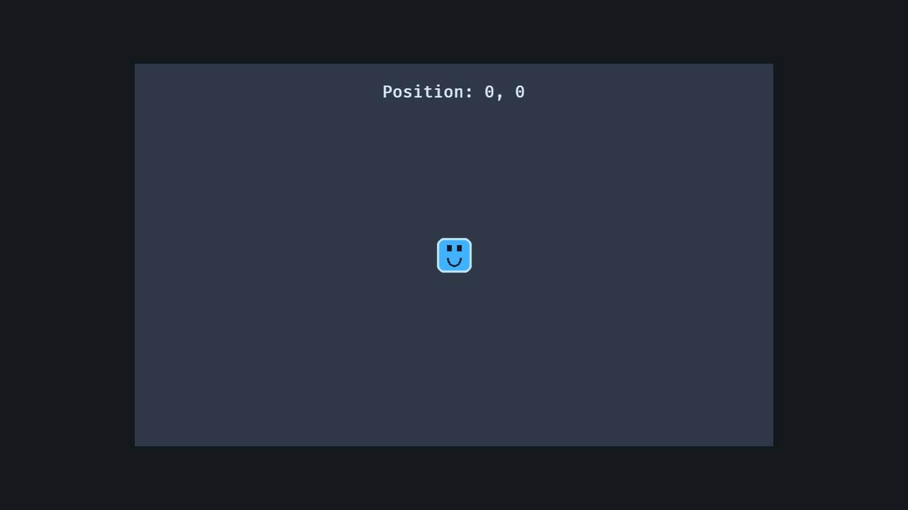

# 6. 에셋, 카메라, UI

<div align="center">

[목차](index.md) · [← 이전: 번들, 플러그인, 세트](05-bundles-plugins-sets.md) · [다음: RPG 기초 예제 →](07-rpg-slice.md)

</div>

---

## 이 장에서 만들 것

이 장이 끝나면 플레이어가 실제 이미지 에셋으로 보이고, 카메라가 플레이어를 따라오며, 월드 공간의 텍스트가 플레이어 위치를 표시합니다.



## 실행

```sh
cargo run --example 06_assets_camera_ui
```

WASD나 방향키로 움직입니다. 카메라가 플레이어를 따라오기 때문에 플레이어는 화면 가운데에 머뭅니다.

## 구현 흐름 1: `AssetServer`로 스프라이트 로드하기

플레이어 bundle은 애셋 서버를 받습니다.

```rust
impl PlayerBundle {
    fn new(asset_server: &AssetServer) -> Self {
        Self {
            player: Player,
            sprite: Sprite::from_image(asset_server.load("player.png")),
            transform: Transform::from_xyz(0.0, 0.0, 1.0),
        }
    }
}
```

`asset_server.load("player.png")`는 핸들을 반환합니다. 핸들은 가볍게 복제해 저장할 수 있고, 실제 이미지 로딩은 Bevy의 애셋 시스템이 처리합니다.

경로는 `assets/` 디렉토리를 기준으로 합니다.

```text
assets/player.png -> asset_server.load("player.png")
```

## 구현 흐름 2: 배경 만들기

예제는 플레이어 뒤에 큰 색상 스프라이트를 둡니다.

```rust
commands.spawn((
    Sprite::from_color(Color::srgb(0.18, 0.22, 0.28), Vec2::new(900.0, 540.0)),
    Transform::from_xyz(0.0, 0.0, 0.0),
));
```

플레이어는 `z = 1.0`, 배경은 `z = 0.0`입니다. 그래서 플레이어가 배경 위에 그려집니다.

2D에서는 보통 `z` 값이 클수록 나중에 그려지고, 화면에서는 위에 보입니다.

## 구현 흐름 3: 플레이어 하나에는 `Single` 쓰기

이동 시스템은 플레이어가 정확히 하나라고 기대합니다.

```rust
fn move_player(
    keyboard: Res<ButtonInput<KeyCode>>,
    time: Res<Time>,
    mut player: Single<&mut Transform, With<Player>>,
) {
    player.translation +=
        (direction.normalize_or_zero() * PLAYER_SPEED * time.delta_secs()).extend(0.0);
}
```

`Single`은 의도를 분명하게 보여줍니다. 이 예제는 여러 명의 플레이어를 다루는 코드가 아니라, 플레이어 하나를 다루는 코드입니다.

## 구현 흐름 4: 카메라가 플레이어 따라가기

카메라 추적 시스템은 `Single` 쿼리 두 개를 씁니다.

```rust
fn follow_player(
    player: Single<&Transform, (With<Player>, Without<Camera2d>)>,
    mut camera: Single<&mut Transform, With<Camera2d>>,
) {
    camera.translation.x = player.translation.x;
    camera.translation.y = player.translation.y;
}
```

`Without<Camera2d>`는 플레이어 쿼리와 카메라 쿼리를 분리합니다. 둘 다 `Transform`을 다루므로 필터가 중요합니다.

이 시스템은 `x`, `y`만 복사합니다. 카메라의 `z`는 그대로 둡니다.

## 구현 흐름 5: 월드 공간 텍스트 추가하기

위치 표시 텍스트는 월드 엔티티입니다.

```rust
commands.spawn((
    HudText,
    Text2d::new("Position: 0, 0"),
    TextFont::from_font_size(24.0),
    TextColor(Color::srgb(0.86, 0.91, 0.98)),
    Transform::from_xyz(0.0, 230.0, 2.0),
));
```

이 텍스트는 `Transform`으로 위치가 정해지므로 게임 월드 안에 있습니다. 예제는 매 프레임 텍스트를 플레이어 근처로 옮깁니다.

```rust
hud.translation.x = player.translation.x;
hud.translation.y = player.translation.y + 230.0;
```

12장에서는 화면에 고정되는 UI를 만듭니다.

## Rust로 보면

이 생성자는 `AssetServer`를 빌립니다.

```rust
fn new(asset_server: &AssetServer) -> Self
```

Bundle이 애셋 서버를 소유하는 것이 아닙니다. 잠깐 빌려서 핸들을 요청할 뿐입니다.

`format!`은 `String`을 만듭니다.

```rust
hud.0 = format!(
    "Position: {:.0}, {:.0}",
    player.translation.x, player.translation.y
);
```

`{:.0}`은 소수점 없이 숫자를 표시하라는 뜻입니다.

## Bevy로 보면

이 장에는 좌표 공간이 두 개 나옵니다.

```text
월드 공간     Sprite, Transform, Text2d, 카메라 이동
화면 공간     Node, Text, 고정 HUD, 메뉴
```

`Text2d`는 월드 공간 텍스트입니다. `Text`와 `Node`는 UI 텍스트입니다. RPG에서는 둘 다 쓰게 됩니다.

## 확인

실행합니다.

```sh
cargo run --example 06_assets_camera_ui
```

기대 결과:

- 색상 사각형이 아니라 플레이어 이미지가 보입니다.
- 움직이면 카메라가 플레이어 위치로 따라옵니다.
- 위치 텍스트가 플레이어를 따라오며 숫자가 갱신됩니다.

## 바꿔보기

`follow_player`에 오프셋을 더해 봅니다.

```rust
camera.translation.x = player.translation.x + 120.0;
camera.translation.y = player.translation.y + 60.0;
```

기대 결과: 플레이어가 화면 정중앙에 있지 않고, 카메라가 플레이어에서 조금 떨어진 지점을 따라갑니다.

---

<div align="center">

[← 이전: 번들, 플러그인, 세트](05-bundles-plugins-sets.md) · [목차](index.md) · [다음: RPG 기초 예제 →](07-rpg-slice.md)

</div>
