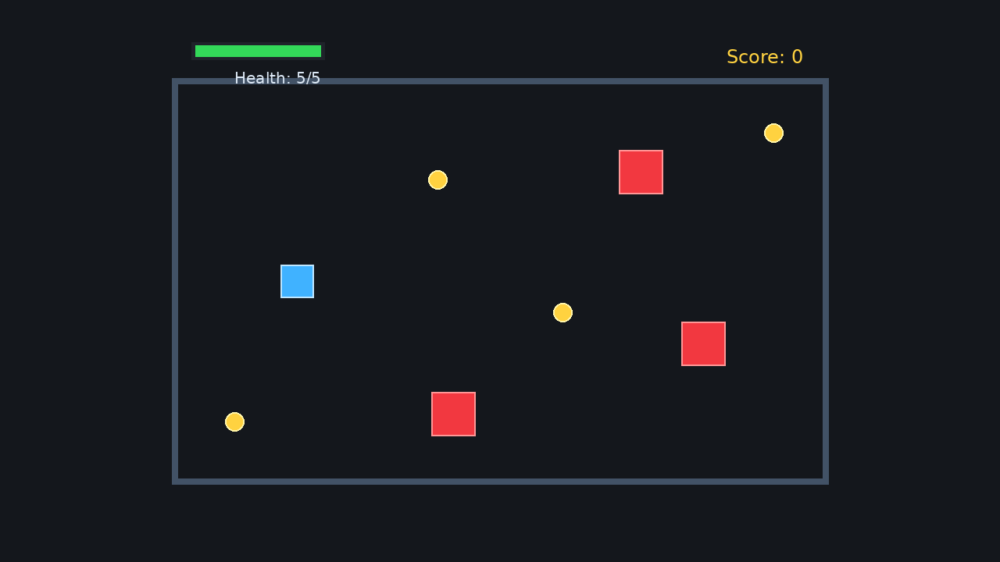

# 7. RPG 기초 조각


<div align="center">

[목차](index.md) · [← 이전: 에셋, 카메라, UI](06-assets-camera-ui.md) · [다음: 부드러운 카메라 추적 →](08-smooth-camera-follow.md)

</div>

---

실행합니다.

```sh
cargo run --example 07_rpg_slice
```



이 기초 예제는 앞에서 배운 조각들을 하나의 작은 게임 루프로 합칩니다.

- 플레이어 입력
- 단순한 적 추적
- 재사용 가능한 바디 이동
- 경기장 경계 제한
- 수집 아이템 획득
- 쿨다운이 있는 적 접촉 데미지
- 체력과 점수 표시
- 명시적인 시스템 실행 순서

이 장이 튜토리얼의 최종 결과는 아닙니다. 이후 장에서 부드러운 카메라, 웨이브, 히트박스, 화면 고정 UI, 애니메이션 상태, 맵 지오메트리, 게임 상태, 저장/불러오기를 이 기초 위에 올립니다.

## 상수

예제 위쪽은 튜닝 값을 한곳에 둡니다.

```rust
const PLAYER_SIZE: Vec2 = Vec2::splat(42.0);
const ENEMY_SIZE: Vec2 = Vec2::new(56.0, 56.0);
const COLLECTIBLE_SIZE: Vec2 = Vec2::splat(24.0);
const PLAYER_SPEED: f32 = 260.0;
const ENEMY_SPEED: f32 = 80.0;
const MAX_HEALTH: i32 = 5;
const ARENA_HALF_SIZE: Vec2 = Vec2::new(420.0, 260.0);
```

예제가 런타임에 이 값을 바꾸지 않으므로 리소스가 아닙니다. 나중에 난이도 설정이나 실시간 튜닝을 원한다면 일부는 리소스가 될 수 있습니다.

## System Set

기초 예제는 다섯 단계의 `Update` 순서를 씁니다.

```rust
#[derive(SystemSet, Debug, Clone, PartialEq, Eq, Hash)]
enum GameSet {
    Input,
    Ai,
    Movement,
    Collision,
    Display,
}
```

플러그인은 이 set들을 chain합니다.

```rust
.configure_sets(
    Update,
    (
        GameSet::Input,
        GameSet::Ai,
        GameSet::Movement,
        GameSet::Collision,
        GameSet::Display,
    )
        .chain(),
)
```

결과적인 frame flow:

```text
Input      player velocity from keyboard
Ai         enemy velocity toward player
Movement   apply velocity and clamp to arena
Collision  collect items and damage player
Display    update health bar and text HUD
```

이 순서는 설계의 일부입니다. 충돌은 이동 뒤에 일어나야 하고, display는 최신 health와 score를 반영해야 합니다.

## Component와 Resource

예제는 정체성을 위해 marker component를 씁니다.

```rust
struct Player;
struct Enemy;
struct Collectible;
struct HealthBarFill;
struct HealthText;
struct ScoreText;
```

엔티티별 상태에는 data component를 씁니다.

```rust
struct Body {
    half_size: Vec2,
}

struct Velocity(Vec2);

struct Health {
    current: i32,
    max: i32,
}
```

`Health`는 플레이어 엔티티에 속하므로 컴포넌트입니다. `Score`는 예제 전체에 하나인 점수이므로 리소스입니다.

```rust
#[derive(Resource)]
struct Score(u32);
```

플러그인이 이것을 insert합니다.

```rust
.insert_resource(Score(0))
```

의도적인 분리입니다.

```text
Health = 플레이어 엔티티에 붙는 컴포넌트
Score  = 게임 전체에 하나만 있는 리소스
```

## 명시적 Bundle

기초 예제는 도메인 엔티티에 튜플 spawn 대신 명시적인 번들을 씁니다.

```rust
#[derive(Bundle)]
struct PlayerBundle {
    player: Player,
    body: BodyBundle,
    sprite: Sprite,
    health: Health,
}
```

`BodyBundle`은 공유되는 물리 컴포넌트를 담습니다.

```rust
#[derive(Bundle)]
struct BodyBundle {
    body: Body,
    velocity: Velocity,
    transform: Transform,
}
```

그리고 `PlayerBundle`, `EnemyBundle`, `CollectibleBundle`이 각각 자신의 spawn shape를 정의합니다.

```rust
commands.spawn(PlayerBundle::new(Vec3::new(-260.0, 0.0, 1.0)));
commands.spawn(EnemyBundle::new(position));
commands.spawn(CollectibleBundle::new(position));
```

중첩 bundle은 spawn될 때 평평하게 펼쳐집니다. 플레이어 엔티티는 다음을 받습니다.

```text
Player
Body
Velocity
Transform
Sprite
Health
```

적은 다음을 받습니다.

```text
Enemy
Body
Velocity
Transform
Sprite
```

수집 아이템도 `BodyBundle`을 사용하므로 `Velocity`를 가집니다. 하지만 어떤 시스템도 수집 아이템에 0이 아닌 속도를 주지 않습니다. 이렇게 하면 수집 아이템에 쓰지 않는 컴포넌트 하나가 생기지만 번들은 단순해집니다.

## Setup

`setup`은 초기 월드를 만듭니다.

```text
Camera2d
arena frame sprites
one player
three enemies
four collectibles
health bar background
health bar fill
health text
score text
```

arena border는 helper 함수가 만듭니다.

```rust
fn spawn_arena_frame(commands: &mut Commands) {
    // spawns four rectangle sprites
}
```

이 helper는 `setup`에서 호출되므로 시스템이 아닙니다. `&mut Commands`를 받아 추가 spawn을 큐에 넣습니다.

## Player Input

`player_input`은 앞 장의 입력 아이디어와 같지만, 초당 단위의 실제 velocity를 씁니다.

```rust
fn player_input(
    keyboard: Res<ButtonInput<KeyCode>>,
    mut players: Query<&mut Velocity, With<Player>>,
) {
    // ...
    for mut velocity in &mut players {
        velocity.0 = direction.normalize_or_zero() * PLAYER_SPEED;
    }
}
```

이 시스템은 `Transform`을 건드리지 않습니다. 플레이어가 어느 방향으로 움직이고 싶은지만 말합니다.

## Enemy AI

적은 플레이어를 추적합니다.

```rust
fn enemy_ai(
    player: Single<&Transform, With<Player>>,
    mut enemies: Query<(&Transform, &mut Velocity), With<Enemy>>,
) {
    let player_position = player.translation.truncate();

    for (transform, mut velocity) in &mut enemies {
        let to_player = player_position - transform.translation.truncate();
        velocity.0 = to_player.normalize_or_zero() * ENEMY_SPEED;
    }
}
```

`Single<&Transform, With<Player>>`는 정확히 하나의 player transform이 있어야 한다는 뜻입니다. 각 적은 자신의 transform을 읽고 자신의 velocity를 씁니다.

이 단순한 AI에는 pathfinding이 없습니다. 그냥 플레이어 쪽으로 직선 이동합니다.

## Movement와 Arena Clamp

플러그인은 movement와 clamp를 `GameSet::Movement` 안에서 순서가 있는 쌍으로 등록합니다.

```rust
.add_systems(
    Update,
    (move_bodies, clamp_to_arena)
        .chain()
        .in_set(GameSet::Movement),
)
```

순서가 중요합니다. 먼저 velocity를 적용하고, 그 결과 위치를 arena 안으로 제한합니다.

movement는 velocity를 적용합니다.

```rust
fn move_bodies(time: Res<Time>, mut bodies: Query<(&mut Transform, &Velocity), With<Body>>) {
    for (mut transform, velocity) in &mut bodies {
        transform.translation += (velocity.0 * time.delta_secs()).extend(0.0);
    }
}
```

그다음 `clamp_to_arena`가 body를 arena 안에 유지합니다.

```rust
fn clamp_to_arena(mut bodies: Query<(&mut Transform, &Body), With<Body>>) {
    for (mut transform, body) in &mut bodies {
        let min = -ARENA_HALF_SIZE + body.half_size;
        let max = ARENA_HALF_SIZE - body.half_size;
        transform.translation.x = transform.translation.x.clamp(min.x, max.x);
        transform.translation.y = transform.translation.y.clamp(min.y, max.y);
    }
}
```

`Body.half_size` 덕분에 큰 sprite가 경계 밖으로 시각적으로 넘어가지 않습니다. body의 중심은 arena에서 자기 extents를 뺀 범위로 clamp됩니다.

## AABB Collision

collision helper는 axis-aligned bounding box를 씁니다.

```rust
fn overlaps(
    a_transform: &Transform,
    a_body: &Body,
    b_transform: &Transform,
    b_body: &Body,
) -> bool {
    let a = a_transform.translation.truncate();
    let b = b_transform.translation.truncate();
    let distance = (a - b).abs();
    let allowed = a_body.half_size + b_body.half_size;

    distance.x < allowed.x && distance.y < allowed.y
}
```

x와 y 각각에서 overlap을 검사합니다.

```text
horizontal distance < combined half widths
vertical distance   < combined half heights
```

예제가 회전하지 않은 사각형을 쓰기 때문에 동작합니다. 일반 물리 엔진은 아닙니다.

## Collectible: `Commands`와 `ResMut`

`collect_items`는 플레이어와 collectible의 overlap을 감지합니다.

```rust
fn collect_items(
    mut commands: Commands,
    mut score: ResMut<Score>,
    player: Single<(&Transform, &Body), With<Player>>,
    collectibles: Query<(Entity, &Transform, &Body), With<Collectible>>,
) {
    let (player_transform, player_body) = *player;

    for (entity, transform, body) in &collectibles {
        if overlaps(player_transform, player_body, transform, body) {
            commands.entity(entity).despawn();
            score.0 += 1;
            info!("score: {}", score.0);
        }
    }
}
```

despawn에는 엔티티 ID가 필요하므로 쿼리에 `Entity`가 포함됩니다. `Commands`는 despawn을 큐에 넣습니다. `ResMut<Score>`는 전역 점수 리소스에 대한 가변 접근을 줍니다.

## Enemy Hit: `Local` Cooldown과 `Health`

`enemy_hits_player`는 적이 overlap할 때 플레이어에게 피해를 줍니다.

```rust
fn enemy_hits_player(
    time: Res<Time>,
    player: Single<(&Transform, &Body, &mut Health), With<Player>>,
    enemies: Query<(&Transform, &Body), With<Enemy>>,
    mut hit_cooldown: Local<f32>,
) {
    *hit_cooldown -= time.delta_secs();

    if *hit_cooldown > 0.0 {
        return;
    }

    let (player_transform, player_body, mut health) = player.into_inner();

    for (enemy_transform, enemy_body) in &enemies {
        if overlaps(player_transform, player_body, enemy_transform, enemy_body) {
            health.current = (health.current - 1).max(0);
            *hit_cooldown = 1.0;
            info!("health: {}", health.current);
            break;
        }
    }
}
```

`Local<f32>`는 이 시스템만의 쿨다운 상태를 저장합니다. 시스템은 매 프레임 delta time을 빼고, 피격이 발생하면 쿨다운을 1초로 reset합니다.

`Health`는 플레이어 컴포넌트에서 직접 수정됩니다. `(health.current - 1).max(0)`은 체력이 0 아래로 내려가지 않게 합니다.

## Display: Health Bar와 Text HUD

체력 막대 fill은 `HealthBarFill`이 붙은 스프라이트입니다. 표시 시스템은 이것의 크기와 위치를 갱신합니다.

```rust
fn update_health_bar(
    player: Single<&Health, With<Player>>,
    mut bars: Query<(&mut Sprite, &mut Transform), With<HealthBarFill>>,
) {
    let health = *player;
    let health_fraction = health.current as f32 / health.max as f32;

    for (mut sprite, mut transform) in &mut bars {
        sprite.custom_size = Some(Vec2::new(160.0 * health_fraction, 14.0));
        transform.translation.x = -315.0 - (160.0 * (1.0 - health_fraction) / 2.0);
    }
}
```

텍스트 HUD는 두 `Text2d` 엔티티를 갱신합니다.

```rust
fn update_hud_text(
    score: Res<Score>,
    player: Single<&Health, With<Player>>,
    mut health_text: Single<&mut Text2d, (With<HealthText>, Without<ScoreText>)>,
    mut score_text: Single<&mut Text2d, (With<ScoreText>, Without<HealthText>)>,
) {
    let health = *player;
    health_text.0 = format!("Health: {}/{}", health.current, health.max);
    score_text.0 = format!("Score: {}", score.0);
}
```

`Without` 필터는 두 가변 `Text2d` 접근이 서로 다른 엔티티에 대한 것임을 증명합니다.

## 왜 이 구조가 확장되는가

각 기능은 명확한 데이터 흐름을 가집니다.

```text
키보드 입력    -> Player의 Velocity
적 AI          -> Enemy의 Velocity
Velocity       -> Body의 Transform
Transform/Body -> 충돌 판정
Collision      -> Score 리소스, Health 컴포넌트, despawn commands
Health/Score   -> 스프라이트와 Text2d 표시
```

기능을 추가할 때도 같은 어휘 안에 배치합니다.

```text
New per-entity data?  Component
One global value?     Resource
Spawn recipe?         Bundle
Behavior?             System
Feature registration? Plugin
Order dependency?     SystemSet
```

## 연습

한 번에 하나씩 바꿔 보세요.

1. 네 번째 enemy spawn position을 추가하세요.
2. `ENEMY_SPEED`를 바꾸고 collision pressure가 어떻게 달라지는지 관찰하세요.
3. collectible position을 하나 더 추가하고 score text가 갱신되는지 확인하세요.
4. `MAX_HEALTH`를 바꾸고 시작 텍스트와 health bar가 여전히 말이 되는지 확인하세요.
5. 미래 effects를 위해 `Collision`과 `Display` 사이에 새 `GameSet`을 추가하되, 아직 어떤 시스템도 넣지 마세요.

## 흔한 실수

- 여기서 score를 컴포넌트라고 문서화함. 이 예제에서 `Score`는 리소스입니다.
- 여기서 health를 리소스라고 문서화함. 이 예제에서 `Health`는 플레이어 엔티티에 있습니다.
- 매칭된 엔티티를 despawn해야 하는데 query에 `Entity`를 포함하지 않음.
- AABB overlap을 중심점 검사로 바꾸고 사각형 크기가 왜 더 이상 중요하지 않은지 고민함.
- HUD text query에서 `Without` 필터를 제거해 가변 query conflict를 만듦.
- 이것을 physics engine으로 취급함. 회전하지 않은 사각형에 대한 hand-written collision입니다.

---

<div align="center">

[← 이전: 에셋, 카메라, UI](06-assets-camera-ui.md) · [목차](index.md) · [다음: 부드러운 카메라 추적 →](08-smooth-camera-follow.md)

</div>
