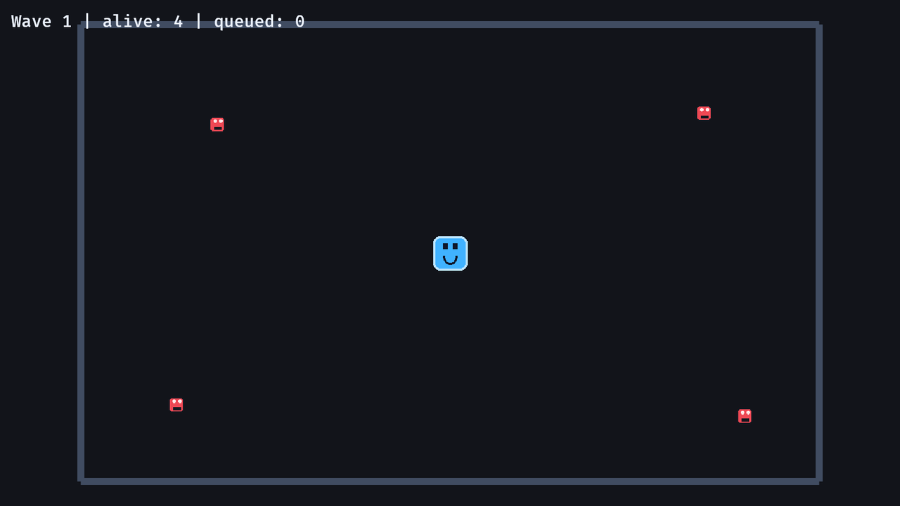

# 9. 적 웨이브

<div align="center">

[목차](index.md) · [← 이전: 부드러운 카메라 추적](08-smooth-camera-follow.md) · [다음: 공격 히트박스 →](10-attack-hitbox.md)

</div>

---

## 이 장에서 만들 것

이 장이 끝나면 적이 웨이브 단위로 시간차를 두고 생성됩니다. 현재 웨이브, 남은 생성 수, 다음 생성 위치, 다음 생성 타이밍을 명시적으로 추적합니다.



## 실행

```sh
cargo run --example 09_enemy_waves
```

적은 아레나 모서리에서 생성되고, 플레이어를 쫓아오다가 짧은 시간이 지나면 사라집니다. 적이 모두 사라지고 생성 대기 수도 0이 되면 다음 웨이브로 넘어갑니다.

## 구현 흐름 1: 웨이브 상태를 리소스에 넣기

웨이브 상태는 전역 게임플레이 상태입니다. 그래서 리소스가 맞습니다.

```rust
#[derive(Resource)]
struct WaveSpawner {
    wave: u32,
    remaining_to_spawn: u32,
    spawn_index: usize,
    timer: Timer,
}
```

`Default`는 첫 웨이브 값을 만듭니다.

```rust
impl Default for WaveSpawner {
    fn default() -> Self {
        Self {
            wave: 1,
            remaining_to_spawn: 4,
            spawn_index: 0,
            timer: Timer::from_seconds(0.35, TimerMode::Repeating),
        }
    }
}
```

등록은 이렇게 합니다.

```rust
.init_resource::<WaveSpawner>()
```

`init_resource`는 해당 리소스가 없으면 기본값으로 생성합니다.

## 구현 흐름 2: 적에게 수명 주기

예제에서는 적이 자동으로 사라져야 웨이브가 끝납니다.

```rust
#[derive(Component)]
struct EnemyLifetime(Timer);
```

각 적은 자기 타이머를 가집니다.

```rust
lifetime: EnemyLifetime(Timer::from_seconds(2.5, TimerMode::Once)),
```

만료 시스템은 타이머가 끝난 적을 `despawn`합니다.

```rust
fn expire_enemies(
    mut commands: Commands,
    time: Res<Time>,
    mut enemies: Query<(Entity, &mut EnemyLifetime), With<Enemy>>,
) {
    for (entity, mut lifetime) in &mut enemies {
        lifetime.0.tick(time.delta());

        if lifetime.0.is_finished() {
            commands.entity(entity).despawn();
        }
    }
}
```

## 구현 흐름 3: 다음 웨이브 시작하기

스포너는 조건 두 개를 확인합니다.

```rust
if spawner.remaining_to_spawn == 0 && enemies.iter().count() == 0 {
    spawner.wave += 1;
    spawner.remaining_to_spawn = spawner.wave + 3;
    spawner.timer.reset();
}
```

생성 대기 중인 적이 없고, 살아 있는 적도 없어야 다음 웨이브가 시작됩니다.

## 구현 흐름 4: 타이머 진행에 맞춰 생성하기

스포너는 매 프레임 타이머를 진행시킵니다.

```rust
spawner.timer.tick(time.delta());

if !spawner.timer.just_finished() {
    return;
}
```

타이머가 막 끝난 프레임에만 적을 생성합니다.

```rust
let spawn = SPAWN_POINTS[spawner.spawn_index % SPAWN_POINTS.len()];
spawner.spawn_index += 1;
spawner.remaining_to_spawn -= 1;

commands.spawn(EnemyBundle::new(spawn.extend(2.0), asset_server.as_ref()));
```

`%`를 쓰면 생성 지점 개수보다 웨이브 크기가 커도 위치가 순환됩니다.

## 구현 흐름 5: 웨이브 상태 표시하기

UI 텍스트는 리소스와 Enemy 쿼리를 읽습니다.

```rust
fn update_wave_text(
    spawner: Res<WaveSpawner>,
    enemies: Query<(), With<Enemy>>,
    mut text: Single<&mut Text, With<WaveText>>,
) {
    text.0 = format!(
        "Wave {} | alive: {} | queued: {}",
        spawner.wave,
        enemies.iter().count(),
        spawner.remaining_to_spawn
    );
}
```

`Query<(), With<Enemy>>`는 “Enemy가 붙은 엔티티를 세기만 하고, 컴포넌트 데이터는 필요 없다”는 뜻입니다.

## Rust로 보면

이 상수는 배열입니다.

```rust
const SPAWN_POINTS: [Vec2; 4] = [
    Vec2::new(-470.0, 260.0),
    Vec2::new(470.0, 260.0),
    Vec2::new(-470.0, -260.0),
    Vec2::new(470.0, -260.0),
];
```

`[Vec2; 4]`는 `Vec2` 값이 정확히 네 개 있다는 뜻입니다.

인덱스에는 `usize`를 씁니다.

```rust
spawn_index: usize
```

Rust 배열 인덱스 타입은 `usize`입니다.

## Bevy로 보면

웨이브 생성 상태는 `Update` 안의 지역 변수로 둘 수 없습니다. 프레임이 지나도 유지되어야 하기 때문입니다. 기준은 이렇게 잡습니다.

```text
한 프레임 안에서만 필요한 계산값     -> 지역 변수
한 시스템만 기억하면 되는 값         -> Local<T>
여러 프레임/시스템에서 쓰는 전역 상태 -> 리소스
```

## 확인

실행합니다.

```sh
cargo run --example 09_enemy_waves
```

기대 결과:

- 웨이브 텍스트가 wave 1에서 시작합니다.
- 적이 모서리에서 시간차를 두고 나타납니다.
- 적이 생성되고 사라지면서 alive 수가 바뀝니다.
- 현재 웨이브가 끝나면 다음 웨이브가 시작됩니다.

## 바꿔보기

타이머를 바꿔 봅니다.

```rust
Timer::from_seconds(0.35, TimerMode::Repeating)
```

```rust
Timer::from_seconds(0.08, TimerMode::Repeating)
```

기대 결과: 적이 훨씬 빠르게 생성됩니다. 웨이브 규칙은 그대로 유지됩니다.

---

<div align="center">

[← 이전: 부드러운 카메라 추적](08-smooth-camera-follow.md) · [목차](index.md) · [다음: 공격 히트박스 →](10-attack-hitbox.md)

</div>
