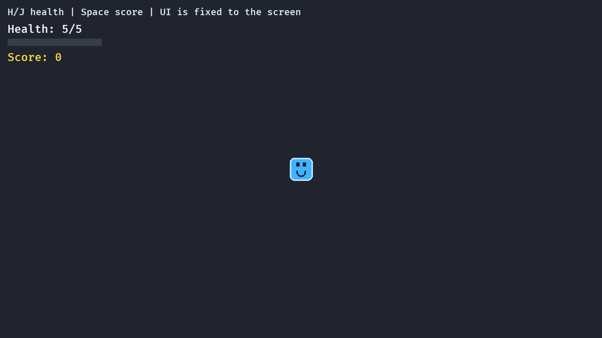

# 12. 화면 고정 UI

<div align="center">

[목차](index.md) · [← 이전: 스프라이트 에셋](11-sprite-assets.md) · [다음: 애니메이션 상태 →](13-animation-state.md)

</div>

---

## 이 장에서 만들 것

이 장이 끝나면 카메라가 플레이어를 따라 움직여도 체력과 점수 UI는 화면에 고정됩니다.



## 실행

```sh
cargo run --example 12_screen_space_ui
```

WASD/방향키로 움직입니다. `H`, `J`로 체력을 바꾸고, Space로 점수를 올립니다.

## 구현 흐름 1: 메인 카메라 표시하기

카메라에 표식을 붙입니다.

```rust
#[derive(Component)]
struct MainCamera;

commands.spawn((Camera2d, MainCamera));
```

이 표식 덕분에 카메라 시스템은 게임 카메라를 정확히 고를 수 있습니다.

## 구현 흐름 2: `Node`로 UI 텍스트 만들기

화면 고정 UI는 `Text`와 layout 컴포넌트를 씁니다.

```rust
commands.spawn((
    HealthText,
    Text::new("Health: 5/5"),
    TextFont::from_font_size(24.0),
    TextColor(Color::srgb(0.94, 0.97, 1.0)),
    Node {
        position_type: PositionType::Absolute,
        top: px(48),
        left: px(16),
        ..default()
    },
));
```

이 엔티티에는 `Transform`이 없습니다. 위치는 월드 좌표가 아니라 UI layout 데이터로 정해집니다.

## 구현 흐름 3: UI 체력 바 만들기

체력 바 배경과 채움은 UI node입니다.

```rust
commands.spawn((
    Node {
        position_type: PositionType::Absolute,
        top: px(82),
        left: px(16),
        width: px(200),
        height: px(16),
        ..default()
    },
    BackgroundColor(Color::srgb(0.22, 0.24, 0.30)),
));
```

채움 node에는 표식을 붙입니다.

```rust
#[derive(Component)]
struct HealthBarFill;
```

이 표식으로 갱신 시스템이 채움 width만 수정할 수 있습니다.

## 구현 흐름 4: 화면 고정인지 확인하기

카메라는 플레이어를 따라갑니다.

```rust
fn follow_player_with_camera(
    player: Single<&Transform, (With<Player>, Without<MainCamera>)>,
    mut camera: Single<&mut Transform, (With<MainCamera>, Without<Player>)>,
) {
    camera.translation.x = player.translation.x;
    camera.translation.y = player.translation.y;
}
```

UI가 고정되는 이유는 `Node`로 화면 좌표에 배치했기 때문입니다.

6장의 월드 텍스트는 `Transform`을 따라 움직였습니다. 화면 텍스트는 카메라 이동의 영향을 받지 않습니다.

## 구현 흐름 5: 리소스와 컴포넌트로 UI 갱신하기

디버그 시스템은 점수와 체력을 바꿉니다.

```rust
if keyboard.just_pressed(KeyCode::Space) {
    score.0 += 1;
}

if keyboard.just_pressed(KeyCode::KeyH) {
    player.current = (player.current - 1).max(0);
}
```

UI 시스템은 데이터를 읽고 텍스트와 노드 너비를 바꿉니다.

```rust
fn update_screen_space_ui(
    score: Res<Score>,
    player: Single<&Health, With<Player>>,
    mut health_text: Single<&mut Text, (With<HealthText>, Without<ScoreText>)>,
    mut score_text: Single<&mut Text, (With<ScoreText>, Without<HealthText>)>,
    mut health_bar: Single<&mut Node, With<HealthBarFill>>,
) {
    let health = *player;
    let health_fraction = health.current as f32 / health.max as f32;

    health_text.0 = format!("Health: {}/{}", health.current, health.max);
    score_text.0 = format!("Score: {}", score.0);
    health_bar.width = px(200.0 * health_fraction);
}
```

## Rust로 보면

`as f32`는 정수를 float로 바꿉니다.

```rust
let health_fraction = health.current as f32 / health.max as f32;
```

체력 비율로 체력 바의 너비를 계산해야 하므로 부동소수점 나눗셈이 필요합니다.

텍스트 쿼리의 필터는 어떤 엔티티를 수정하는지 모호해지지 않게 합니다.

```rust
(With<HealthText>, Without<ScoreText>)
```

이 필터는 두 가변 텍스트 쿼리가 서로 다른 엔티티를 대상으로 한다고 Bevy에 알려줍니다.

## Bevy로 보면

구분은 이렇게 잡습니다.

```text
Text2d + Transform    게임 월드 안의 라벨
Text + Node           화면에 고정되는 UI
Sprite + Transform    월드에 그려지는 오브젝트
Node + BackgroundColor UI 사각형
```

대부분의 RPG HUD는 화면 고정 UI로 만드는 것이 맞습니다. 데미지 숫자나 이름표처럼 월드 안에 떠 있어야 하는 것은 월드 텍스트로 둡니다.

## 확인

실행합니다.

```sh
cargo run --example 12_screen_space_ui
```

기대 결과:

- 플레이어가 움직이면 카메라도 움직입니다.
- HUD는 화면 왼쪽 위에 고정됩니다.
- `H`를 누르면 체력이 줄고 체력 바가 짧아집니다.
- `J`를 누르면 체력이 회복됩니다.
- Space를 누르면 점수가 오릅니다.

## 바꿔보기

HUD를 오른쪽으로 옮겨 봅니다.

```rust
left: px(16),
```

```rust
right: px(16),
```

기대 결과: UI가 화면 오른쪽에 붙습니다. 같은 정렬로 움직이고 싶은 HUD node에 같은 변경을 적용하면 됩니다.

---

<div align="center">

[← 이전: 스프라이트 에셋](11-sprite-assets.md) · [목차](index.md) · [다음: 애니메이션 상태 →](13-animation-state.md)

</div>
