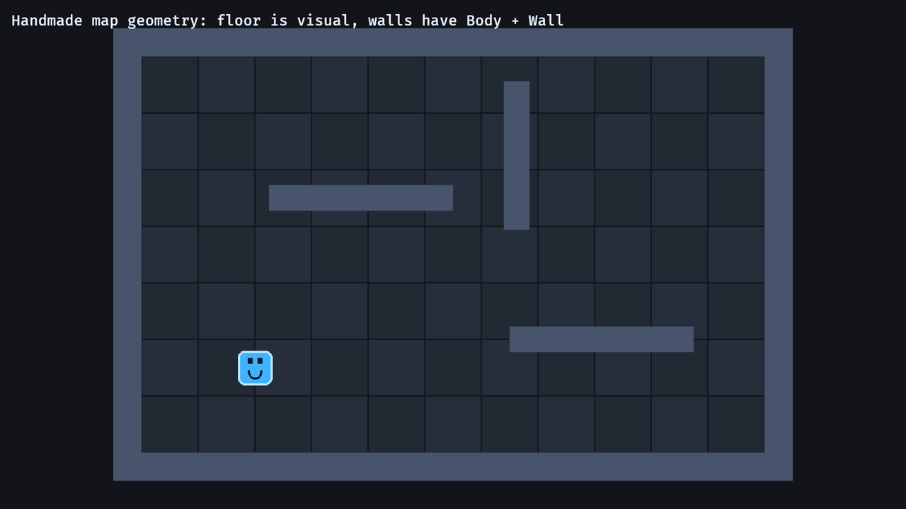

# 14. 직접 만든 맵 구조

<div align="center">

[목차](index.md) · [← 이전: 애니메이션 상태](13-animation-state.md) · [다음: 게임 상태 →](15-game-states.md)

</div>

---

## 이 장에서 만들 것

이 장이 끝나면 맵을 직접 작성한 구조로 만듭니다. 바닥은 시각용 타일이고, 벽은 충돌 판정이 있는 단단한 사각형입니다.



## 실행

```sh
cargo run --example 14_handmade_map_geometry
```

WASD/방향키로 움직이고 벽에 부딪혀 봅니다.

## 구현 흐름 1: 시각용 바닥과 충돌 벽 분리하기

바닥은 보기 위한 요소입니다.

```rust
fn spawn_floor(commands: &mut Commands) {
    let tile_size = Vec2::splat(80.0);

    for x in -5..=5 {
        for y in -3..=3 {
            commands.spawn((
                Sprite::from_color(color, tile_size - Vec2::splat(2.0)),
                Transform::from_xyz(x as f32 * tile_size.x, y as f32 * tile_size.y, 0.0),
            ));
        }
    }
}
```

바닥 타일에는 `Sprite`와 `Transform`만 있고, `Body`나 `Wall`은 없습니다.

벽은 게임플레이 구조물입니다.

```rust
#[derive(Component)]
struct Wall;

#[derive(Bundle)]
struct WallBundle {
    wall: Wall,
    body: BodyBundle,
    sprite: Sprite,
}
```

벽은 보이기도 하고, 충돌도 합니다.

## 구현 흐름 2: Static body 데이터 쓰기

이 장의 `BodyBundle`은 `Body`와 `Transform`을 저장합니다.

```rust
#[derive(Bundle)]
struct BodyBundle {
    body: Body,
    transform: Transform,
}
```

플레이어는 움직여야 하므로 `Velocity`를 따로 가집니다.

```rust
#[derive(Bundle)]
struct PlayerBundle {
    player: Player,
    body: BodyBundle,
    velocity: Velocity,
    sprite: Sprite,
}
```

구분은 이렇게 보면 됩니다.

```text
Body       충돌할 수 있음
Velocity   이번 프레임에 움직일 수 있음
Wall       충돌하는 맵 장애물
Player     플레이어가 조작하는 body
```

## 구현 흐름 3: 데이터로 벽 생성하기

벽 목록은 직접 적은 맵 구조 데이터입니다.

```rust
for (position, size) in [
    (Vec3::new(0.0, 300.0, 2.0), Vec2::new(900.0, 40.0)),
    (Vec3::new(0.0, -300.0, 2.0), Vec2::new(900.0, 40.0)),
    (Vec3::new(-460.0, 0.0, 2.0), Vec2::new(40.0, 640.0)),
    (Vec3::new(460.0, 0.0, 2.0), Vec2::new(40.0, 640.0)),
    (Vec3::new(-130.0, 80.0, 2.0), Vec2::new(260.0, 36.0)),
] {
    commands.spawn(WallBundle::new(position, size));
}
```

타일맵 플러그인을 쓰는 방식이 아닙니다. Rust 데이터로 직접 작은 맵 구조를 표현합니다.

## 구현 흐름 4: 먼저 움직이고, 나중에 충돌 해결하기

시스템 순서는 이렇습니다.

```rust
.configure_sets(
    Update,
    (GameSet::Input, GameSet::Movement, GameSet::Collision).chain(),
)
```

먼저 이동합니다.

```rust
fn move_player(time: Res<Time>, mut players: Query<(&mut Transform, &Velocity), With<Player>>) {
    for (mut transform, velocity) in &mut players {
        transform.translation += (velocity.0 * time.delta_secs()).extend(0.0);
    }
}
```

그다음 충돌 시스템이 잘못 들어간 위치를 밀어냅니다.

## 구현 흐름 5: 벽과 겹친 만큼 밀어내기

충돌 해결 시스템은 먼저 벽 사각형을 모읍니다.

```rust
let mut walls = Vec::new();

for (transform, body, _, wall) in &mut bodies {
    if wall.is_some() {
        walls.push((transform.translation.truncate(), body.half_size));
    }
}
```

그다음 플레이어를 가장 얕게 겹친 축 방향으로 밀어냅니다.

```rust
let delta = player_position - *wall_position;
let overlap = player_body.half_size + *wall_half_size - delta.abs();

if overlap.x <= 0.0 || overlap.y <= 0.0 {
    continue;
}

if overlap.x < overlap.y {
    player_transform.translation.x += overlap.x * delta.x.signum();
} else {
    player_transform.translation.y += overlap.y * delta.y.signum();
}
```

단순한 AABB 충돌 처리입니다. 직사각형 벽이 있는 RPG 맵에는 충분히 쓸 만합니다.

## Rust로 보면

충돌 쿼리는 선택 컴포넌트를 씁니다.

```rust
Query<(&mut Transform, &Body, Option<&Player>, Option<&Wall>)>
```

`Option<&Wall>` 덕분에 하나의 쿼리로 플레이어와 벽을 모두 볼 수 있습니다. `wall.is_some()`은 이 엔티티에 `Wall` 컴포넌트가 있다는 뜻입니다.

맵 반복문에서는 정수를 부동소수점 값으로 변환합니다.

```rust
x as f32 * tile_size.x
```

`-5..=5`에서 나온 반복문 변수는 정수이고, Bevy 위치는 `f32`입니다.

## Bevy로 보면

맵 렌더링과 맵 충돌은 같은 것이 아닙니다.

```text
floor tile    Sprite + Transform
wall          Wall + Body + Sprite + Transform
player        Player + Body + Velocity + Sprite + Transform
```

보이는 모든 타일을 충돌 대상으로 만들 필요는 없습니다. 시스템이 처리해야 하는 데이터만 컴포넌트로 표시하는 것이 좋습니다.

## 확인

실행합니다.

```sh
cargo run --example 14_handmade_map_geometry
```

기대 결과:

- 바닥이 보입니다.
- 플레이어가 바닥 위를 움직입니다.
- 플레이어가 벽 사각형을 통과하지 못합니다.
- 입력은 계속 먹고, 충돌 시스템이 이동 후 위치를 보정합니다.

## 바꿔보기

벽 목록에 새 벽을 하나 추가합니다.

```rust
(Vec3::new(0.0, 0.0, 2.0), Vec2::new(120.0, 36.0)),
```

기대 결과: 가운데에 새 수평 장애물이 생기고 플레이어를 막습니다.

---

<div align="center">

[← 이전: 애니메이션 상태](13-animation-state.md) · [목차](index.md) · [다음: 게임 상태 →](15-game-states.md)

</div>
