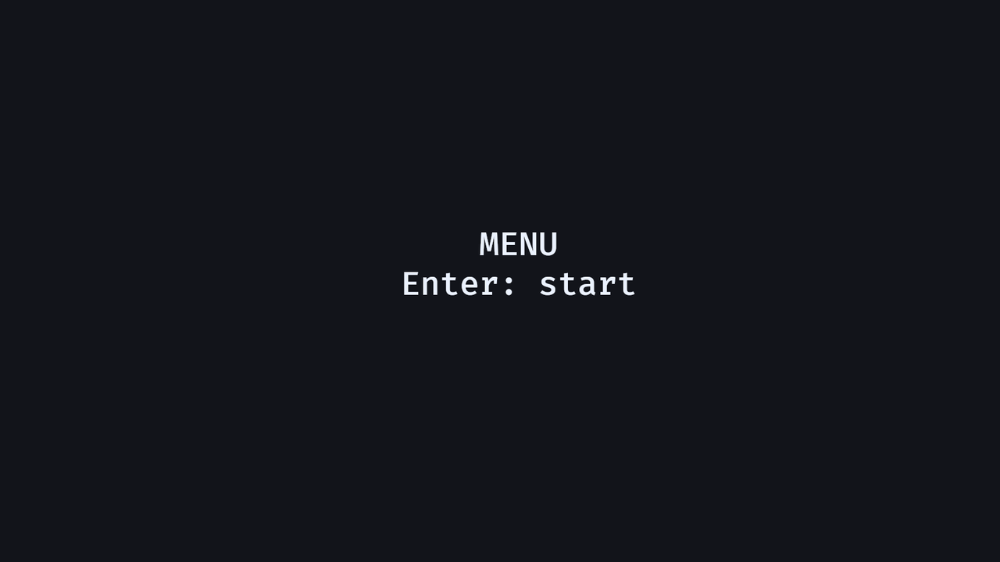

# 15. 게임 상태

<div align="center">

[목차](index.md) · [← 이전: 직접 만든 맵 구조](14-handmade-map-geometry.md) · [다음: 진행도 저장과 불러오기 →](16-save-load-progress.md)

</div>

---

## 이 장에서 만들 것

이 장이 끝나면 앱에 네 가지 모드가 생깁니다. 메뉴, 플레이 중, 일시정지, 게임 오버입니다. 각 시스템은 자기 모드에서만 실행됩니다.



## 실행

```sh
cargo run --example 15_game_states
```

조작은 이렇습니다.

```text
Enter     메뉴에서 시작
WASD      플레이 중 이동
H         디버그 피해
P         일시정지/재개
Esc       일시정지나 게임 오버에서 메뉴로 복귀
R         게임 오버에서 재시작
```

## 구현 흐름 1: State enum 정의하기

Bevy 상태는 Rust enum으로 만듭니다.

```rust
#[derive(States, Debug, Clone, Copy, PartialEq, Eq, Hash, Default)]
enum GameState {
    #[default]
    Menu,
    Playing,
    Paused,
    GameOver,
}
```

상태 타입을 등록합니다.

```rust
.init_state::<GameState>()
```

`#[default]`가 붙은 variant가 시작 상태입니다.

## 구현 흐름 2: 상태에 들어갈 때 UI 만들고, 나갈 때 지우기

메뉴 UI는 `Menu` 상태에 들어갈 때 생성합니다.

```rust
.add_systems(OnEnter(GameState::Menu), spawn_menu)
```

`Menu` 상태에서 나갈 때 제거합니다.

```rust
.add_systems(OnExit(GameState::Menu), cleanup_entities::<MenuUi>)
```

표식 컴포넌트로 메뉴 UI를 표시합니다.

```rust
#[derive(Component)]
struct MenuUi;
```

일시정지 UI와 게임 오버 UI도 같은 패턴을 씁니다.

## 구현 흐름 3: `run_if`로 시스템 실행 제한하기

메뉴 입력은 플레이 중에 실행되면 안 됩니다.

```rust
.add_systems(Update, menu_input.run_if(in_state(GameState::Menu)))
```

게임플레이 시스템은 플레이 중에만 실행합니다.

```rust
.add_systems(
    Update,
    (move_player, debug_take_damage, game_over_when_dead)
        .chain()
        .run_if(in_state(GameState::Playing)),
)
```

모든 시스템 안에 `if current_state == ...`를 쓰는 것보다 이 방식이 훨씬 깔끔합니다.

## 구현 흐름 4: `NextState`로 전환 요청하기

시스템은 `NextState`로 상태 전환을 요청합니다.

```rust
fn menu_input(
    mut commands: Commands,
    keyboard: Res<ButtonInput<KeyCode>>,
    asset_server: Res<AssetServer>,
    mut next_state: ResMut<NextState<GameState>>,
) {
    if keyboard.just_pressed(KeyCode::Enter) {
        spawn_gameplay(&mut commands, &asset_server);
        next_state.set(GameState::Playing);
    }
}
```

전환 적용은 Bevy의 상태 시스템이 처리합니다. 요청은 타입으로 명확하게 남습니다.

## 구현 흐름 5: GameplayEntity로 런타임 엔티티 표시하기

게임플레이 엔티티에는 공통 표식을 붙입니다.

```rust
#[derive(Component)]
struct GameplayEntity;
```

메뉴로 돌아가거나 게임 오버에 들어갈 때 게임플레이 엔티티를 전부 제거할 수 있습니다.

```rust
for entity in &gameplay {
    commands.entity(entity).despawn();
}
```

UI 표식과 게임플레이 표식을 나눠 두면 정리 대상이 정확해집니다.

## 구현 흐름 6: 제네릭 정리 시스템 쓰기

정리 시스템은 어떤 표식 컴포넌트에도 쓸 수 있습니다.

```rust
fn cleanup_entities<T: Component>(mut commands: Commands, entities: Query<Entity, With<T>>) {
    for entity in &entities {
        commands.entity(entity).despawn();
    }
}
```

그래서 등록할 때 이렇게 쓸 수 있습니다.

```rust
cleanup_entities::<MenuUi>
cleanup_entities::<PauseUi>
cleanup_entities::<GameOverUi>
```

## Rust로 보면

`cleanup_entities::<MenuUi>`는 제네릭 타입을 직접 지정하는 문법입니다. 이 시스템에서 `T`가 `MenuUi`라는 뜻입니다.

상태 enum에 여러 derive가 붙는 데에도 이유가 있습니다.

```rust
#[derive(States, Debug, Clone, Copy, PartialEq, Eq, Hash, Default)]
```

Bevy는 상태 값을 저장하고, 비교하고, hash하고, clone하고, debug 출력할 수 있어야 합니다. derive는 장식이 아니라 trait 요구사항을 만족시키는 코드입니다.

## Bevy로 보면

State는 schedule을 제어합니다.

```text
OnEnter(Menu)      Menu에 들어갈 때 한 번 실행
OnExit(Menu)       Menu에서 나갈 때 한 번 실행
Update + run_if    조건이 true인 프레임에만 실행
NextState<T>       상태 전환 요청
```

메뉴, 플레이 중, 일시정지, 게임 오버, 로딩, 컷신처럼 앱 모드가 나뉘는 곳에 상태를 씁니다.

## 확인

실행합니다.

```sh
cargo run --example 15_game_states
```

기대 결과:

- 앱은 메뉴에서 시작합니다.
- Enter를 누르면 게임플레이가 생성되고 플레이 중 상태로 전환됩니다.
- P를 누르면 일시정지 UI가 보이고 이동이 멈춥니다.
- 일시정지에서 Esc를 누르면 게임플레이가 제거되고 메뉴로 돌아갑니다.
- H를 눌러 체력을 0으로 만들면 게임 오버로 전환됩니다.
- R을 누르면 게임 오버에서 다시 시작합니다.

## 바꿔보기

플레이어 시작 체력을 바꿔 봅니다.

```rust
Health(3)
```

```rust
Health(1)
```

기대 결과: 플레이 중 `H`를 한 번만 눌러도 게임 오버로 넘어갑니다.

---

<div align="center">

[← 이전: 직접 만든 맵 구조](14-handmade-map-geometry.md) · [목차](index.md) · [다음: 진행도 저장과 불러오기 →](16-save-load-progress.md)

</div>
