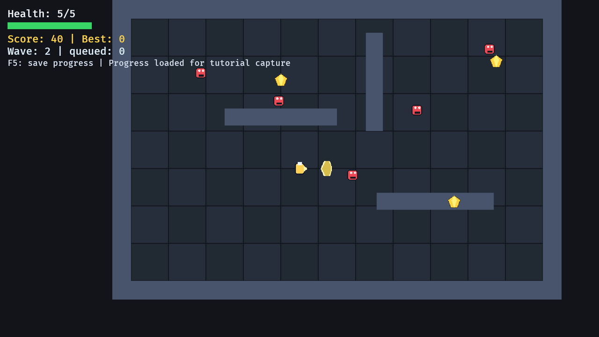

# 17. 완성된 RPG 예제

<div align="center">

[목차](index.md) · [← 이전: 진행도 저장과 불러오기](16-save-load-progress.md) · [다음: 기여하기 →](https://github.com/smturtle2/bevy-tutorial)

</div>

---

## 이 장에서 만들 것

이 장이 끝나면 앞에서 만든 시스템을 합쳐 작은 RPG 예제를 완성합니다. 메뉴, 게임플레이, 일시정지, 게임 오버, 이미지 에셋, 플레이어 애니메이션, 부드러운 카메라, 적 웨이브, 공격 히트박스, 맵 충돌, 화면 고정 HUD, 진행도 저장이 모두 들어갑니다.



## 실행

```sh
cargo run --example 17_complete_rpg_slice
```

조작은 이렇습니다.

```text
Enter     메뉴에서 시작
WASD      이동
Space     공격
P         일시정지/재개
F5        플레이 중 진행도 저장
F9        플레이 중 진행도 불러오기
Esc       일시정지나 게임 오버에서 메뉴로 복귀
R         게임 오버에서 재시작
```

## 구현 흐름 1: 통합 파이프라인을 명시하기

최종 예제는 시스템이 많기 때문에 프레임 단계를 명확히 둡니다.

```rust
#[derive(SystemSet, Debug, Clone, PartialEq, Eq, Hash)]
enum GameSet {
    Input,
    Wave,
    Ai,
    Movement,
    Collision,
    Animation,
    Ui,
}
```

순서는 이렇습니다.

```text
Input -> Wave -> Ai -> Movement -> Collision -> Animation -> Ui
```

이 순서는 게임 설계입니다. 예를 들어 충돌 단계는 이동 단계 뒤에 와야 하고, UI는 게임플레이 변화가 끝난 뒤에 와야 합니다.

## 구현 흐름 2: 공통 에셋을 한 번만 저장하기

최종 예제는 이미지 핸들과 플레이어 atlas layout을 리소스에 넣습니다.

```rust
#[derive(Resource, Clone)]
struct SpriteAssets {
    player_sheet: Handle<Image>,
    player_layout: Handle<TextureAtlasLayout>,
    enemy: Handle<Image>,
    gem: Handle<Image>,
    slash: Handle<Image>,
}
```

setup에서 한 번 로드합니다.

```rust
commands.insert_resource(SpriteAssets {
    player_sheet: asset_server.load("player_sheet.png"),
    player_layout,
    enemy: asset_server.load("enemy.png"),
    gem: asset_server.load("gem.png"),
    slash: asset_server.load("slash.png"),
});
```

이후 Bundle은 경로를 반복해서 로드하지 않고 `&SpriteAssets`를 받습니다.

## 구현 흐름 3: Bundle을 생성 규칙처럼 쓰기

최종 예제는 서로 다른 엔티티 모양을 Bundle 단위로 나눕니다.

```text
PlayerBundle          player, body, facing, health, animation, atlas sprite
EnemyBundle           enemy, body, health, sprite
CollectibleBundle     gem body와 sprite
WallBundle            static wall body와 sprite
AttackHitboxBundle    짧게 살아 있는 피해 판정 body와 베기 스프라이트
```

그래서 `start_run`이 읽기 쉬워집니다.

```rust
commands.spawn(PlayerBundle::new(assets));
spawn_map(commands);
spawn_hud(commands);
commands.spawn(CollectibleBundle::new(position, assets));
```

호출하는 곳에는 게임 오브젝트가 보이고, 컴포넌트 조립은 Bundle 안으로 들어갑니다.

## 구현 흐름 4: Run 시작과 초기화

run을 시작할 때 실행 중 점수와 웨이브 상태를 초기화합니다.

```rust
fn start_run(
    commands: &mut Commands,
    assets: &SpriteAssets,
    progress: &Progress,
    stats: &mut RunStats,
    spawner: &mut WaveSpawner,
) {
    *stats = RunStats::default();
    stats.wave = progress.unlocked_wave.max(1);
    spawner.reset_to_wave(stats.wave);

    commands.spawn(PlayerBundle::new(assets));
    spawn_map(commands);
    spawn_hud(commands);
}
```

저장된 진행도는 시작 웨이브에 영향을 줍니다. 하지만 적, HUD, 맵처럼 실행 중에만 필요한 엔티티는 매 run마다 새로 생성합니다.

## 구현 흐름 5: State로 게임플레이 실행 제한하기

게임플레이 시스템은 플레이 중에만 실행됩니다.

```rust
.add_systems(
    Update,
    (player_input, spawn_attack_hitbox)
        .chain()
        .in_set(GameSet::Input)
        .run_if(in_state(GameState::Playing)),
)
```

메뉴, 일시정지, 게임 오버 시스템도 각자 상태 조건을 가집니다.

그래서 일시정지 중에는 이동하지 않고, 메뉴에서는 적이 생성되지 않습니다.

## 구현 흐름 6: 충돌 규칙 합치기

충돌 단계에는 여러 게임플레이 규칙이 들어갑니다.

```rust
(
    collect_gems,
    attack_hits_enemies,
    enemy_hits_player,
    expire_attack_hitboxes,
    end_game_if_dead,
)
    .chain()
    .in_set(GameSet::Collision)
```

순서는 이렇게 읽습니다.

```text
보석 수집
플레이어 공격 적용
적 접촉 피해 적용
만료된 히트박스 제거
체력이 0이면 게임 오버 진입
```

하나로 합치지 않고 나눈 이유는 규칙마다 책임이 다르기 때문입니다.

## 구현 흐름 7: 자연스러운 지점에서 진행도 저장하기

게임 오버에 들어갈 때 진행도를 갱신합니다.

```rust
progress.best_score = progress.best_score.max(stats.score);
progress.unlocked_wave = progress.unlocked_wave.max(stats.wave);
```

플레이 중 F5로 직접 저장할 수도 있습니다.

```rust
if keyboard.just_pressed(KeyCode::F5) {
    progress.best_score = progress.best_score.max(stats.score);
    progress.unlocked_wave = progress.unlocked_wave.max(stats.wave);
    save_status.0 = match save_progress_to_disk(&progress) {
        Ok(()) => format!("Saved progress to {SAVE_PATH}"),
        Err(error) => format!("Save failed: {error}"),
    };
}
```

최종 게임도 임시 적, 히트박스, UI를 저장하지 않습니다. 오래 유지되어야 하는 진행도만 저장합니다.

## Rust로 보면

최종 예제에는 앞에서 배운 Rust 개념이 모두 섞여 있습니다.

```text
struct               component, resource, bundle
tuple struct         Velocity(Vec2), SaveStatus(String)
enum                 GameState, GameSet, PlayerAnimState
impl                 생성자와 reset 메서드
제네릭 함수          cleanup_entities::<MenuUi>
Option               texture atlas 접근
Result               save/load IO
borrowing            Res, ResMut, Query, Single
```

Bevy가 매개변수를 넣어준다고 해서 Rust를 덜 쓰는 것이 아닙니다. Bevy 시스템 시그니처 자체가 Rust 타입 계약입니다.

## Bevy로 보면

최종 예제는 작은 ECS 규칙들의 조합입니다.

```text
상태(state)는 어떤 시스템이 실행될지 정합니다
system set은 프레임 순서를 정합니다
리소스(resource)는 전역 게임 상태를 저장합니다
컴포넌트(component)는 엔티티별 사실을 저장합니다
bundle은 생성 규칙을 재사용하게 해 줍니다
commands는 엔티티를 만들고 제거합니다
query는 조건에 맞는 엔티티에 동작을 적용합니다
```

이 구조가 이 튜토리얼 본편의 완성 형태입니다. 앞 장에서 따로 배운 시스템들이 여기서는 한 게임 루프 안에서 함께 돌아갑니다.

## 확인

실행합니다.

```sh
cargo run --example 17_complete_rpg_slice
```

확인 기준:

- 처음에는 메뉴가 보입니다.
- Enter를 누르면 게임플레이가 시작됩니다.
- 플레이어가 움직이고 애니메이션이 재생됩니다.
- 카메라가 부드럽게 따라옵니다.
- 적이 웨이브로 생성되고 플레이어를 추적합니다.
- Space를 누르면 베기 히트박스가 생기고 적에게 피해를 줍니다.
- 보석을 먹으면 점수가 오릅니다.
- 벽이 이동을 막습니다.
- HUD는 화면에 고정됩니다.
- P로 일시정지/재개가 됩니다.
- 게임 오버에서 best score와 unlocked wave가 저장됩니다.
- 재시작하면 저장된 진행도를 활용할 수 있습니다.

## 바꿔보기

`start_run`에 보석 위치를 하나 더 추가합니다.

```rust
Vec3::new(0.0, 210.0, 3.0),
```

기대 결과: 맵에 새 보석이 보입니다. 기존 충돌 시스템으로 수집되고, 새 시스템을 만들지 않아도 점수가 오릅니다.

## 본편 완성 기준

이 튜토리얼은 아래 시스템을 본편 안에서 모두 다룹니다.

```text
camera follow      플레이어를 부드럽게 따라오는 카메라
enemy waves        웨이브 단위 적 생성과 추적
attack hitbox      짧게 생겼다가 사라지는 공격 판정
sprite assets      이미지와 스프라이트 시트 기반 표현
screen-space UI    화면에 고정되는 HUD
animation state    이동/대기/공격 상태에 따른 애니메이션
map geometry       직접 만든 벽과 충돌 구조
game states        menu, playing, paused, game over
save/load          best score와 unlocked wave 저장/불러오기
```

마지막 장은 이 시스템들을 한 프레임 순서 안에서 연결하고, 각 시스템의 책임이 어떻게 맞물리는지 확인하는 장입니다.

---

<div align="center">

[← 이전: 진행도 저장과 불러오기](16-save-load-progress.md) · [목차](index.md) · [기여하기 →](https://github.com/smturtle2/bevy-tutorial)

</div>
