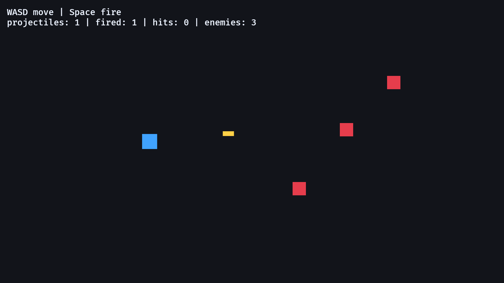

# 18. 발사체

<div align="center">

[목차](index.md) · [← 이전: 통합 RPG 예제](17-complete-rpg-slice.md) · [다음: 인벤토리 →](19-inventory.md)

</div>

---

## 이 장에서 만들 것

이 장이 끝나면 플레이어가 움직이는 발사체를 쏠 수 있습니다. 발사체는 자기 위치, 속도, 충돌 범위, 피해량, 수명을 가진 엔티티입니다. 적에게 맞으면 피해를 주고, 빗나가면 시간이 지나 사라집니다.



## 실행

```sh
cargo run --example 18_projectiles
```

WASD나 방향키로 움직입니다. Space를 누르면 마지막으로 바라본 방향으로 발사체를 쏩니다.

## 구현 흐름 1: 발사체를 엔티티로 보기

발사체는 플레이어의 상태 플래그가 아닙니다. 짧게 살아 있는 별도 엔티티입니다.

```rust
#[derive(Component)]
struct Projectile {
    lifetime: Timer,
    damage: i32,
}
```

이 엔티티에는 `Body`, `Velocity`, `Transform`, `Sprite`도 함께 붙습니다. 그러면 플레이어와 적이 쓰던 이동, 충돌, 표시 규칙을 그대로 쓸 수 있습니다.

```text
Projectile entity = Projectile + Body + Velocity + Transform + Sprite
```

RPG 오브젝트를 볼 때 기준은 간단합니다. 자기 위치와 자기 수명이 있으면 엔티티로 다룹니다.

## 구현 흐름 2: 플레이어 위치와 방향에서 생성하기

플레이어는 마지막으로 바라본 방향을 저장합니다.

```rust
#[derive(Component)]
struct Facing(Vec2);
```

Space를 누르면 발사 시스템이 플레이어의 `Transform`과 `Facing`을 읽습니다.

```rust
let (transform, facing) = *player;
let start = transform.translation + (facing.0 * 34.0).extend(1.0);

commands.spawn(ProjectileBundle::new(start, facing.0));
```

`34.0`은 발사체가 플레이어 몸 안이 아니라 앞쪽에서 시작하게 하는 거리입니다. `extend(1.0)`은 2D 방향 오프셋을 `Vec3`로 바꾸고, 발사체를 플레이어보다 위 레이어에 둡니다.

## 구현 흐름 3: 발사체에 속도와 회전 주기

Bundle 생성자는 방향을 이동 속도로 바꿉니다.

```rust
velocity: Velocity(direction * PROJECTILE_SPEED),
```

그리고 스프라이트도 진행 방향으로 돌립니다.

```rust
let angle = direction.y.atan2(direction.x);

Transform {
    translation: position,
    rotation: Quat::from_rotation_z(angle),
    ..default()
}
```

이제 발사체는 공용 이동 시스템을 그대로 사용할 수 있습니다.

```rust
fn move_bodies(time: Res<Time>, mut bodies: Query<(&mut Transform, &Velocity), With<Body>>) {
    for (mut transform, velocity) in &mut bodies {
        transform.translation += (velocity.0 * time.delta_secs()).extend(0.0);
    }
}
```

## 구현 흐름 4: 빗나간 발사체 제거하기

아무것도 맞히지 못한 발사체도 정리 규칙이 필요합니다.

```rust
fn tick_projectile_lifetime(
    mut commands: Commands,
    time: Res<Time>,
    mut projectiles: Query<(Entity, &mut Projectile)>,
) {
    for (entity, mut projectile) in &mut projectiles {
        projectile.lifetime.tick(time.delta());

        if projectile.lifetime.is_finished() {
            commands.entity(entity).despawn();
        }
    }
}
```

이 시스템이 없으면 빗나간 발사체가 월드에 계속 쌓입니다.

## 구현 흐름 5: 충돌하면 피해 주기

충돌 시스템은 모든 발사체와 모든 적을 비교합니다.

```rust
if overlaps(projectile_transform, projectile_body, enemy_transform, enemy_body) {
    health.0 -= projectile.damage;
    commands.entity(projectile_entity).despawn();
    stats.hits += 1;

    if health.0 <= 0 {
        commands.entity(enemy_entity).despawn();
    }
}
```

이 예제의 발사체는 적을 맞히면 바로 사라집니다. 관통 화살을 만들고 싶다면 이 규칙을 바꾸면 됩니다.

## 구현 흐름 6: 시스템 순서 고정하기

발사체 기능에는 프레임 순서가 필요합니다.

```text
Input      발사체 생성
Movement   발사체 이동과 수명 타이머 진행
Collision  발사체 명중 처리
Ui         숫자 표시
```

충돌이 이동보다 먼저 실행되면 발사체가 지난 프레임 위치로 판정됩니다. 수명 정리가 없으면 발사체가 계속 남습니다. 순서도 기능의 일부입니다.

## Rust로 보면

이 장은 단일 값 컴포넌트에 tuple struct를 씁니다.

```rust
struct Velocity(Vec2);
struct Health(i32);
```

`velocity.0`, `health.0`처럼 내부 값을 꺼냅니다. 값은 하나뿐이고 타입 이름이 의미를 충분히 설명할 때 tuple struct가 깔끔합니다.

방향 계산에는 `normalize_or_zero`를 씁니다.

```rust
let normalized = direction.normalize_or_zero();
```

0 벡터를 정규화하면 수학적으로 문제가 생깁니다. `normalize_or_zero`는 0 벡터일 때 `Vec2::ZERO`를 돌려주므로 이동과 발사 코드가 단순해집니다.

## Bevy로 보면

발사체는 ECS에 잘 맞는 오브젝트입니다.

```text
어디에 있는가     Transform
어떻게 움직이는가  Velocity
무엇과 부딪히는가  Body
무슨 효과가 있는가 Projectile { damage, lifetime }
어떻게 보이는가    Sprite
```

발사 시스템은 생성만 합니다. 이동과 충돌은 다른 시스템이 처리합니다. 그래서 발사체를 추가해도 플레이어 이동 코드를 다시 짤 필요가 없습니다.

## 확인

실행합니다.

```sh
cargo run --example 18_projectiles
```

확인 기준:

- Space를 누르면 플레이어가 바라보는 방향으로 발사체가 나갑니다.
- 발사체는 플레이어와 독립적으로 움직입니다.
- 적은 충분히 맞으면 사라집니다.
- 빗나간 발사체는 잠시 뒤 사라집니다.
- UI의 발사 수와 명중 수가 바뀝니다.

## 바꿔보기

다음을:

```rust
const PROJECTILE_LIFETIME: f32 = 0.9;
```

이렇게 바꿉니다.

```rust
const PROJECTILE_LIFETIME: f32 = 2.0;
```

기대 결과: 발사체가 더 멀리 날아간 뒤 사라집니다.

---

<div align="center">

[← 이전: 통합 RPG 예제](17-complete-rpg-slice.md) · [목차](index.md) · [다음: 인벤토리 →](19-inventory.md)

</div>
