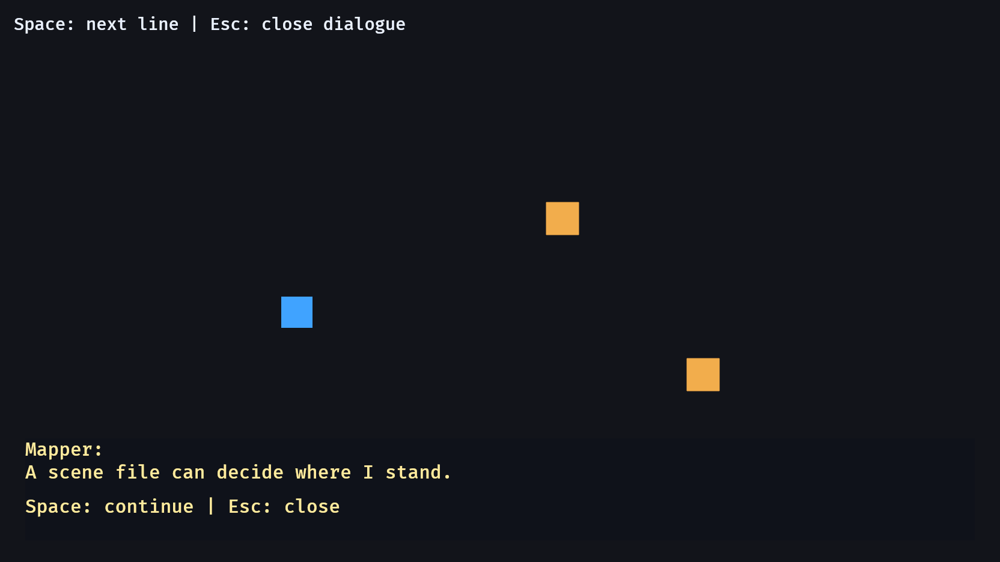

# 20. 대화

<div align="center">

[목차](index.md) · [← 이전: 인벤토리](19-inventory.md) · [다음: 오디오 이벤트 →](21-audio-events.md)

</div>

---

## 이 장에서 만들 것

이 장이 끝나면 플레이어가 NPC에게 다가가 대화를 시작하고, 문장을 넘기고, 대화를 닫을 수 있습니다. 대화창은 화면 고정 UI로 나오고, NPC와 플레이어는 계속 ECS 엔티티로 남습니다.



## 실행

```sh
cargo run --example 20_dialogue
```

WASD나 방향키로 NPC 근처로 갑니다. E로 말을 걸고, Space로 다음 문장을 보고, Esc로 닫습니다.

## 구현 흐름 1: 대사 데이터는 NPC에 두기

NPC는 자신의 정적인 대화 데이터를 가집니다.

```rust
#[derive(Component)]
struct Npc {
    name: &'static str,
    lines: &'static [&'static str],
}
```

이 예제에서는 대사를 코드에 직접 적기 때문에 `'static` 문자열 슬라이스를 씁니다.

```rust
Npc {
    name: "Mapper",
    lines: &[
        "A scene file can decide where I stand.",
        "Code decides what talking to me means.",
    ],
}
```

파일에서 대사를 읽는 구조라면 `String`을 쓰는 편이 자연스럽습니다.

## 구현 흐름 2: 현재 대화 상태는 리소스에 두기

현재 진행 중인 대화는 모드에 가까운 전역 상태입니다.

```rust
#[derive(Resource, Default)]
struct DialogueState {
    active_npc: Option<Entity>,
    line_index: usize,
}
```

이 값은 NPC 컴포넌트에 넣지 않습니다. NPC는 대사를 갖고, 대화 리소스는 “지금 누구와 몇 번째 줄을 보고 있는지”를 갖습니다.

## 구현 흐름 3: 가까운 NPC 찾기

프롬프트 시스템은 플레이어 근처의 NPC를 찾습니다.

```rust
let nearby = npcs.iter().find(|(transform, _)| {
    player
        .translation
        .truncate()
        .distance(transform.translation.truncate())
        <= INTERACT_DISTANCE
});
```

가까운 NPC가 있으면 상호작용 문구를 보여줍니다. 없으면 NPC 근처로 가라는 문구를 보여줍니다.

## 구현 흐름 4: 시작, 진행, 종료 처리하기

입력 시스템은 세 갈래로 나뉩니다.

```text
대화 중 Esc       대화 닫기
대화 중 Space     다음 문장으로 이동
NPC 근처에서 E     대화 시작
```

활성 NPC는 `Entity`로 저장합니다.

```rust
dialogue.active_npc = Some(entity);
dialogue.line_index = 0;
```

마지막 문장 다음으로 넘어가면 대화를 닫습니다.

```rust
if dialogue.line_index >= npc.lines.len() {
    dialogue.active_npc = None;
    dialogue.line_index = 0;
}
```

## 구현 흐름 5: 대화 중 이동 막기

이동 시스템은 `DialogueState`를 읽습니다.

```rust
if dialogue.active_npc.is_some() {
    return;
}
```

이건 간단한 모드 제한입니다. 규모가 커지면 같은 감각으로 `GameState::Dialogue` 같은 Bevy 상태를 만들 수 있습니다.

## 구현 흐름 6: 대화창 그리기

대화창도 일반적인 Bevy UI 엔티티입니다.

```rust
commands.spawn((
    DialogueText,
    Text::new(""),
    Node {
        position_type: PositionType::Absolute,
        bottom: px(28),
        left: px(32),
        right: px(32),
        padding: UiRect::all(px(14)),
        ..default()
    },
    BackgroundColor(Color::srgba(0.06, 0.07, 0.10, 0.88)),
));
```

업데이트 시스템은 화자와 문장을 씁니다.

```rust
text.0 = format!("{}:\n{}", npc.name, line);
```

## Rust로 보면

`Option<Entity>`는 현재 대화가 열려 있을 수도 있고 없을 수도 있다는 뜻입니다.

```rust
active_npc: Option<Entity>
```

대화가 없을 때는 `let else`로 일찍 빠져나갑니다.

```rust
let Some(entity) = dialogue.active_npc else {
    text.0.clear();
    return;
};
```

이렇게 쓰면 실제 대화가 있는 경우의 코드가 깊게 들여쓰기되지 않습니다.

## Bevy로 보면

대화는 세 책임이 만나는 기능입니다.

```text
NPC 컴포넌트       화자와 대사 데이터
Dialogue 리소스    현재 대화 진행 상태
UI 엔티티          화면에 보이는 대화창
```

현재 줄 번호를 모든 NPC 안에 넣지 않습니다. 동시에 진행되는 대화가 하나라면 리소스 하나가 더 정확한 소유자입니다.

## 확인

실행합니다.

```sh
cargo run --example 20_dialogue
```

확인 기준:

- NPC 근처에 가면 프롬프트가 보입니다.
- E를 누르면 대화창이 열립니다.
- Space를 누르면 NPC의 다음 문장으로 넘어갑니다.
- Esc를 누르면 대화창이 닫힙니다.
- 대화 중에는 플레이어가 움직이지 않습니다.

## 바꿔보기

Mapper NPC의 대사에 한 줄을 추가합니다.

```rust
"Dialogue data can grow without changing the UI system.",
```

기대 결과: 그 NPC와 대화할 때 Space로 넘길 문장이 하나 더 생깁니다.

---

<div align="center">

[← 이전: 인벤토리](19-inventory.md) · [목차](index.md) · [다음: 오디오 이벤트 →](21-audio-events.md)

</div>
