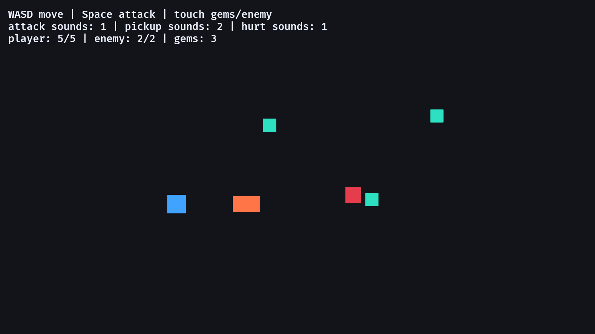

# 21. 오디오 이벤트

<div align="center">

[목차](index.md) · [← 이전: 대화](20-dialogue.md) · [다음: 씬 로딩 →](22-scene-loading.md)

</div>

---

## 이 장에서 만들 것

게임플레이 시스템이 소리 재생 방식을 몰라도 되게 오디오를 붙입니다. 공격, 수집, 피격 시스템은 타입 있는 메시지를 보냅니다. 오디오 시스템 하나가 그 메시지를 읽고 짧게 재생되는 오디오 엔티티를 만듭니다.



## 실행

```sh
cargo run --example 21_audio_events
```

조작:

```text
WASD / 방향키   이동
Space           공격
보석에 닿기      수집 이벤트
적에 닿기        피격 이벤트
```

## 이어받는 계약

오디오는 실제 게임플레이 사건에 연결됩니다.

```text
공격 입력        AttackHitbox 생성 + GameAudioEvent::Attack 발생
보석 수집        Gem 제거 + GameAudioEvent::Pickup 발생
적 접촉          플레이어 피해 + GameAudioEvent::Hurt 발생
오디오 시스템     이벤트를 읽고 AudioPlayer 엔티티 생성
```

충돌과 전투 시스템은 어떤 일이 일어났는지 알립니다. 주파수, 사운드 핸들, 재생 설정은 오디오 시스템의 책임입니다.

## 구현 흐름 1: 오디오 메시지 타입 정의하기

이벤트 값은 작은 enum입니다.

```rust
#[derive(Message, Debug, Clone, Copy)]
enum GameAudioEvent {
    Attack,
    Pickup,
    Hurt,
}
```

각 derive의 역할은 분명합니다.

```text
Message      Bevy 메시지/이벤트 시스템으로 보낼 수 있게 함
Debug        디버깅 중 값을 출력할 수 있게 함
Clone/Copy   작은 이벤트 값을 싸게 복제할 수 있게 함
```

앱은 메시지 타입을 등록합니다.

```rust
.add_message::<GameAudioEvent>()
```

이 등록이 `MessageWriter<GameAudioEvent>`와 `MessageReader<GameAudioEvent>`가 사용할 채널을 만듭니다.

## 구현 흐름 2: 게임플레이 규칙에서 이벤트 보내기

공격 입력 시스템은 히트박스를 만들 때 `Attack`을 보냅니다.

```rust
commands.spawn((AttackHitbox { ... }, ...));
audio_events.write(GameAudioEvent::Attack);
```

수집 시스템은 보석이 실제로 수집될 때만 `Pickup`을 보냅니다.

```rust
if overlaps(player_transform, player_body, gem_transform, gem_body) {
    commands.entity(entity).despawn();
    audio_events.write(GameAudioEvent::Pickup);
}
```

피격 시스템은 적 접촉으로 플레이어 체력이 줄었을 때만 `Hurt`를 보냅니다.

```rust
health.current = (health.current - 1).max(0);
audio_events.write(GameAudioEvent::Hurt);
```

## 구현 흐름 3: 오디오 시스템 하나에서 이벤트 읽기

한 시스템이 게임플레이 이벤트를 소리로 바꿉니다.

```rust
for event in events.read() {
    let frequency = match event {
        GameAudioEvent::Attack => 360.0,
        GameAudioEvent::Pickup => 720.0,
        GameAudioEvent::Hurt => 180.0,
    };

    commands.spawn((
        AudioPlayer(pitch_assets.add(Pitch::new(frequency, Duration::from_millis(120)))),
        PlaybackSettings::DESPAWN,
    ));
}
```

`match`는 모든 variant를 다룹니다. `GameAudioEvent::MenuSelect`를 추가하면 Rust가 그 이벤트의 소리도 정하라고 요구합니다.

## 구현 흐름 4: 재생 엔티티를 짧게 살리기

스폰되는 오디오 엔티티에는 이 설정을 붙입니다.

```rust
PlaybackSettings::DESPAWN
```

재생이 끝나면 Bevy가 오디오 엔티티를 제거합니다. 게임플레이 시스템이 일회성 소리의 수명을 관리할 필요가 없습니다.

## 구현 흐름 5: 오디오를 화면에서 확인하기

예제는 `AudioStats`도 갱신합니다.

```rust
#[derive(Resource, Default)]
struct AudioStats {
    attack_sounds: u32,
    pickup_sounds: u32,
    hurt_sounds: u32,
}
```

카운터는 학습용 확인 장치입니다. 컴퓨터가 음소거 상태여도 오디오 이벤트가 실제 게임플레이 규칙에서 발생했는지 볼 수 있습니다.

## 통합 지점

오디오는 입력 키가 아니라 게임플레이 사실에 붙어야 합니다.

```text
공격 시스템      Attack 기록
수집 시스템      Pickup 기록
피해 시스템      Hurt 기록
오디오 시스템     모든 GameAudioEvent 읽기
UI/디버그 시스템  확인용 AudioStats 읽기
```

파일 사운드를 쓰려면 `Pitch::new(...)` 대신 `AssetServer`로 읽은 핸들을 쓰면 됩니다. 예를 들면 `asset_server.load("sounds/hit.ogg")`입니다. 이벤트 계약은 그대로 유지됩니다.

## Rust로 보면

enum은 닫힌 어휘입니다.

```rust
enum GameAudioEvent {
    Attack,
    Pickup,
    Hurt,
}
```

`"attack"` 같은 문자열을 보내는 것보다 강합니다. variant 이름을 틀리면 컴파일 오류가 나고, 새 variant를 추가하면 모든 exhaustive `match`가 수정 대상이 됩니다.

메시지도 타입으로 구분됩니다.

```rust
MessageWriter<GameAudioEvent>
MessageReader<GameAudioEvent>
```

이 시스템 매개변수들은 어떤 이벤트 스트림을 쓰거나 읽는지 정확히 말합니다.

## 확인

실행합니다.

```sh
cargo run --example 21_audio_events
```

확인 기준:

- `Space`를 누르면 공격 히트박스가 생기고 공격 소리 카운터가 올라갑니다.
- 보석에 닿으면 보석이 사라지고 수집 소리 카운터가 올라갑니다.
- 적에 닿으면 플레이어 체력이 줄고 피격 소리 카운터가 올라갑니다.
- 오디오 엔티티가 계속 쌓이지 않습니다.
- UI 카운터가 실제 게임 이벤트와 맞습니다.

## 바꿔보기

수집 소리 주파수를 바꿉니다.

```rust
GameAudioEvent::Pickup => 720.0,
```

이렇게 바꿉니다.

```rust
GameAudioEvent::Pickup => 960.0,
```

기대 결과: 수집 시스템을 바꾸지 않아도 수집 소리만 더 높은 음으로 바뀝니다.

---

<div align="center">

[← 이전: 대화](20-dialogue.md) · [목차](index.md) · [다음: 씬 로딩 →](22-scene-loading.md)

</div>
