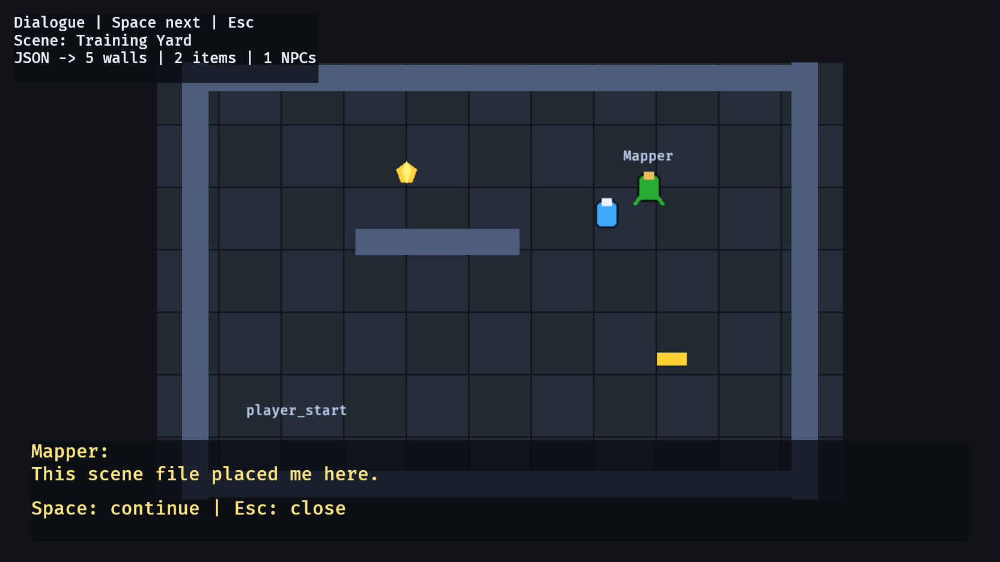

# 21. 씬 로딩

<div align="center">

[목차](index.md) · [← 이전: 오디오 이벤트](20-audio-events.md) · [다음: 최종 RPG 게임 →](22-final-rpg-game.md)

</div>

---

## 이 장에서 만들 것

레벨 배치를 Rust 코드 밖의 JSON 씬 파일로 옮깁니다. 씬에서 읽은 데이터는 이전 장에서 배운 같은 게임플레이 컴포넌트를 생성합니다. `Player`, `Wall`, `InventoryItem`, `Npc`, `Body`, `Transform`, 스프라이트가 그대로 쓰입니다.



## 실행

```sh
cargo run --example 21_scene_loading
```

조작:

```text
1               Training Yard 로드
2               Library Hall 로드
WASD / 방향키   이동하고 로드된 아이템 수집
E               로드된 NPC와 대화
Space           다음 대사
Esc             대화 닫기
```

## 이어받는 계약

씬 로딩은 데이터를 읽어 엔티티를 생성하는 기능입니다.

```text
씬 파일           게임 오브젝트의 시작 위치를 설명
serde struct      파일이 가져야 할 모양을 정의
spawn_scene       씬 데이터를 Bevy 엔티티로 변환
SceneEntity       씬 전환 전 제거할 로드 엔티티 표시
GameplayEntity    기능 예제들이 공유하는 게임플레이 마커
InventoryItem     로드된 수집물이 인벤토리 장의 컴포넌트를 사용
Npc               로드된 NPC가 대화 장의 name + lines 모양을 사용
DialogueState     현재 로드된 NPC와의 대화를 추적
```

씬 파일은 배치 데이터를 소유합니다. 이동, 충돌, 수집, 대화, UI, 정리 규칙은 여전히 Rust 시스템이 소유합니다.

## 구현 흐름 1: 씬 파일 계약 정하기

JSON 파일은 레벨 배치 데이터를 담습니다.

```json
{
  "name": "Training Yard",
  "player_start": [-260.0, -120.0],
  "walls": [
    { "x": 0.0, "y": 260.0, "w": 760.0, "h": 34.0 }
  ],
  "items": [
    { "kind": "Gem", "x": -120.0, "y": 140.0 }
  ],
  "npcs": [
    {
      "name": "Mapper",
      "x": 190.0,
      "y": 120.0,
      "lines": ["This scene file placed me here."]
    }
  ]
}
```

Rust 쪽 타입은 이 모양을 그대로 반영합니다.

```rust
#[derive(Deserialize)]
struct SceneData {
    name: String,
    player_start: [f32; 2],
    walls: Vec<RectData>,
    items: Vec<ItemData>,
    npcs: Vec<NpcData>,
}
```

`Deserialize`는 serde가 JSON 텍스트에서 `SceneData` 값을 만들 수 있게 합니다.

## 구현 흐름 2: 아이템 종류를 타입으로 파싱하기

아이템 종류는 Rust enum 계약을 가집니다.

```rust
#[derive(Component, Deserialize, Debug, Clone, Copy, PartialEq, Eq, Hash)]
enum ItemKind {
    Gem,
    Key,
    Potion,
}
```

JSON의 `"Gem"`은 `ItemKind::Gem`이 됩니다. Rust에 `Coin` variant가 없는데 파일에 `"Coin"`이 들어오면 파싱이 실패합니다. 잘못된 게임 데이터가 조용히 만들어지는 것보다 낫습니다.

## 구현 흐름 3: 로드된 엔티티 표시하기

씬에서 만들어진 엔티티에는 모두 `SceneEntity`를 붙입니다.

```rust
#[derive(Component)]
struct SceneEntity;
```

씬 전환은 이 마커를 사용합니다.

```rust
for entity in &entities {
    commands.entity(entity).despawn();
}
```

이전 씬의 플레이어, 벽, 아이템, NPC를 제거한 뒤 다음 씬을 생성합니다.

## 구현 흐름 4: 파일 읽고 파싱하기

로딩은 세 단계입니다.

```rust
let text = fs::read_to_string(&fs_path)?;
let scene = serde_json::from_str::<SceneData>(&text)?;
spawn_scene(commands, &scene);
```

예제에서는 UI에 오류 메시지를 보여주기 위해 `match`로 씁니다.

```rust
let scene = match serde_json::from_str::<SceneData>(&text) {
    Ok(scene) => scene,
    Err(error) => return format!("Failed to parse {asset_path}: {error}"),
};
```

## 구현 흐름 5: 기존 게임플레이 컴포넌트 생성하기

씬 로더는 앞 장에서 배운 개념을 그대로 재사용합니다. 아이템은 `InventoryItem` 엔티티가 됩니다.

```rust
commands.spawn((
    GameplayEntity,
    SceneEntity,
    InventoryItem { kind: item.kind },
    Body { half_size: ITEM_SIZE / 2.0 },
    Sprite::from_color(item.kind.color(), ITEM_SIZE),
    Transform::from_xyz(item.x, item.y, 3.0),
));
```

NPC는 소유한 문자열을 가진 `Npc` 엔티티가 됩니다.

```rust
Npc {
    name: npc.name.clone(),
    lines: npc.lines.clone(),
}
```

이제 로드된 씬도 앞에서 배운 수집 데이터와 대화 데이터 모양을 그대로 사용합니다.

## 구현 흐름 6: 기존 시스템이 로드 데이터를 쓰게 하기

수집 시스템은 컴포넌트에 의존하므로, 코드에서 직접 만든 아이템과 JSON에서 로드한 아이템에 같은 규칙을 적용합니다.

```rust
if overlaps(player_transform, player_body, item_transform, item_body) {
    inventory.add(item.kind);
    stats.score += item.kind.score_value();
    commands.entity(entity).despawn();
}
```

여러 장에서 같은 컴포넌트 계약을 유지했기 때문에 가능한 구조입니다.

## 통합 지점

씬 로딩은 데이터 파일과 게임플레이 시스템을 연결하며 고급 시스템 트랙을 마무리합니다.

```text
인벤토리     로드된 아이템은 InventoryItem 엔티티
대화         로드된 NPC와 E로 대화를 열고 Space/Esc로 진행/닫기
이동         로드된 벽은 Body 충돌 사용
상태/리셋     씬 전환 시 SceneEntity 엔티티 제거
UI           상태 텍스트와 대화 패널이 로드된 씬 데이터를 읽어 표시
```

전체 게임에서는 씬 파일과 저장 파일의 소유자가 다릅니다. 씬 파일은 레벨을 설명하고, 저장 파일은 플레이어의 지속 진행도를 설명합니다.

## Rust로 보면

`Vec<T>`는 해당 타입의 값이 몇 개든 들어올 수 있다는 뜻입니다.

```rust
walls: Vec<RectData>,
items: Vec<ItemData>,
npcs: Vec<NpcData>,
```

`serde_json::from_str::<SceneData>(&text)`는 명시적 제네릭 문법입니다. serde에게 JSON 문자열을 정확히 `SceneData` 타입으로 파싱하라고 요청합니다.

로드된 NPC에는 `String`이 들어갑니다.

```rust
struct Npc {
    name: String,
    lines: Vec<String>,
}
```

20장에서 코드에 직접 적은 대화가 `&'static str`이었다면, 여기서는 파일에서 읽은 문자열을 실행 중에 소유해야 하므로 `String`을 씁니다.

## 확인

실행합니다.

```sh
cargo run --example 21_scene_loading
```

확인 기준:

- 시작하면 1번 씬이 로드됩니다.
- `2`를 누르면 1번 씬 엔티티가 제거되고 2번 씬 엔티티가 생성됩니다.
- 벽이 이동을 막습니다.
- 로드된 아이템을 수집하면 인벤토리와 점수가 바뀝니다.
- 로드된 NPC 근처에서 `E`를 누르면 대화 패널이 열립니다.
- `Space`로 로드된 NPC 대사를 넘기고 `Esc`로 닫을 수 있습니다.
- `1`을 누르면 다시 첫 씬으로 돌아갑니다.

## 바꿔보기

`assets/scenes/arena_a.json`에 아이템을 하나 더 추가합니다.

```json
{ "kind": "Potion", "x": 80.0, "y": -170.0 }
```

기대 결과: Rust 코드를 바꾸지 않아도 예제를 다시 실행하면 새 포션이 보입니다.

---

<div align="center">

[← 이전: 오디오 이벤트](20-audio-events.md) · [목차](index.md) · [다음: 최종 RPG 게임 →](22-final-rpg-game.md)

</div>
