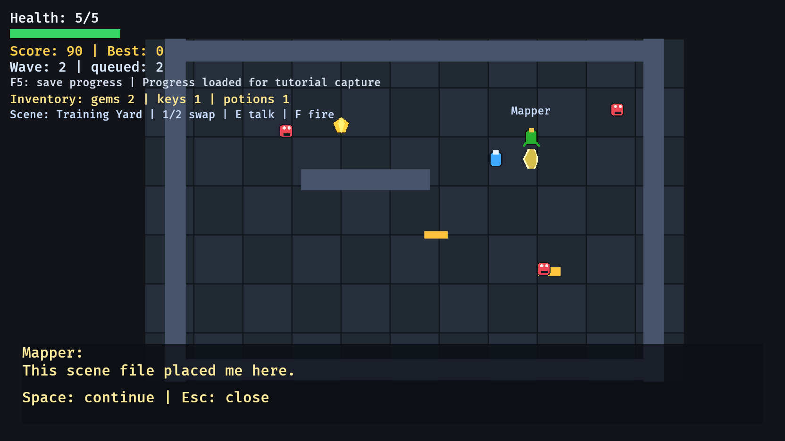

# 22. 최종 RPG 게임

<div align="center">

[목차](index.md) · [← 이전: 씬 로딩](21-scene-loading.md) · [기여하기 →](https://github.com/smturtle2/bevy-tutorial)

</div>

---

## 이 장에서 만들 것

이 장이 마지막 장입니다. 앞에서 따로 배운 시스템을 하나의 플레이 가능한 RPG 게임으로 합칩니다. 씬 로딩, 플레이어 이동, 부드러운 카메라, 맵 충돌, 적 웨이브, 근접 히트박스, 발사체, 인벤토리, NPC 대화, 오디오 이벤트, 화면 고정 HUD, 메뉴, 일시정지, 게임 오버, 진행도 저장/불러오기가 한 예제 안에서 같이 동작합니다.



## 실행

```sh
cargo run --example 22_final_rpg_game
```

조작:

```text
Enter       메뉴에서 시작
WASD        이동
Space       근접 공격 / 대화 넘기기
F           발사체 발사
E           NPC 근처에서 대화
1 / 2       다른 씬 로드
P           일시정지
Esc         대화 닫기 / 일시정지에서 메뉴로
F5 / F9     진행도 저장과 불러오기
```

## 최종 게임 계약

이 예제는 또 다른 단독 기능 데모가 아닙니다. 튜토리얼 전체의 통합 지점입니다.

```text
State       Menu, Playing, Dialogue, Paused, GameOver 모드 관리
Scene       JSON을 읽어 Player, Wall, InventoryItem, Npc, Body, Transform 생성
Combat      근접 히트박스와 발사체가 같은 Health 모델을 공격
Inventory   Gem, Key, Potion 보유량 기록
Dialogue    GameState::Dialogue와 DialogueState로 이동을 멈추고 대화 진행
Audio       게임플레이 규칙에서 GameAudioEvent 메시지 발생
HUD         리소스와 컴포넌트를 읽어 화면 고정 상태 표시
Progress    최고 점수와 해금 웨이브를 명시적으로 저장
```

핵심 규칙은 책임 소유입니다.

```text
게임플레이 시스템은 무슨 일이 일어났는지 결정한다.
리소스는 플레이 전체 상태를 기억한다.
메시지는 기능을 가로지르는 사건을 알린다.
UI 시스템은 상태를 표시한다.
씬 로딩은 데이터에서 엔티티를 만든다.
```

## 통합 지도

최종 게임은 앞에서 만든 기능을 주석이나 나중에 할 일로 남기지 않습니다. 실제 시스템으로 들어갑니다.

| 앞에서 만든 기능 | 최종 게임 안의 책임자 |
| --- | --- |
| 부드러운 카메라 추적 | `smooth_follow_camera`가 플레이어 transform을 읽고 카메라를 보간 |
| 적 웨이브 | `WaveSpawner`와 `spawn_enemy_waves`가 시간에 맞춰 적 생성 |
| 공격 히트박스 | `AttackHitboxBundle`, `expire_attack_hitboxes`, `attack_hits_enemies` |
| 발사체 | `ProjectileBundle`, `fire_projectile`, `tick_projectile_lifetime`, `projectiles_hit_enemies` |
| 스프라이트 에셋 | `SpriteAssets`가 player sheet, enemy, gem, slash 이미지 로드 |
| 화면 고정 UI | HUD 텍스트와 체력 바가 absolute `Node`로 화면에 고정 |
| 애니메이션 상태 | `PlayerAnimation`과 `PlayerAnimState`가 texture atlas 프레임 제어 |
| 맵 구조 | JSON 씬의 벽이 `Wall + Body` 엔티티가 됨 |
| 게임 상태 | `Menu`, `Playing`, `Dialogue`, `Paused`, `GameOver`가 시스템 실행을 나눔 |
| 저장/불러오기 | `Progress`가 최고 점수와 해금 웨이브를 JSON으로 직렬화 |

이 표는 최종장의 계약입니다. 여기 적힌 기능은 최종 예제 안에 실제 실행 경로가 있습니다.

## 시스템 실행 순서

최종 게임의 플레이 프레임은 하나의 순서 있는 스케줄을 씁니다.

```text
Input
-> Wave
-> Ai
-> Movement
-> Collision
-> Animation
-> Ui
```

이 순서는 게임 규칙의 일부입니다.

```text
Input      의도, 공격, 발사체, 대화 요청, 씬 전환 생성
Wave       AI가 월드를 읽기 전에 새 적 생성
Ai         적 velocity 작성
Movement   몸체 이동과 벽 충돌 해결
Collision  수집, 피해, 정리, 게임 오버 판정
Animation  게임 상태에서 플레이어 프레임 갱신
Ui         결과 상태를 플레이어에게 표시
```

핵심은 각 단계가 이전 단계의 결과를 소비한다는 점입니다. 여러 시스템이 같이 돌아도 최종 게임을 읽을 수 있게 만드는 습관입니다.

## 구현 흐름 1: 최종 상태 정의하기

최종 게임은 다섯 상태를 씁니다.

```rust
#[derive(States, Debug, Clone, Copy, PartialEq, Eq, Hash, Default)]
enum GameState {
    #[default]
    Menu,
    Playing,
    Dialogue,
    Paused,
    GameOver,
}
```

`Dialogue`는 플레이어 입력 안의 boolean이 아니라 실제 게임 상태입니다. 이동, AI, 충돌, 웨이브 생성은 `Playing`에서 돌고, 대화 입력은 `Dialogue`에서 돕니다.

## 구현 흐름 2: 씬 파일을 게임플레이 컴포넌트로 로드하기

최종 게임은 `assets/scenes/arena_a.json`과 `assets/scenes/arena_b.json`을 읽습니다. JSON은 배치와 내용을 결정하고, Rust 시스템은 행동 규칙을 결정합니다.

```text
scene file -> SceneData
SceneData  -> Player, Wall, InventoryItem, Npc 엔티티
systems    -> 이동, 충돌, 수집, 대화, 전투
```

데이터는 무엇이 존재하는지 정합니다. 시스템은 그것이 무엇을 의미하는지 정합니다.

## 구현 흐름 3: 전투 모델 공유하기

근접 공격과 원거리 공격은 같은 적 계약을 공격합니다.

```text
Enemy = Enemy + Body + Velocity + Health + Transform + Sprite
```

차이는 공격이 존재하는 방식입니다.

```text
근접 공격   플레이어 옆에 잠깐 생기는 AttackHitbox
발사체      자기 lifetime을 가진 움직이는 Projectile 엔티티
```

두 시스템 모두 `Health`를 변경합니다. 체력 모델을 둘로 나누지 않습니다.

## 구현 흐름 4: 인벤토리는 플레이 상태로 두기

월드 아이템은 엔티티이고, 플레이어 인벤토리는 리소스입니다.

```rust
#[derive(Resource, Default)]
struct Inventory {
    gems: u32,
    keys: u32,
    potions: u32,
}
```

수집 시스템은 `InventoryItem` 엔티티를 제거하고, `Inventory`를 갱신하고, 점수를 더하고, `GameAudioEvent::Pickup`을 보냅니다.

## 구현 흐름 5: 대화 상태 분리하기

NPC는 자기 대사를 갖습니다.

```text
Npc { name: String, lines: Vec<String> }
```

현재 대화는 리소스가 갖습니다.

```text
DialogueState { active_npc, line_index }
```

엔티티 데이터와 현재 UI 흐름을 분리하는 구조입니다.

## 구현 흐름 6: 오디오는 이벤트로 연결하기

게임플레이 시스템은 타입 있는 메시지를 보냅니다.

```rust
#[derive(Message, Debug, Clone, Copy)]
enum GameAudioEvent {
    Attack,
    Projectile,
    Pickup,
    Hurt,
    Dialogue,
}
```

오디오 시스템 하나가 이 메시지를 읽고 짧게 살아 있는 `AudioPlayer` 엔티티를 만듭니다. 공격 코드는 주파수, 사운드 핸들, 재생 설정을 몰라도 됩니다.

## 구현 흐름 7: HUD는 상태를 읽기만 하기

최종 HUD는 두 번째 진실 공급원이 아닙니다.

```text
체력 텍스트      Health 읽기
점수 텍스트      RunStats + Progress 읽기
웨이브 텍스트    RunStats + WaveSpawner 읽기
인벤토리 텍스트  Inventory 읽기
씬 텍스트        CurrentScene 읽기
저장 텍스트      SaveStatus 읽기
대화 패널        DialogueState + Npc 읽기
```

HUD가 틀렸다면 보통 텍스트 자체가 아니라 리소스/컴포넌트 갱신 경로를 봐야 합니다.

## Rust로 보면

최종 예제에는 앞에서 배운 Rust 개념이 같이 들어갑니다.

```text
struct        이름 있는 게임 데이터와 소유 책임
enum          상태와 이벤트 선택지
derive        Bevy, serde, debug, copy, equality, hashing 계약
Option        현재 대화가 있을 수도 없을 수도 있음
Result        씬/저장 I/O는 실패할 수 있음
Vec<T>        로드된 대사와 씬 목록
String        실행 중 로드한 문자열
&T / &mut T   시스템이 ECS 데이터를 빌려 읽고 씀
```

## 확인

최종 게임을 실행합니다.

```sh
cargo run --example 22_final_rpg_game
```

기대 결과:

```text
Enter로 게임이 시작됩니다.
WASD로 로드된 씬 안을 이동합니다.
Space로 근처 적을 공격합니다.
F로 발사체를 쏩니다.
아이템을 먹으면 점수와 인벤토리가 바뀝니다.
E로 NPC 대화를 엽니다.
1/2로 로드된 씬을 바꿉니다.
P로 일시정지합니다.
F5로 저장하고 F9로 불러옵니다.
```

## 바꿔보기

`assets/scenes/arena_a.json`에 아이템을 하나 추가합니다.

```json
{ "kind": "Potion", "x": 80.0, "y": -170.0 }
```

다시 실행하면 Rust 생성 코드를 새로 쓰지 않아도 아이템이 등장합니다. 최종 게임이 씬 데이터를 읽어 엔티티를 만들기 때문입니다.

---

<div align="center">

[← 이전: 씬 로딩](21-scene-loading.md) · [목차](index.md) · [기여하기 →](https://github.com/smturtle2/bevy-tutorial)

</div>
