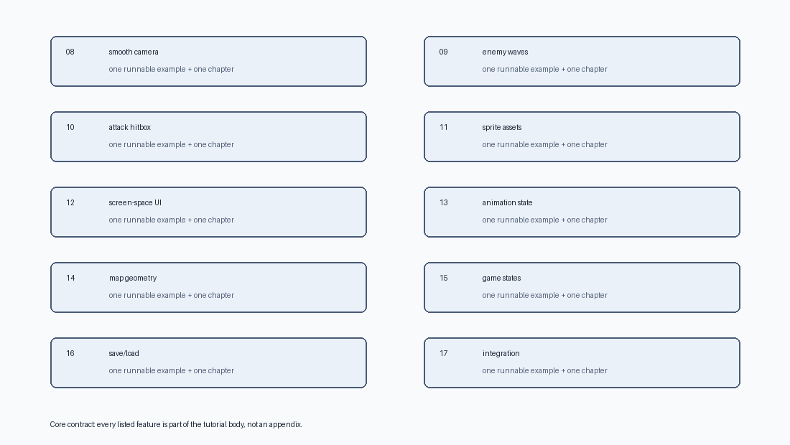

# Rust + Bevy 튜토리얼

<div align="center">

[저장소 루트](../../README.md) · [English](../en/index.md)

<code>Rust 2024</code> · <code>Bevy 0.18.1</code> · <code>18개 실행 예제</code> · <code>한국어/English</code>

</div>

---

이 튜토리얼은 Rust와 Bevy를 하나의 흐름으로 배웁니다. 빈 Bevy 창에서 시작해 부드러운 카메라 추적, 적 웨이브, 공격 히트박스, 스프라이트 에셋, 화면 고정 UI, 애니메이션 상태, 직접 만든 맵 지오메트리, 게임 상태, 저장/불러오기를 포함한 작은 탑다운 RPG까지 만듭니다.



> [!IMPORTANT]
> 이 문서는 Rust를 이미 안다고 가정하지 않습니다. Rust 문법은 Bevy 예제 코드가 등장하는 순서에 맞춰 설명하고, 각 장은 실행 가능한 예제 하나와 연결됩니다.

## 학습 계약

끝까지 진행하면 아래를 할 수 있어야 합니다.

- `Commands`, `Res`, `ResMut`, `Query`, `Single`, `With`, `Without`를 사용하는 Bevy 시스템을 읽고 작성한다.
- 작은 컴포넌트 타입을 설계하고, 엔티티는 번들로 생성한다.
- 게임 기능을 플러그인과 모듈로 나눈다.
- `.chain()`과 `SystemSet`으로 시스템 실행 순서를 제어한다.
- Bevy 코드에 나오는 Rust 개념을 설명한다: 함수 시그니처, `struct`, 튜플, 튜플 struct, `impl`, trait, derive, Generic 타입, 소유권, 참조, `Option`, `Result`, `match`, 모듈, 가시성.
- 이미지 에셋, 부드러운 카메라, 화면 고정 UI, 애니메이션 상태, 직접 만든 충돌 지형을 설명한다.
- 상태 전환, 웨이브, 공격 히트박스, 저장/불러오기를 ECS 계약으로 설계한다.
- 완성된 RPG 조각 예제에 새 엔티티와 시스템을 추가할 수 있다.

## 학습 경로

| 구간 | 장 | 결과물 |
|---|---:|---|
| 준비 | 0 | Cargo/Bevy 프로젝트가 빌드된다 |
| Rust + 앱 기초 | 1-2 | Rust 타입 문법과 Bevy 앱 등록 흐름을 읽는다 |
| ECS 기초 | 3-5 | 컴포넌트, 리소스, 쿼리, 번들, 플러그인, 시스템 순서를 다룬다 |
| 프레젠테이션 | 6 | 에셋, 카메라, 월드 텍스트를 붙인다 |
| RPG 기초 | 7 | 이동, AI, 충돌, 점수, HUD가 있는 작은 루프를 만든다 |
| 필수 RPG 기능 | 8-17 | 카메라 추적, 웨이브, 공격, UI, 애니메이션, 맵, 상태, 저장을 통합한다 |

## 목차

0. [프로젝트 설정](00-project-setup.md)
1. [Bevy를 위한 Rust](01-rust-for-bevy.md)
2. [Bevy 앱 모델](02-bevy-app-model.md)
3. [ECS 기본](03-ecs-fundamentals.md)
4. [입력과 이동](04-input-and-movement.md)
5. [번들, 플러그인, 세트](05-bundles-plugins-sets.md)
6. [에셋, 카메라, UI](06-assets-camera-ui.md)
7. [RPG 기초 조각](07-rpg-slice.md)
8. [부드러운 카메라 추적](08-smooth-camera-follow.md)
9. [적 웨이브](09-enemy-waves.md)
10. [공격 히트박스](10-attack-hitbox.md)
11. [스프라이트 에셋](11-sprite-assets.md)
12. [화면 고정 UI](12-screen-space-ui.md)
13. [애니메이션 상태](13-animation-state.md)
14. [직접 만든 맵 지오메트리](14-handmade-map-geometry.md)
15. [게임 상태](15-game-states.md)
16. [진행 저장/불러오기](16-save-load-progress.md)
17. [완성 RPG 조각](17-complete-rpg-slice.md)

## 사용 방법

> [!TIP]
> 한 장을 읽고, 해당 예제를 실행하고, 코드를 조금 바꿔본 뒤 다음 장으로 넘어가세요. 최종 코드만 복사하지 마세요. Bevy는 "이 시스템이 어떤 데이터를 읽고, 어떤 데이터를 쓰는가?"를 반복해서 물을 때 가장 배우기 쉽습니다.

```sh
cargo run --example 01_empty_app
cargo run --example 02_spawn_sprite
cargo run --example 03_player_input
cargo run --example 04_velocity_body
cargo run --example 05_plugins_sets
cargo run --example 06_assets_camera_ui
cargo run --example 07_rpg_slice
cargo run --example 08_smooth_camera_follow
cargo run --example 09_enemy_waves
cargo run --example 10_attack_hitbox
cargo run --example 11_sprite_assets
cargo run --example 12_screen_space_ui
cargo run --example 13_animation_state
cargo run --example 14_handmade_map_geometry
cargo run --example 15_game_states
cargo run --example 16_save_load_progress
cargo run --example 17_complete_rpg_slice
```

## 핵심 모델

```text
Entity    = 월드 안의 ID
Component = 엔티티에 붙는 데이터
System    = ECS 데이터를 읽고 쓰는 Rust 함수
Resource  = 월드에 하나만 있는 전역 데이터
Plugin    = 시스템/리소스/플러그인을 등록하는 단위
State     = 현재 실행 가능한 게임 모드
```

코드가 흩어져 보이면 책임 경계를 확인하세요.

```text
Component = 데이터 모양
Bundle    = 생성 모양
System    = 동작
Plugin    = 기능 등록
SystemSet = 프레임 안의 실행 순서
State     = 어떤 시스템이 실행 가능한지 정하는 모드
Module    = 소스 코드 경계
```

---

<div align="center">

[첫 장 시작: 프로젝트 설정 →](00-project-setup.md)

</div>
